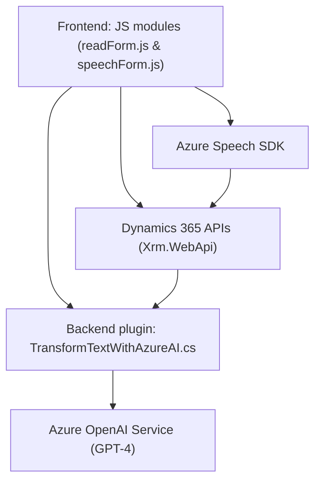

### Resumen técnico
Este repositorio contiene una solución para interactuar con formularios en Dynamics 365 mediante voz, utilizando el SDK de Azure Speech. También incluye un plugin .NET que transforma texto utilizando el servicio Azure OpenAI. Se trata de una integración híbrida frontend-backend con dependencias en servicios externos como Azure Speech y OpenAI.

---

### Descripción de la arquitectura
1. **Componentes principales**:
   - **Frontend**: Maneja el reconocimiento de voz, transformaciones de texto y define interacciones con formularios Dynamics.
   - **Backend/plugin**: Implementa lógica para transformar textos enviados desde Dynamics CRM mediante APIs externas (Azure OpenAI).
   - **Dependencias externas**: SDK de Azure Speech para entrada/salida de voz y Azure OpenAI para procesamiento de texto.

2. **Patrones observados**:
   - **Arquitectura por capas**: El repositorio organiza la lógica de presentación (frontend interactivo) y la lógica empresarial (backend y plugins) como capas distintas.
   - **Integración basada en API**: La aplicación depende en gran medida de servicios externos (Azure Speech y OpenAI).
   - **Event-driven programming**: En el frontend, las funciones son disparadas por eventos del usuario (como interacción de formularios) y por reconocimiento de voz.
   - **Plugin-based architecture**: Backend utiliza el estándar de plugin de Dynamics CRM para personalizar el comportamiento mediante eventos específicos.

---

### Tecnologías usadas
1. **Frontend (JavaScript)**:
   - SDK de Azure Speech para reconocimiento de voz y síntesis de audio.
   - Framework de Dynamics 365 para la interacción con formularios y entidades.
   - JavaScript como lenguaje de programación.
   - Event-driven y modular programming.

2. **Backend/plugin (.NET)**:
   - `C#`.
   - Dynamics CRM SDK (Microsoft.Xrm.Sdk) para integración con el motor de Dynamics.
   - Azure OpenAI Service API (modelo GPT-4).
   - Dependencias adicionales: `HttpClient`, `Newtonsoft.Json`.

---

### Diagrama Mermaid

Representación gráfica de la arquitectura del repositorio:

---

### Conclusión final
Este repositorio implementa una solución híbrida orientada a la interacción inteligente con formularios en Dynamics 365. El frontend facilita la entrada y salida por voz utilizando Azure Speech SDK y transforma esa información mediante APIs del propio CRM. En el backend, se ejecuta un plugin para enriquecer el texto proporcionado con Azure OpenAI.

**Posibles mejoras**:
- Separación modular más clara para facilitar el mantenimiento (ej. dividir en subdirectorios por capa lógica).
- Implementaciones de seguridad para evitar el hardcoding de valores sensibles como claves API.
- Optimización de los tiempos de respuesta en plugins para evitar problemas de latencia durante llamadas bloqueantes en Dynamics.