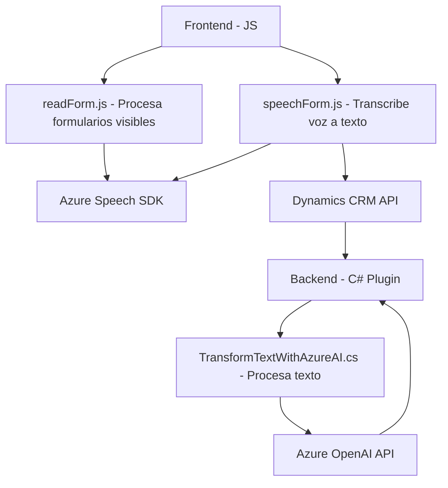

### Breve resumen técnico:
El repositorio presenta una solución que combina un frontend interactivo con accesibilidad por voz, un backend basado en un plugin de Dynamics CRM, y servicios externos como Azure Speech SDK y Azure OpenAI. Su enfoque principal es mejorar la experiencia de usuario a través de transcripción de voz, síntesis de texto a voz y transformación de datos mediante inteligencia artificial.

---

### Descripción de arquitectura:
La arquitectura tiene una estructura basada en servicios y componentes:
1. **Frontend (JS)**:
   - Procesa datos de formularios visibles, aplica síntesis de voz con Azure Speech SDK, y facilita la interacción directa con usuarios mediante funciones dinámicas.
2. **Backend (C#)**:
   - Implementa plugins especializados para Dynamics CRM, integrándose con servicios externos como Azure OpenAI para transformar texto según reglas específicas.
3. **Integración de APIs**:
   - Comunicación con APIs externas como Azure Speech SDK y Azure OpenAI, y APIs internas como Dynamics CRM APIs, para procesar datos distribuidos.

### Tecnologías usadas:
1. **Frontend**:
   - Lenguaje: Javascript.
   - Dependencias: Azure Speech SDK, DOM API.
2. **Backend**:
   - Lenguaje: C#.
   - Framework: Dynamics CRM Plugin Framework.
   - Dependencias: Microsoft.Xrm.Sdk, Newtonsoft.Json, System.Net.Http.
3. **Servicios externos**:
   - Azure Speech SDK: Reconocimiento y síntesis de voz.
   - Azure OpenAI API: Transformación de texto mediante GPT-4.

### Dependencias o componentes externos:
1. **SDKs**:
   - Azure Speech SDK para interacción por voz en frontend.
   - Microsoft.Xrm.Sdk para integración con Dynamics CRM.
2. **APIs**:
   - Azure OpenAI (implementación GPT-4) para procesamiento de texto estructurado en el backend.
3. **Entornos soportados**:
   - Dynamics CRM para backend.
   - Navegadores modernos para el frontend con soporte para Speech SDK.

### Diagrama **Mermaid** válido para GitHub Markdown:

---

### Conclusión final:
La solución implementa una arquitectura de **servicios distribuidos** con integración de APIs externas para proporcionar accesibilidad por voz y transformación de texto por inteligencia artificial. El uso de patrones como **cargador dinámico de SDKs**, **Service Layer**, y **Plugin Pattern** facilita la modularidad y adaptación a diversos contextos. Además, su diseño altamente acoplado a servicios como Azure y Dynamics CRM convierte esta solución en una potente herramienta para escenarios empresariales de accesibilidad y automatización.