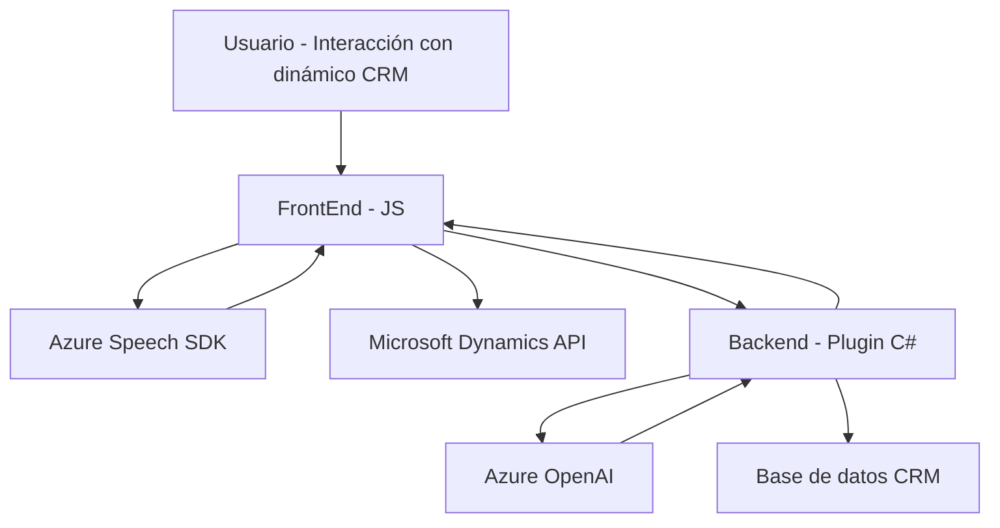

### Resumen técnico general

Este repositorio alberga una solución que integra formularios dinámicos de Microsoft Dynamics 365 con capacidades de síntesis de voz y procesamiento de texto mediante servicios de Azure, como **Azure Speech SDK** y **Azure OpenAI**. La solución incluye tanto lógica frontend basada en JavaScript como un plugin backend desarrollado en **C#** para Dynamics CRM.

---

### Descripción de arquitectura

El sistema sigue una **arquitectura de tipo n capas**:
1. **Capa de presentación (FrontEnd)**: Encapsula la lectura y escritura de datos en formularios dinámicos mediante manipulación DOM, integración con Azure Speech SDK y API personalizada. Se usan eventos y JavaScript modular.
2. **Capa de lógica aplicada (Negocio)**: Presentada como un plugin en C#. Este se ejecuta mediante eventos de Dynamics CRM y contiene lógica avanzada de procesamiento de texto integrada con Azure OpenAI.
3. **Capa de datos**: Utilizando Microsoft Dynamics 365 API para acceder y modificar datos de los formularios o entidades.
4. **Capa de servicios externos**:
   - **Azure Speech SDK**: Para reconocimiento y síntesis de voz.
   - **Azure OpenAI**: Procesamiento de texto y transcripción avanzada.

---

### Tecnologías usadas

1. **Frontend**:
   - JavaScript: Funciones modulares para manipulación de formularios y consumo de Azure Speech SDK.
   - Azure Speech SDK: Para funcionalidades de reconocimiento de voz y síntesis de texto.
   - Microsoft Dynamics 365 API: Para la actualización de datos en formularios.
   
2. **Backend**:
   - **C#** (.NET Framework): Para la lógica del plugin integrado con Dynamics CRM.
   - **Microsoft Dynamics SDK**: Para eventos de plugin y modificación de entidades.
   - **Azure OpenAI Endpoint**: Uso de solicitudes REST vía HTTP.

3. **Servicios externos** adicionales:
   - JavasScript SDK de Azure Speech.
   - Azure OpenAI para procesamiento semántico.

---

### Patrones utilizados

- **Event-driven architecture**: El plugin y el frontend reaccionan a eventos específicos del usuario y del sistema.
- **Integration pattern**: Comunicación bidireccional mediante APIs externas (Azure Speech SDK, Azure OpenAI).
- **Modularidad**: El frontend y plugin están diseñados con funciones independientes para cumplir objetivos específicos.
- **Callback**: Carga dinámica de SDKs para asegurar su correcto funcionamiento.
- **Factory pattern**: Implementado en la gestión de transcripciones y mapeo de datos en atributos de formulario.

---

### Diagrama Mermaid válido para GitHub

---

### Conclusión final

Esta solución combina un frontend web interactivo pensado para formularios dinámicos de **Dynamics 365** con capacidades avanzadas de voz y procesamiento de texto respaldadas por servicios de Azure. La arquitectura sigue un diseño n capas perfectamente compatible con el entorno Dynamics CRM. Su integración con APIs externas (Azure Speech SDK y OpenAI) evidencia una orientación hacia microservicios y servicios distribuidos. Es flexible, modular y está diseñada para manejar extendidamente la interacción por voz en aplicaciones empresariales centradas en datos.