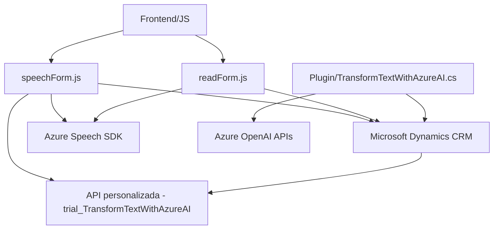

### Análisis técnico del repositorio

#### **Breve resumen técnico:**  
El repositorio contiene tres tipos de archivos principales:  
1. **Frontend/JS:** Archivos que implementan funcionalidades para interacción por voz usando Azure Speech SDK, enfocados en contextos de formularios en Dynamics 365. Incluyen reconocimiento de voz (SpeechRecognition.js) y síntesis de audio (readForm.js, speechForm.js).  
2. **Plugins:** Archivo para un plugin en .NET (C#) que interactúa con Azure OpenAI para transformar texto según ciertas reglas. Este se integra directamente con Dynamics CRM para proporcionar respuestas procesadas con IA.  

#### **Descripción de arquitectura:**  
La solución parece estar diseñada para integrarse con Dynamics 365 en un esquema híbrido de arquitectura **n-capas**. Los archivos JS son responsables de la capa de cliente (frontend), que interactúa activamente con el contexto del formulario. El plugin de Dynamics CRM actúa como la **capa de integración con servicios externos**, conectando el sistema CRM con un modelo de OpenAI alojado en Azure mediante una arquitectura **SOA**.  

El enfoque modular, la división de responsabilidades y la interacción con servicios externos indican el uso de principios como **SaaS (Software-as-a-Service)** para el procesamiento de datos con IA en Azure. Podría considerarse una solución orientada hacia una arquitectura **API Gateway** en su interacción directa con servicios externos.

#### **Tecnologías usadas:**
1. **JavaScript:** Para la interacción con los formularios en Dynamics 365.  
2. **Microsoft Dynamics CRM:** El entorno principal de la solución, con los archivos JS y plugins operando dentro del ecosistema CRM.  
3. **Azure Speech SDK:** Utilizado para reconocimiento de voz (speech-to-text) y síntesis de voz (text-to-speech).  
4. **Azure OpenAI:** Provee servicios de inteligencia artificial para transformación de texto en el plugin.  
5. **.NET (C#):** Para desarrollo del plugin.  
6. **JSON libraries:** Uso de `System.Text.Json` y `Newtonsoft.Json.Linq` para serialización/deserialización de datos JSON.  
7. **Dynamics APIs:** Uso intensivo de `Xrm.WebApi` para la integración con formularios en Dynamics 365.  

#### **Dependencias o componentes externos:**  
1. **Speech SDK de Azure:** Cargado dinámicamente desde el paquete indicado (`https://aka.ms/csspeech/jsbrowserpackageraw`).  
2. **Azure OpenAI APIs:** Endpoint propio para la transformación de texto bajo procesamiento de inteligencia artificial.  
3. **Dynamics APIs:** `Xrm.WebApi.online`, `formContext` y `executionContext`.  
4. **Reglas y normas específicas:** Implementadas en el plugin para transformar texto.  
5. **Servicios web internos:** Para consultar entidades (ej.: `searchLookupByName`) usando conexiones mediante Dynamics Web API.

---

#### **Diagrama Mermaid para la solución:**

---

### Conclusión final:
La solución propuesta es una implementación híbrida en un entorno Dynamics 365 que utiliza integración con servicios de Azure (Speech SDK y OpenAI).  

- **Frontend:** Manejo de interacción por voz mediante JavaScript con funciones como síntesis vocal y transcripción de texto en formularios.  
- **Backend:** Plugins de Dynamics programados en C# interactúan con el sistema y con Azure OpenAI para funcionalidades más avanzadas, como la transformación de texto según normas predefinidas.  

La arquitectura modular y la integración de SaaS (Azure APIs) hacen que la solución sea escalable y flexible. También sigue patrones como **SOA**, **API Gateway**, y mejores prácticas como **SRP** o manejos dinámicos de dependencias con JavaScript.

Advertencia: Se debe mejorar el manejo de configuraciones sensibles (API keys) para evitar riesgos de seguridad. La solución está diseñada principalmente para entornos empresariales que necesitan interacción avanzada entre UI, IA y servicios en la nube.