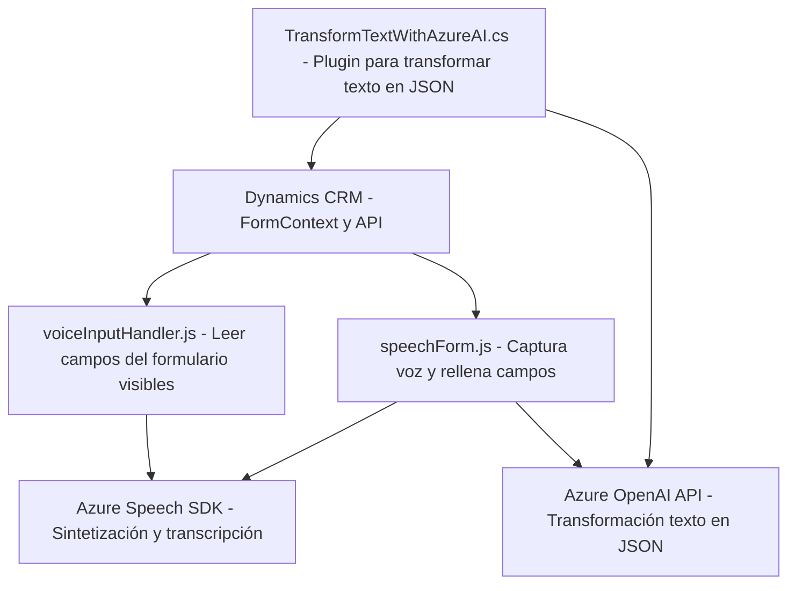

### Breve resumen técnico
El repositorio contiene tres archivos centrados en la integración de servicios de Microsoft Dynamics 365, Azure Speech SDK y Azure OpenAI API. La mayoría de la lógica está enfocada en la interacción con formularios y el procesamiento de datos mediante sintetización y transcripción de voz, además del uso de un plugin en C# para transformar texto en JSON utilizando Azure OpenAI.

---

### Descripción de arquitectura
La solución utiliza una **arquitectura de integración de sistemas** que conecta servicios de Azure (Speech SDK y OpenAI) con Microsoft Dynamics 365. La lógica está modularizada a través de la estructura de archivos `Frontend/JS/` y `Plugins/`, que manejan funcionalidades específicas:
1. Los archivos de frontend (`readForm.js` y `speechForm.js`) se encargan de gestionar interacción entre usuarios y formularios de Dynamics 365 mediante sintetización de voz y transcripción, además de integrar una API externa.
2. El plugin (`TransformTextWithAzureAI.cs`) actúa como una capa de lógica extendida dentro de la arquitectura basada en plugins de Dynamics CRM. Este sigue el patrón de integración con servicios externos mediante peticiones HTTP y transformación de datos.

La arquitectura en general puede clasificarse como una **n-capas con integración de servicios externos**, ya que:
- Tiene una capa de presentación (los scripts de frontend manejan la interacción UI en Dynamics).
- Una capa de lógica empresarial (los plugins y el procesamiento de datos con servicios de Azure).
- Una capa de acceso a datos (mediante servicios como `Xrm.WebApi` y Microsoft Dynamics CRM).

---

### Tecnologías usadas
1. **Frontend**:
   - Lenguaje: JavaScript.
   - Servicios: Azure Speech SDK.
   - Plataforma: Microsoft Dynamics 365.
2. **Backend** (C# Plugin):
   - Lenguaje: C#.
   - Plataforma: Microsoft Dynamics CRM.
   - Librerías: 
     - `System.Net.Http` para interacción HTTP con Azure OpenAI.
     - `System.Text.Json` y `Newtonsoft.Json.Linq` para manipulación de datos JSON.
3. **Servicios externos**:
   - Azure Speech SDK: Para transcripción y sintetización de voz.
   - Azure OpenAI API: Para transformar texto según reglas específicas.
4. **Patrones de diseño**:
   - Modularización.
   - Facade-like (gestión de voz).
   - Service Provider (Dynamics CRM).

---

### Diagrama Mermaid válido para GitHub

---

### Conclusión final
La solución es una integración avanzada de servicios externalizados en Azure y Microsoft Dynamics 365, diseñada para optimizar la entrada de voz en CRM mediante sintetización y transcripción. Además, utiliza un plugin en C# para procesar datos textuales y generar resultados estructurados con Azure OpenAI API. La arquitectura modular y la implementación de patrones como el proveedor de servicios y la carga dinámica de SDK son características destacadas de esta solución empresarial distribuida.