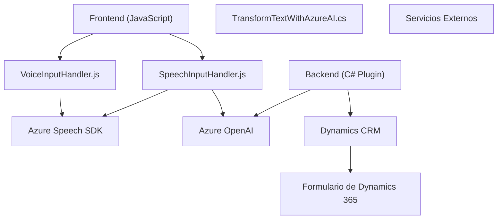

### Breve resumen técnico
El repositorio parece estar diseñado para integrar funcionalidades avanzadas utilizando voz y procesamiento de lenguaje natural (NLP) en aplicaciones basadas en **Microsoft Dynamics 365**. Se utilizan tres componentes:

1. **Frontend (JavaScript):**
   - Manejo de entrada y salida de voz mediante **Azure Speech SDK**.
   - Integración con formularios de Dynamics 365.

2. **Backend (C#: Plugins):**
   - Procesamiento avanzado de texto ingresado (con IA de **Azure OpenAI**) para estructurar datos en JSON.

3. **API externa de Dynamics CRM** para operaciones CRUD y transformación de datos con IA.

---

### Descripción de arquitectura
La solución parece combinar **n capas** en la arquitectura, donde se divide en:
1. **Capa de presentación**: Manejo de voz en la interfaz del usuario, implementada en **JavaScript**.
2. **Capa de integración**: Funcionalidades como llamadas API al backend de Dynamics 365 y uso de servicios en Azure en el lado del cliente.
3. **Capa de lógica empresarial**: Plugin en C# donde se procesa texto usando OpenAI en Azure para operaciones personalizadas de Dynamics CRM.
4. **Capa de datos**: Utilización del modelo de datos de Dynamics 365 para almacenar y recuperar información del sistema.

Este diseño utiliza varios patrones:
- **Integración con servicios externos**: Azure Speech SDK y OpenAI.
- **Plugin Architecture**: Implementación estándar para extensiones en Dynamics CRM.
- **Patrón Modular en el Frontend**: Funcionalidades organizadas en funciones con roles específicos.

Tipo de arquitectura: **n capas híbrida** con integración con servicios externos de IA.

---

### Tecnologías usadas
1. **Frontend**:
   - **JavaScript**: Para la lógica de entrada/salida de voz y manipulación visual del formulario.
   - **Azure Speech SDK**: Reconocimiento y síntesis de voz.

2. **Backend**:
   - **C# y Dynamics SDK**: Plugins para transformar datos y acceder al CRM.
   - **Azure OpenAI**: Procesamiento de texto avanzado.

3. **Servicios externos**:
   - **Xrm.WebApi** para Dynamics CRM.
   - **Azure Speech SDK**, llamado desde scripts.

---

### Dependencias y componentes externos
- **Dependencias del frontend**:
  - **Azure Speech SDK**: API externa que se importa dinámicamente desde el navegador.
  - Frameworks posibles: Por ahora no se menciona explícitamente ningún framework, por lo que parece ser código independiente de una librería como React o Angular.

- **Dependencias del backend**:
  - **Microsoft Dynamics SDK**: Para gestión de formularios y datos.
  - **Azure OpenAI**: Comunicación para procesamiento de texto.
  - Librerías como **Newtonsoft.Json**.

---

### Diagrama Mermaid

---

### Conclusión final
La solución implementa una arquitectura **híbrida n capas** con una integración en tiempo real de servicios de **Azure Speech SDK** para entrada y salida de voz en el lado del cliente y procesamiento avanzado de texto mediante IA de **Azure OpenAI** en el backend. Estas funcionalidades están diseñadas para trabajar sobre la plataforma **Microsoft Dynamics 365**, utilizando plugins personalizados en C#. El diseño optimiza la interacción del usuario con formularios de CRM mediante voz e IA.

La modularidad presente en ambos lados facilita la mantenibilidad y escalabilidad, mientras que la dependencia de servicios externos asegura una alta capacidad de procesamiento y rendimiento en escenarios de síntesis y reconocimiento de voz.