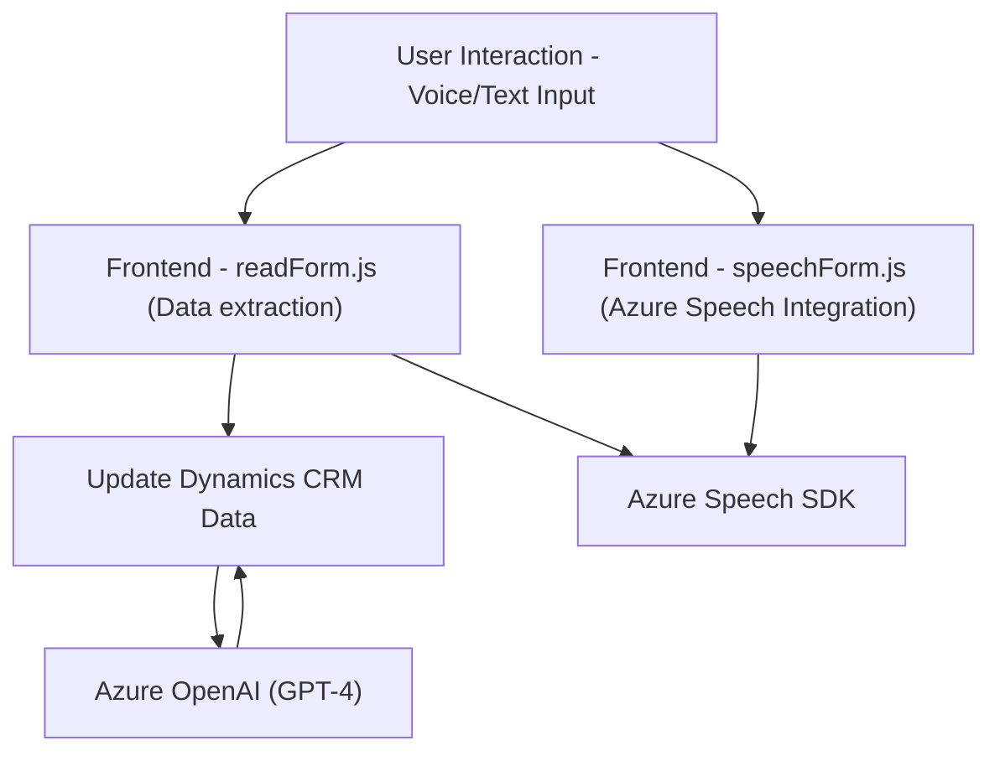

### Breve Resumen Técnico
El repositorio contiene funcionalidades para formularios dinámicos en Dynamics CRM/PowerApps y APIs de Azure (Azure Speech SDK y OpenAI). Se detallan archivos frontend (`readForm.js`, `speechForm.js`) y un plugin (`TransformTextWithAzureAI.cs`) que realizan gestión avanzada de formularios mediante reconocimiento y síntesis de voz, integración con IA, estructuración de datos y actualización dinámica en un backend basado en Dynamics CRM.

---

### Descripción de Arquitectura
La solución sigue una arquitectura **orientada a servicios (SOA)**, con múltiples componentes colaborando para lograr la integración entre formularios dinámicos en Dynamics CRM y servicios de Azure.

- Los componentes `Frontend/JS` interactúan con los servicios externos y el DOM de Dynamics CRM.
- Los plugins de backend (`TransformTextWithAzureAI.cs`) actúan como procesadores orientados a eventos dentro de Dynamics CRM, ejecutándose según los eventos del usuario.
- La lógica de negocio evita mantener estados en el sistema, priorizando flujos de datos transitorios desde APIs y usuarios hacia el formulario.

---

### Tecnologías Usadas
1. **Frontend**:
   - Azure Speech SDK (síntesis y entrada de voz).
   - Microsoft Dynamics CRM APIs (`Xrm.WebApi`, `formContext`).
   - DOM manipulation (para interacción con formularios).
   - ES6/ES2021 JavaScript (async/await, promises, etc.).

2. **Backend (Plugins)**:
   - Dynamics CRM SDK (`IPlugin`, `IServiceProvider`).
   - Azure OpenAI Service (GPT-4).
   - JSON manipulation (C# libraries como `Newtonsoft.Json` y `System.Text.Json`).

3. **Patrones arquitectónicos**:
   - **Facade** en el frontend (simplificación de flujo con métodos controladores).
   - **Middleware** en el backend (plugins como capas intermedias entre CRM y Azure OpenAI).
   - **Asynchronous Processing** para llamadas externas en el frontend.
   - **Pluggable Architecture** en Dynamics CRM.

---

### Dependencias o Componentes Externos
- **Azure Speech SDK**: Entrada y salida de voz (síntesis y reconocimiento).
- **Dynamics CRM APIs**: Acceso y actualización de datos mediante `formContext` y `Xrm.WebApi`.
- **Azure OpenAI (GPT-4)**: Procesamiento avanzado para estructuración de texto.
- **C# Libraries**:
  - `Newtonsoft.Json` para JSON manipulation.
  - `System.Net.Http` para consumidores de API.
- **Frontend Dependencies**:
  - HTML DOM y métodos JavaScript.

---

### Diagrama Mermaid

---

### Conclusión Final
Este repositorio implementa una modular solución basada en la integración de servicios externos (Azure Speech y OpenAI) y formulación dinámica en Dynamics CRM. Utiliza patrones SOA con una separación clara entre frontend y backend, proporcionando una arquitectura escalable y extensible. Las tecnologías utilizadas son estándares modernos que facilitan operaciones asincrónicas y procesamiento dinámico de datos.