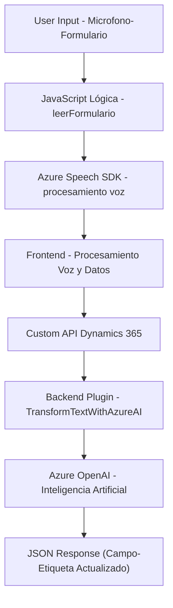

### Breve Resumen Técnico
El repositorio contiene múltiples archivos que implementan tanto lógica de frontend como backend. En el frontend se observa integración con servicios de Azure Speech SDK y Dynamics 365, mientras que en el backend hay un plugin que utiliza Azure OpenAI para procesar texto. La solución parece ser una **aplicación empresarial híbrida** orientada a la gestión de formularios dinámicos basados en voz y la transformación avanzada de datos mediante Inteligencia Artificial.

---

### Descripción de Arquitectura
La arquitectura parece **multicapa**:
1. **Frontend**: Implementado en JavaScript, interactúa con formularios dinámicos y APIs externas (Speech SDK, Custom APIs en Dynamics 365).
2. **Middleware/Backend**: Uso de plugins desarrollados en C# para integrar funcionalidad adicional en Microsoft Dynamics CRM y Azure OpenAI.
3. **Servicios Externos**:
   - Azure Speech SDK para reconocimiento y síntesis de voz.
   - Azure OpenAI para procesamiento de texto.

El diseño de la solución mezcla **n capas** para estructuración (entre frontend y backend) y se apoya en un **modelo híbrido** que utiliza servicios externos para capacidades avanzadas (reconocimiento de voz, IA).

---

### Tecnologías Usadas
- **Frontend**:
  - JavaScript: Lógica para integración y procesamiento de voz.
  - Azure Speech SDK: Cargado dinámicamente para reconocimiento y síntesis.
  - Dynamics 365 JavaScript API: Interacción con formularios D365.

- **Backend**:
  - C#: Desarrollo de plugins para Dynamics CRM.
  - Azure OpenAI: Procesamiento y transformación avanzada de datos.
  - .NET Framework: Tipo estándar en soluciones basadas en Dynamics CRM.

---

### Diagrama Mermaid

---

### Conclusión Final
La solución parece ser una **aplicación empresarial de reconocimiento de voz y procesamiento de texto estructurado**. Integra múltiples componentes externos, como Azure Speech SDK y Azure OpenAI, junto con Microsoft Dynamics 365 para flujo de datos estructurado e interacción de usuario. Adopta una arquitectura **multicapa** con responsabilidad claramente distribuida entre frontend, backend y servicios externos, utilizando patrones modernos para el desarrollo de sistemas dinámicos y distribuidos.