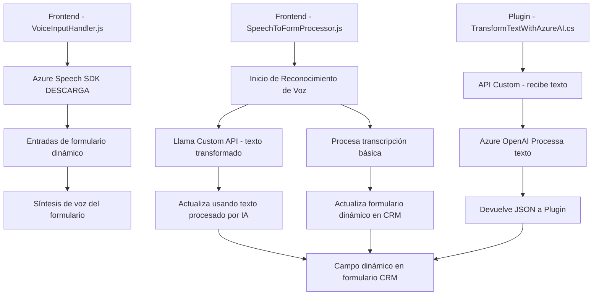

## Breve resumen técnico

El repositorio reflejado tiene tres archivos principales. Dos en el directorio `FRONTEND/JS`, ambos implementando funcionalidades relacionadas con el SDK de Azure Speech para interacción de voz, y un archivo en `Plugins`, que es un plugin desarrollado para **Dynamics CRM** que interactúa con Azure OpenAI para procesar texto como JSON estructurado según reglas específicas.

Esto indica que el propósito de este repositorio es integrar interacción por voz y procesamiento de texto mediante inteligencia artificial con formularios dinámicos, probablemente en una aplicación de CRM como Dynamics 365.

---

## Descripción de arquitectura

La solución cuenta con una arquitectura híbrida que combina un cliente frontend con servicios externos (Azure Speech SDK y Azure OpenAI Service) y un plugin basado en **Dynamics CRM**. El frontend está desarrollado en JavaScript y parece tener una base de arquitecturas orientadas a funciones, sin uso explícito de un framework web moderno. Por otro lado, el plugin en C# emplea patrones de la **Plugin Architecture** para CRM y un enfoque de integración modular con servicios externos. 

Aunque el diseño contiene elementos de una arquitectura basada en capas (frontend - backend - external services), no sigue el patrón clásico de **n capas**, sino que es una arquitectura más ligera y basada en la colaboración entre el frontend y el plugin mediante APIs de Dynamics 365.

---

## Tecnologías y frameworks utilizados

### Frontend (`readForm.js` / `speechForm.js` - JS)
1. **JavaScript nativo**: Manipulación directa del DOM, eventos, y estructura modular funcional.
2. **Azure Speech SDK**: Integración con el servicio de síntesis y reconocimiento de voz de Microsoft Azure.
3. **Xrm.WebApi**: Punto de integración con el API de Dynamics 365 para modificar formularios y realizar operaciones.
4. **HTML**: Manipulación del DOM y carga de dependencias externas como el SDK por CDN.
5. **Promesas y eventos**: Para manejar llamadas asíncronas.

### Backend (`TransformTextWithAzureAI.cs` - C#)
1. **Microsoft Dynamics SDK (IPlugin)**: Implementación de plugins personalizados en Dynamics CRM.
2. **Azure OpenAI API**: Transformación de texto utilizando modelos de inteligencia artificial.
3. **Newtonsoft Json**: Serialización y deserialización de JSON.
4. **HttpClient**: Para realizar llamadas HTTP al servicio REST de OpenAI.
5. **Regex/Text libraries**: Probables para manipulación y validación de texto.
   
---

## Diagrama Mermaid (100 % compatible con GitHub Markdown)

---

## Conclusión final

La solución es una **arquitectura híbrida modular** que conecta la interacción de voz y procesamiento de texto dinámica con un sistema CRM (Dynamics 365). 

### Características principales:
1. **Frontend Modular**: Implementación en JavaScript con integración directa con Azure Speech SDK.
2. **Backend CRM-driven**: Plugin en Dynamics CRM que extiende las capacidades del sistema con procesos basados en Azure OpenAI.
3. **Desacoplamiento y carga dinámica**:
   - El SDK de Azure Speech y las operaciones IA se cargan y procesan de forma condicional.
4. **Patrones enfocados**: Modularidad, separación de responsabilidades y event-driven async en el frontend, mientras el backend abstrae lógica técnica con reglas precisas.

Este repositorio logra una integración efectiva de servicios externos para extender un sistema CRM y podría beneficiarse adicionalmente de mejoras en encapsulación y uso de frameworks modernos (React, Angular, Vue, etc.) para el frontend y mejores prácticas de manejo de configuración sensible.