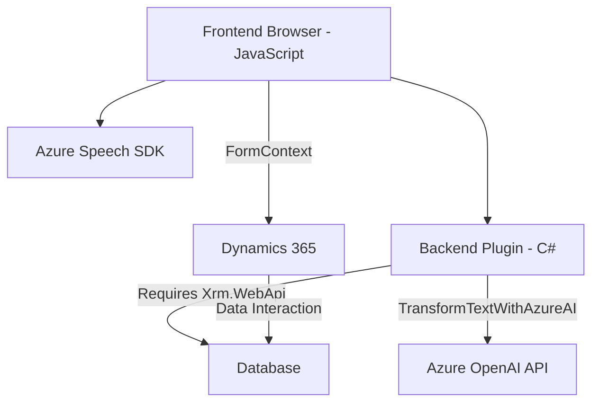

### Análisis técnico y arquitectónico basado en la estructura del repositorio

#### Breve resumen técnico
La solución mencionada parece ser un sistema específico integrado dentro de Dynamics 365 que cumple dos funciones principales:
1. Sintetizar datos visibles de formularios en voz utilizando **Azure Speech SDK** (funcionalidad de conversión de datos dinámicos en sonido).
2. Actualizar campos en formularios basados en comandos de voz con IA mediante **Azure OpenAI API** y procesamiento avanzado de texto a JSON.

En términos funcionales y de arquitectura, el sistema está compuesto por:
- Un **frontend** en **JavaScript** que opera sobre formularios de Dynamics 365.
- Un **backend-plugin** en C# que incorpora lógica empresarial avanzada con **Azure OpenAI**.

Estas evidencias apuntan a una solución híbrida con componentes distribuidos.

---

#### Descripción de arquitectura
La arquitectura del sistema combina **n capas** y **event-driven programming**, con un enfoque de **plugin-based architecture** según lo requerido por la plataforma Dynamics 365.

1. **Frontend**: Una arquitectura centrada en scripts JavaScript modular y estructurado, actuando como controlador dentro del modelo de Dynamics 365. Realiza llamados a APIs externas (Azure Speech y variables formContext) para la interacción dinámica con datos del CRM y para la síntesis o reconocimiento de voz.
   
2. **Backend**: Utiliza el patrón de arquitectura de **SOA (Service-Oriented Architecture)** con integración hacia el servicio externo **Azure OpenAI API**. También implementa la estructura de plugins requerida por Dynamics CRM para interactuar con su modelo interno.

3. **Principios**:
   - Módulos desacoplados: Cada archivo cumple su respectiva responsabilidad (gestión de datos, síntesis de voz, procesamiento por IA, interacción con APIs internas/externas).
   - **Asincronía:** Uso predominante de promesas, `async/await`, callbacks y dependencias externas cargadas dinámicamente para optimizar la performance de la solución.

---

#### Tecnologías usadas
1. **Frontend**:
   - **JavaScript**: Utilizado para la síntesis de voz interactiva y actualización dinámica de formularios.
   - **Azure Speech SDK**: Herramienta principal para sintetizar voz y realizar reconocimiento automático.
   - **Dynamics 365 APIs** (`formContext`, `Xrm.WebApi`): Facilitadores de la interacción con los datos en la plataforma CRM.
   - JavaScript DOM manipulation techniques: Para cargar dinámicamente dependencias externas como Azure Speech SDK desde un CDN.

2. **Backend**:
   - **C#**: Lenguaje base para la creación del plugin.
   - **Dynamics CRM Plugin Framework** (a través de `IPlugin`): Integración directa con Dynamics.
   - **Azure OpenAI API**: Para transformar información textual en JSON estructurado mediante un modelo GPT preentrenado.
   - **Newtonsoft.Json / System.Text.Json**: Serialización y deserialización de JSON.
   - **System.Net.Http**: Comunicación HTTP para APIs externas.

---

#### Dependencias o componentes externos presentes
1. **Azure Speech SDK**: Script cargado dinámicamente a través del CDN.
2. **Dynamics APIs**:
   - `formContext.data.entity.attributes` para obtener información del estado del formulario.
   - `Xrm.WebApi` para realizar operaciones relacionadas con entidades.
3. **Azure OpenAI API** (Backend): Procesamiento persistente de texto mediante endpoint externo.
4. **Newtonsoft.Json**: Integra conversión eficiente entre objetos y JSON en el backend.

---

#### Diagrama Mermaid
Basado en las relaciones e interacciones descritas, se propone la siguiente estructura gráfica:

---

### Conclusión final
La solución implementa una arquitectura modular en capas con pivote en la plataforma Dynamics 365. Integra dependencias externas como Azure Speech SDK y una API de IA basada en Azure OpenAI. Emplea patrones como **separación de responsabilidades**, **event-driven programming**, **plugin-based architecture**, y **SOA**.

Este diseño permite una integración potente con usuarios y tecnología, permitiendo la interacción mediante comandos de voz y síntesis hablada, combinado con procesamiento avanzado de textos por IA. Sin embargo, es crucial manejar adecuadamente las credenciales en la comunicación con servicios como Azure OpenAI para reforzar la seguridad del sistema. La solución destaca por su robustez y flexibilidad para operar en entornos CRM empresariales complejos.