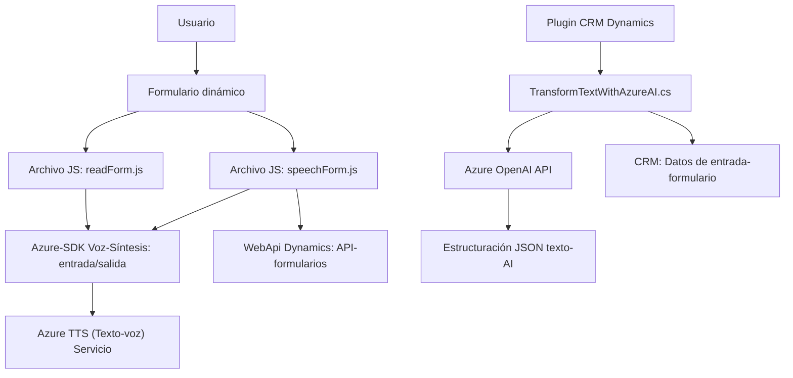

### Resumen técnico
El repositorio contiene tres módulos: 
1. **Frontend/JS/readForm.js** y **speechForm.js**: Implementan capacidades de interacción de voz para formularios usando Azure Speech SDK. 
2. **Plugins/TransformTextWithAzureAI.cs**: Define un plugin para Dynamics CRM que procesa texto mediante Azure OpenAI y transforma datos en formato JSON estructurado.

El sistema está enfocado en integrar la inteligencia artificial (Azure Cognitive Services y Azure OpenAI) con la entrada y procesamiento de datos de formularios en un entorno empresarial.

---

### Descripción de arquitectura
La arquitectura es de tipo modular integrada en un **modelo n-capas**:
- **Capa de presentación/front-end**: Archivos JS basados en APIs del navegador. Incorporan funcionalidades de interacción de usuario orientadas a reconocimiento y síntesis de voz, con procesamiento en el cliente.
- **Capa de lógica empresarial**: Plugin de Dynamics CRM (`TransformTextWithAzureAI.cs`), que interactúa con servicios de Azure para procesamiento de datos y permite aplicar lógica inherentemente dinámica.
- **Capa de integración/APIs**: Usa Azure Speech SDK y OpenAI dentro de un esquema de integración rest-client para evitar lógica repetitiva y promover escalabilidad.

---

### Tecnologías usadas
1. **Frontend**:
   - **Azure Speech SDK**: Bibliotecas para reconocimiento y síntesis de voz.
   - **JavaScript**: DOM manipulación y lógica asincrónica para carga dinámica de componentes.
   - **Dynamics WebApi**: Para operaciones de lectura/escritura en formularios.
   - **Modularización JS**: Código estructurado en funciones independientes y reutilizables.

2. **Backend**:
   - **Azure OpenAI GPT-4**: Utilizado para transformar texto con Inteligencia Artificial.
   - **Dynamics SDK (`Microsoft.Xrm.Sdk`)**: Integración con entorno CRM.
   - **.NET & C# Libraries**:
     - `System`: Core classes y arquitecturas base.
     - `Newtonsoft.Json`: JSON parsing avanzado.
     - `System.Net.Http`: Para las conexiones REST con APIs.
   - **HTTP Clients**: Se usa para realizar solicitudes hacia APIs RESTful.

---

### Dependencias o componentes externos
1. **Azure Speech SDK**: Reconocimiento y síntesis de voz.
2. **Azure OpenAI API**: Procesamiento de texto con GPT-4.
3. **Dynamics CRM SDK**: Para gestionar datos en un software CRM.
4. **Navegadores Web**: Soporte para APIs como DOM y manipulación de scripts.
5. **Newtonsoft.Json & System.Text.Json**: Parsing de respuestas JSON de APIs externas.

---

### Diagrama Mermaid válido para **GitHub**

---

### Conclusión final
Este repositorio parece ser parte de una solución empresarial orientada a mejorar la integración entre aplicaciones internas de Dynamics CRM y capacidades avanzadas de inteligencia artificial cognitiva proporcionadas por Azure AI. Su implementación modular, basada en tecnologías como Azure Speech SDK y OpenAI, refuerza la escalabilidad en interacción usuario-sistema, ofreciendo una experiencia moderna basada en voz y aprendizaje automático. La arquitectura empleada enfatiza modularidad con niveles claros que separan las responsabilidades del front-end, los datos y la lógica empresarial.