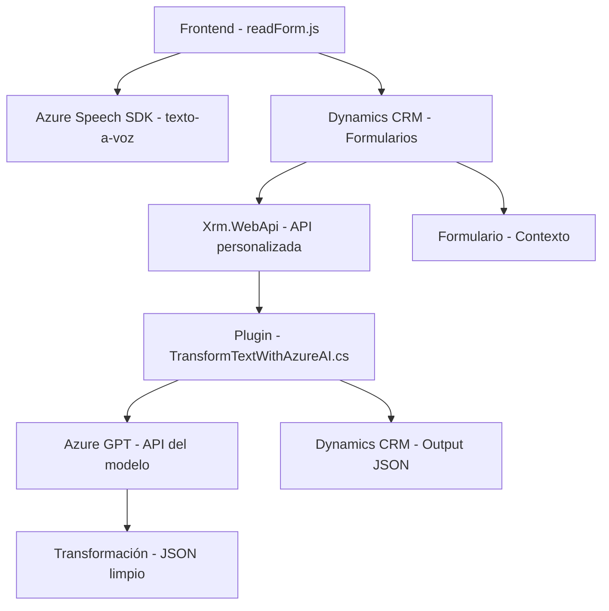

### Breve resumen técnico
El repositorio parece incluir un frontend en JavaScript, complementado con un plugin backend en C#. El objetivo principal de la solución es mejorar la accesibilidad mediante síntesis de voz y procesamiento de voz en el frontend, mientras que el backend utiliza Azure OpenAI GPT para transformar texto en estructuras JSON útiles en Dynamics CRM. El sistema conecta clientes (usuarios) con APIs externas (Azure Speech SDK y OpenAI), creando una interacción más dinámica e intuitiva.

---

### Descripción de arquitectura
La arquitectura general combina un **frontend basado en contexto de formularios dinámicos**, dependiente de Dynamics CRM, con un **plugin C# backend para inteligencia artificial**. La solución está organizada en un modelo de arquitectura **n capas**, donde las capas de presentación (frontend) interactúan con servicios en la nube y un backend que orquesta la integración con sistemas externos (OpenAI, Azure Speech).

### Tecnologías usadas
1. **Frontend (JavaScript):**
   - Azure Speech SDK: Reconocimiento y síntesis de voz.
   - Contexto de formularios Dynamics 365: Manipulación de datos en tiempo real.
   - Modularización y eventos asíncronos.
2. **Backend (C# Plugin para Dynamics CRM):**
   - Azure OpenAI: Procesamiento de texto para inteligencia artificial.
   - Microsoft.Xrm.Sdk: API para interacción con Dynamics CRM.
   - HttpClient: Llamadas HTTP al servicio de OpenAI.
   - Newtonsoft.Json: Serialización/Deserialización de JSON.

### Diagrama Mermaid

---

### Conclusión final
Se trata de una solución basada en arquitectura **n capas** que integra un **frontend dinámico** y accesible con servicios **backend inteligentes**. El uso de Azure Speech SDK facilita la accesibilidad mediante texto a voz, mientras que Azure OpenAI agrega capacidades avanzadas de procesamiento e inteligencia artificial al sistema. Por tanto, este proyecto es ideal para mejorar soluciones corporativas (como CRM) y garantizar experiencias de usuario mejoradas mediante tecnología basada en inteligencia artificial.