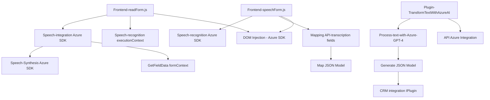

# Análisis detallado

## Resumen técnico
La solución descrita en los tres archivos del repositorio implementa funcionalidades para interacción entre usuarios y sistemas mediante reconocimiento de voz, síntesis de texto, procesamiento de datos con APIs externas y actualización de formularios en un sistema CRM. El uso de Azure Speech SDK y Azure OpenAI crea una solución que combina experiencia de usuario (UX) basada en voz con procesamiento y manipulación de datos en un sistema empresarial.

---

## Descripción de arquitectura
Esta solución emplea una arquitectura **n-capas** con responsabilidades claramente separadas:
1. **Capa cliente (Frontend)**:
   - Los archivos `readForm.js` y `speechForm.js` implementan funcionalidades del cliente (entrada de voz, reconocimiento y mapeo de atributos del formulario) ejecutándose en el navegador o contexto de aplicaciones web integradas.
   - Azure Speech SDK se utiliza para la interacción basada en voz.
2. **Capa lógica empresarial (Backend/Plugins)**:
   - El archivo `TransformTextWithAzureAI.cs` implementa un plugin en Microsoft Dynamics CRM para extender su funcionalidad mediante transformación de datos con la API de Azure OpenAI (GPT-4).
   - Esta capa procesa texto y estructura JSONs para adaptarlos a las necesidades específicas de la organización.
3. **Capa de integración**:
   - La solución depende de APIs externas (Azure Speech SDK, Azure OpenAI API) para realizar operaciones intensivas de cómputo, como reconocimiento de voz y procesamiento avanzado de texto.

Esta arquitectura facilita la interacción entre cliente y servidor, con dependencias bien definidas y componentes reutilizables.

---

## Tecnologías usadas:
1. **Frontend**:
   - **JavaScript** como lenguaje principal.
   - **Azure Speech SDK** para entrada y síntesis de voz.
   - **DOM Manipulation** para cargar dinámicamente SDKs y actualizar formularios en tiempo real.
   - **Dynamics CRM field context** (`executionContext`, `formContext`) para gestionar atributos del formulario.

2. **Backend Plugin**:
   - **Microsoft Dynamics CRM SDK** para interacción con el sistema empresarial.
   - **Azure OpenAI API** para procesamiento de texto utilizando IA (GPT-4).
   - **C#/.NET Framework** como lenguaje principal.
   - **Newtonsoft.Json** para manipulación avanzada de objetos JSON.
   - **HTTP Client Libraries** para integraciones externas.

3. **Patrones observados**:
   - **Modularización**: Separación de responsabilidades en funciones pequeñas y reutilizables.
   - **Callback/Promesas**: Implementación asincrónica en operaciones con SDKs y APIs externas.
   - **API Integration**: Invocación de APIs de Azure con configuración explícita.
   - **Plugin Pattern**: Extensión de funcionalidad en Dynamics CRM mediante plugins personalizados.
   - **Gestión de dependencias externas**: Carga dinámica del SDK de Azure Speech.

---

## Diagrama **Mermaid** válido para GitHub Markdown

---

## Conclusión final
La solución descrita está diseñada para proporcionar una interfaz moderna basada en voz entre usuarios y sistemas CRM. Combina una capa frontend basada en JavaScript con SDKs de Azure y extensiones backend mediante plugins en Dynamics CRM que aprovechan el poder de Azure OpenAI. La arquitectura de **n-capas** segmenta claramente las responsabilidades y facilita la integración externa. Sin embargo, sería recomendable evaluar los siguientes puntos para optimizar el diseño:

1. **Seguridad**: Las claves API para interactuar con Azure deben estar protegidas mediante mecanismos seguros (como Azure Key Vault).
2. **Flexibilidad**: Desacoplar modelos rígidos y mover normas/reglas configurables (como mapeos y estructuras JSON) a archivos externos o bases de datos.
3. **Testing automatizado**: Debido a la interacción con APIs externas, es importante implementar pruebas unitarias y de integración para simular respuestas tanto del SDK de Speech como de la API de Azure OpenAI.

Esta solución es un buen punto de partida para integrar voz, IA y sistemas empresariales en un ecosistema robusto.