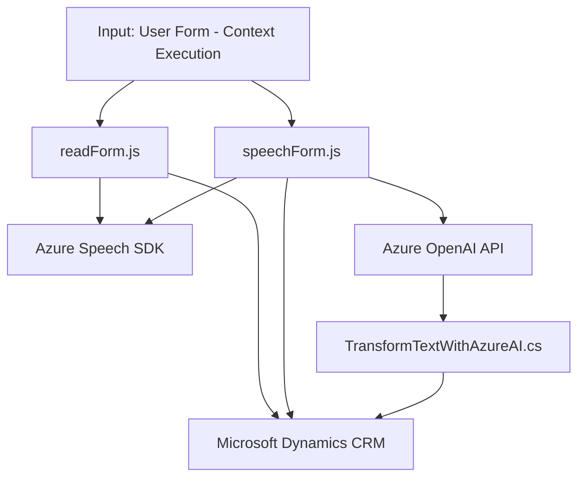

### Breve resumen técnico:
El repositorio contiene archivos destinados principalmente para la interacción entre un frontend y servicios en la nube mediante el SDK de Microsoft Azure Cognitive Services y Dynamics 365 CRM. Incluye lógica para síntesis de voz, reconocimiento y transcripción de voz a texto, procesamiento mediante inteligencia artificial (Azure OpenAI), y asignación de datos trabajados a formularios interactivos.

---

### Descripción de arquitectura:
La solución evidencia una arquitectura **híbrida**, en la que:
- El frontend implementa un diseño **modular basado en funciones**, con puntos de integración para servicios externos como Azure Speech SDK y APIs de Dynamics 365.
- El backend opera bajo el patrón de **n capas**, con el plugin Dynamics CRM funcionando como capa de servicio personalizada y el servicio en la nube (Azure OpenAI) funcionando como una capa externa.
- Existe un patrón de **integración por eventos** en la solución (plugin Dynamics CRM), disparándose actividades según eventos del sistema.
- La comunicación global sigue un enfoque **orientado a servicios** con la integración de IA y APIs basadas en HTTP.

---

### Tecnologías usadas:
1. **Frontend**:
   - Lenguaje: JavaScript.
   - Framework/SDK: Azure Speech SDK.
   - API: Dynamics 365 Web API (para manipulación de formularios y entidades CRM).

2. **Backend** (Plugins CRM):
   - Lenguaje: C# (.NET).
   - Framework: Microsoft Dynamics CRM SDK.
   - Servicios:
     - Azure Cognitive Services - OpenAI API.
   - Librerías:
     - Newtonsoft.Json.Linq (manejo de JSON).
     - System.Net.Http (solicitudes HTTP).
     - System.Text.Json (serialización y procesamiento JSON).

---

### Diagrama **Mermaid** compatible con GitHub Markdown:

---

### Conclusión final:
El repositorio configura una solución para convertir datos entre formato texto y voz, procesarlos con inteligencia artificial, y reflejarlos en formularios de Dynamics CRM. El flujo de trabajo involucra una integración compleja, utilizando tanto un frontend basado en acciones del usuario (JavaScript y Azure SDK) como un backend extendido mediante plugins (.NET/IPlugin). La solución está diseñada como un módulo funcional dentro de sistemas más amplios, lo que sugiere una arquitectura modular y basada en capas adecuadas para entornos empresariales.

