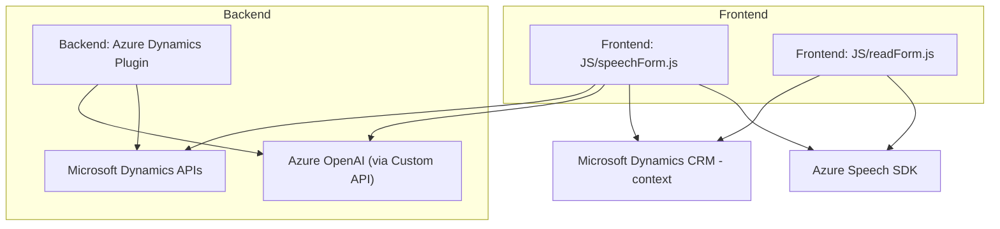

### Breve resumen técnico
El repositorio está diseñado para implementar funcionalidades relacionadas con el procesamiento y síntesis de voz (lectura de formularios, reconocimiento de voz y texto) en un ecosistema de Microsoft Dynamics CRM integrado con Azure Cognitive Services y, específicamente, Azure OpenAI para transformaciones avanzadas de datos y texto. Incluye tanto componentes frontend en JavaScript, como un plugin para Dynamics CRM desarrollado en C#.

---

### Descripción de arquitectura:
Este sistema sigue una **arquitectura por capas** dentro de una solución cliente-servidor. Hay módulos en el frontend que manejan interacción y datos del usuario mediante reconocimiento y síntesis de voz. Adicionalmente, existen módulos backend (como el plugin en C#) que se integran directamente con Microsoft Dynamics CRM y Azure OpenAI para ejecutar transformaciones y devoluciones en formato JSON al sistema.

#### Características principales:
1. **Frontend:**
   - Procesos de captura y síntesis de voz con el SDK de Azure Speech.
   - Captura interactiva en los formularios, mapeo de datos y ejecución de acciones.
   - Modularización clara por funcionalidad específica (sintetizar, procesar y aplicar valores).
2. **Backend:**
   - Plugins extensibles de Dynamics CRM para el procesamiento de texto.
   - Integración continua con el servicio Azure OpenAI para transformaciones más avanzadas de texto y datos.

---

### Tecnologías usadas:
1. **Frontend:**
   - **Base:** JavaScript.
   - **Frameworks/librerías:** Azure Cognitive Services Speech SDK.
   - **Pattern:** Modular design, callback-based execution, data mapping.

2. **Backend:**
   - **Base:** C#, con integración a Microsoft Dynamics CRM.
   - **Frameworks/librerías**:
     - `Newtonsoft.Json` para manejo avanzado de objetos JSON.
     - APIs de Microsoft Dynamics CRM (`Microsoft.Xrm.Sdk`, `Xrm.WebApi`).
     - **Azure OpenAI** para transformación de texto con reglas específicas.

---

### Dependencias y componentes externos:
1. **Azure Speech SDK:** Proporciona las capacidades de síntesis y reconocimiento de voz. 
2. **Microsoft Dynamics CRM API:** Maneja el contexto y la operación con formularios y entidades del CRM.
3. **Entity mapping and metadata:** Para asociar valores reconocidos de voz con campos específicos del formulario.
4. **Azure OpenAI Service:** Utilizado en el plugin para realizar transformaciones avanzadas de texto en el backend.
5. **Xrm.WebApi:** En el frontend, se usa para manejar búsquedas y operaciones de datos en Dynamics CRM.

---

### Diagrama **Mermaid** (Compatible con GitHub Markdown):

---

### Conclusión final:
El repositorio presenta una arquitectura de **n capas** centrada en la integración de servicios de Microsoft Dynamics CRM y Azure AI. El frontend facilita una experiencia de usuario avanzada al extraer datos mediante síntesis y reconocimiento de voz, mientras que el backend utiliza plugins de Dynamics CRM y servicios cognitivos como Azure OpenAI para procesar estos datos.

Los patrones empleados como **Modular Design**, **Data Mapping**, **Plug-in Architecture** y **External API Integration** garantizan una clara separación de responsabilidades y la escalabilidad del sistema. Esta solución puede fácilmente funcionar dentro de un entorno corporativo basado en Dynamics 365.