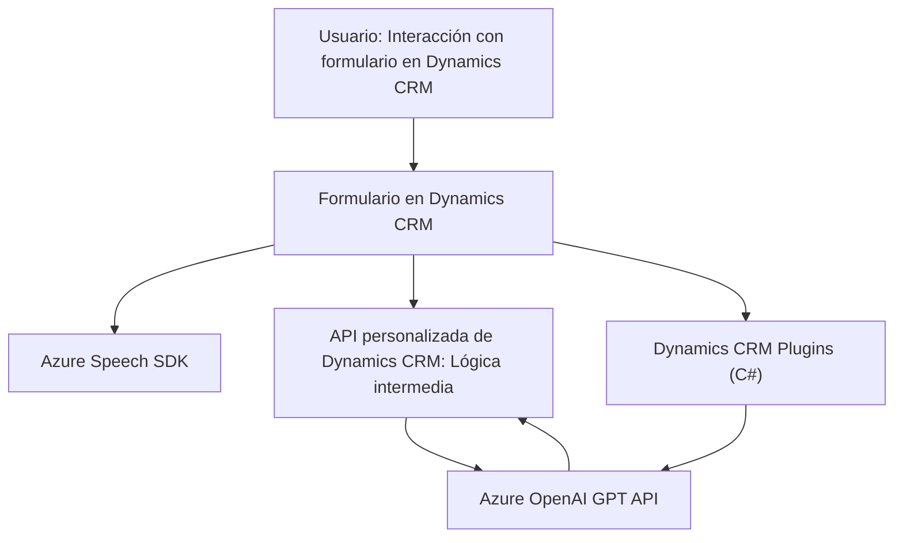

## Breve Resumen Técnico

Los archivos en los tres subdirectorios (`FRONTEND/JS` y `Plugins`) se enfocan en la implementación de una solución integrada basada en procesamiento y síntesis de voz mediante el **Azure Speech SDK** y transformación del texto con **Azure OpenAI GPT**. La solución combina frontend dinámico (JavaScript) y backend extensible (C# plugin en Dynamics CRM).

---

## Descripción de la Arquitectura

### Tipo de Solución
La solución está clasificada como un **aplicativo híbrido** compuesto por:
1. **Frontend**: Scripts en JavaScript para procesamiento de voz y entrada en formularios interactivos (integración en Dynamics CRM).
2. **Backend personalizado**: Plugins en C# que extienden la funcionalidad de Dynamics CRM mediante integración con APIs externas.

### Arquitectura
1. **Frontend**:
   - Modular y dinámico. Los scripts JavaScript están organizados por roles específicos: síntesis de datos del formulario, reconocimiento de voz y mapeo de datos al contexto del formulario.
   - Uso de SDKs externos para la integración API.
   - Patrón observado: **n-capas tradicionales** organizadas en capas de presentación (cliente), lógica (JavaScript) y consumo de datos (Azure Speech SDK).
  
2. **Backend/Plugins**:
   - Implementa la arquitectura típica de un plugin en **Dynamics CRM**, donde la lógica se ejecuta en respuesta a eventos específicos del sistema.
   - Integración con servicios externos mediante funciones RESTful (API de Azure OpenAI GPT).
   - Patrón observado: **Hexagonal**:
     - El plugin actúa como el adaptador entre servicios CRM y funciones externas (Azure OpenAI).
     - Las dependencias están delimitadas claramente por interfaces (`IPlugin`, API clients, etc.).
     - Plugins diseñados con principio de responsabilidad única (SRP).

---

## Tecnologías Usadas

### Frontend:
1. **Lenguaje**: JavaScript.
2. **Frameworks/Bibliotecas**:
   - **Azure Speech SDK**: Para síntesis y reconocimiento de voz.
3. **APIs**:
   - **Dynamics CRM JavaScript API**: `Xrm.WebApi.online.execute()`.
   - Integración con Azure API endpoints.
4. **Patrones**:
   - Modularidad y división de responsabilidades.
   - Loader dinámico para gestionar dependencias externas.

### Backend:
1. **Lenguaje**: C# (para plugins en Dynamics CRM).
2. **Frameworks/Bibliotecas**:
   - **Dynamics CRM SDK (`IPlugin`)**.
   - Cliente Http para integración con **Azure OpenAI GPT**.
   - **Newtonsoft.Json** para la manipulación de datos JSON.
3. **APIs**:
   - **Azure OpenAI GPT API**.
4. **Patrones**:
   - **Hexagonal arquitectura**:
     - Plugin como adaptador entre sistemas internos y externos.
   - Restful API para comunicación externa.
   - SRP en la lógica del plugin.

---

## Dependencias y Componentes Externos
1. **Azure Speech SDK**:
   - Transformación de texto en voz.
   - SDK cargado dinámicamente desde `https://aka.ms/csspeech/jsbrowserpackageraw`.
2. **Azure OpenAI GPT API**:
   - Modelos GPT para procesamiento y transformación avanzada de texto.
3. **Dynamics CRM SDK**:
   - Extensibilidad del backend mediante la interfaz `IPlugin`.
4. **Newtonsoft.Json**:
   - Serialización y manipulación de JSON en el plugin.
5. **System.Net.Http**:
   - Comunicación RESTful con APIs externas.

---

## Diagrama Mermaid

Este diagrama muestra la interacción entre componentes y servicios en el sistema.

---

## Conclusión Final

Este repositorio representa una solución integral que emplea tecnologías modernas para crear una experiencia eficiente y automatizada en la gestión de datos dentro de Dynamics CRM. El uso de **Azure Speech SDK** para voz y **Azure OpenAI GPT** para transformación de texto indica un enfoque hacia la integración de IA y reconocimiento de voz en aplicaciones empresariales. La arquitectura del plugin refleja principios de diseño como SRP y hexagonal, lo que lo convierte en una implementación extensible y modular. Sin embargo, existen áreas de mejora, como en la gestión de credenciales y seguridad, donde se pueden emplear prácticas más robustas usando servicios como **Azure Key Vault**.