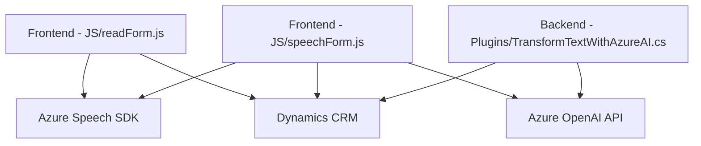

### Breve resumen técnico

El repositorio presenta una estructura centrada en formularios y reconocimiento de voz para la entrada y procesamiento de datos, utilizando el SDK de Azure Speech y Dynamics CRM. Además, se integra con una API basada en servicios de Azure OpenAI para realizar transformaciones de texto avanzadas en un entorno de plugin de Dynamics CRM.

---

### Descripción de arquitectura

La solución parece seguir una arquitectura **n-capas** con integración modular entre frontend y backend. Hay colaboración entre tres capas principales:

1. **Frontend:**
   - Procesadores de formularios y manejo de reconocimiento de voz.
   - Uso de SDK de Azure Speech para entrada de voz y síntesis de texto.
   - Modificación de campos de formularios de Dynamics CRM en tiempo real.

2. **Backend/Plugins:**
   - Plugins que procesan texto utilizando Azure OpenAI, transformando los datos según reglas predefinidas.
   - Centralización de la lógica de transformación en un ambiente que conecta a Dynamics CRM.

3. **Servicios externos:**
   - Integraciones con Dynamics CRM y Azure Speech/OpenAI.

Los componentes están organizados en módulos independientes que interactúan mediante APIs o servicios como Azure y Dynamics, manteniendo cierto desacoplamiento.

### Tecnologías usadas

#### En el Frontend:
- **SDK de Azure Speech**: Interacción de voz (entrada y síntesis).
- **JavaScript**: Procesamiento de datos del DOM y formularios.
- **Dynamics Xrm.WebApi**: API para interacción directa con CRM.

#### En Plugins/Dynamics CRM:
- **Microsoft.Xrm.Sdk**: Para desarrollo de plugins personalizados.
- **Azure OpenAI**: Procesamiento de texto con modelos GPT-4.
- **Bibliotecas JSON (Newtonsoft.Json, System.Text.Json)**: Serialización y transformación de objetos en formato JSON.
- **HTTP (System.Net.Http)**: Comunicación con servicios externos.

### Dependencias o componentes externos presentes
- **Azure Speech SDK**: Reconocimiento y síntesis de voz.
- **Dynamics CRM API**: Procesos relacionados con el manejo de formularios y campos dentro de un entorno CRM.
- **Azure OpenAI (GPT models)**: Generación de respuestas y transformaciones avanzadas.
- **Bibliotecas estándar para plugins (Microsoft Dynamics)**: Presentes en cualquier entorno CRM para manejar extensiones.

---

### Diagrama Mermaid válido para GitHub

---

### Conclusión final

La solución presenta una arquitectura **n-capas** con una fuerte integración hacia un ecosistema de servicios basados en la nube (Azure Speech/OpenAI y Dynamics CRM). La modularidad funcional en el frontend y backend permite tareas específicas, como la entrada de voz, procesamiento de datos con IA, y manejo de formularios CRM en tiempo real. Aunque los componentes están bien separados, el sistema depende de servicios externos en gran medida, centralizando la lógica en estos sistemas.

Si bien el diseño es robusto y aprovecha tecnologías modernas como Azure Speech y OpenAI, la arquitectura podría enfrentar desafíos ante limitaciones de conectividad o cambios en los servicios externos.