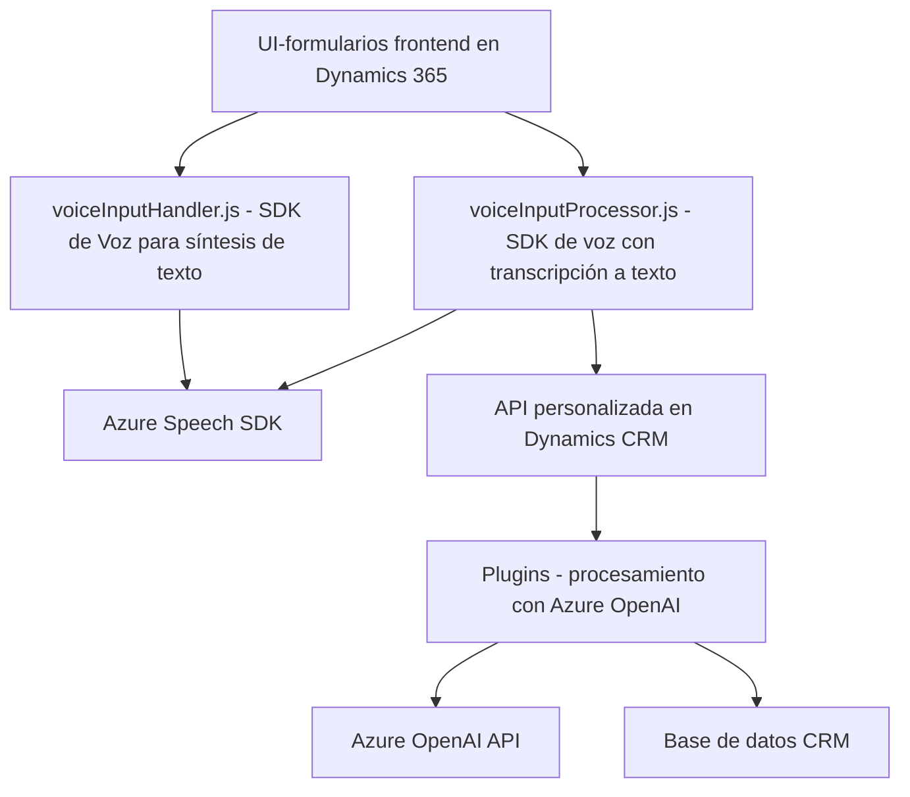

### Breve resumen técnico

Este repositorio contiene varios módulos enfocados en la integración de servicios de voz y procesamiento de texto mediante tecnologías de Microsoft, principalmente **Azure Speech SDK** y **Azure OpenAI API**, con formularios y otras entidades en **Dynamics CRM 365**. Los archivos están organizados en diferentes áreas, incluyendo frontend (JavaScript) y backend (.NET y C#) para ofrecer soporte a estas integraciones.

### Descripción de arquitectura

La arquitectura del sistema parece ser híbrida:

1. **N Capas:** El diseño del sistema combina una capa de frontend (interacción en el navegador) y una capa backend (plugins y extensiones en Dynamics CRM).
2. **Basada en servicios:** Utiliza activamente API externas, específicamente **Azure Speech SDK** y **Azure OpenAI API**, en un modelo de integración basado en eventos.
3. **Plugin en Dynamics CRM:** Se utiliza un plugin personalizado para manejar solicitudes del entorno CRM directamente desde la backend.
4. **Event-driven:** Los módulos del frontend operan bajo eventos generados por la interacción con el usuario o la carga dinámica de recursos como el Azure SDK.

### Tecnologías usadas

1. **Frameworks y SDKs**:
   - **Azure Speech SDK** (texto a voz y reconocimiento del habla).
   - **Dynamics CRM SDK** (extensiones y plugins de Dynamics 365).
   - **Azure OpenAI API** (procesamiento avanzado de texto con IA).
   - **Newtonsoft.Json** y **System.Text.Json** (serialización/deserialización JSON).
   - **Xrm.WebApi** (para interactuar con APIs personalizadas en Dynamics CRM).

2. **Patrones Arquitectónicos**:
   - **Modularidad:** Separación de lógica en funciones aisladas por dominio (como lectura de formularios, síntesis de texto, y transcripción).
   - **Event-driven programming:** Uso de eventos y callbacks tanto en frontend como en backend.
   - **Service integration:** Un consumo notable de APIs externas, siguiendo el patrón de servicio desacoplado.
   - **Helper methods:** Métodos secundarios bien definidos para realizar transformaciones de datos y operaciones específicas.

### Dependencias/Componentes externos

1. **Azure Speech SDK:** Necesario para funciones de síntesis y reconocimiento de voz en la capa frontend.
2. **Azure OpenAI API:** Utilizado en el backend para procesamiento basado en IA.
3. **Dynamics 365 SDK:** Extiende la funcionalidad del CRM mediante plugins y conexiones a entidades internas.
4. **Dependencias de JavaScript en el frontend:** Interacción con formularios y carga dinámica de scripts vía URL.
5. **HTTP libraries:** Librerías en C# como `System.Net.Http` se emplean para consumir la API de OpenAI.

### Diagrama Mermaid válido para GitHub

### Conclusión final

Este sistema utiliza una arquitectura híbrida basada en N capas y servicios integrados donde la lógica del frontend y el backend interactúan activamente dentro del ecosistema **Dynamics CRM** y se expanden mediante **Azure** y su oferta de servicios cognitvos y de IA. Esta arquitectura es adecuada para escenarios donde se busque implementar funcionalidad avanzada como el reconocimiento de voz y procesamiento de texto con modelos de lenguaje natural.