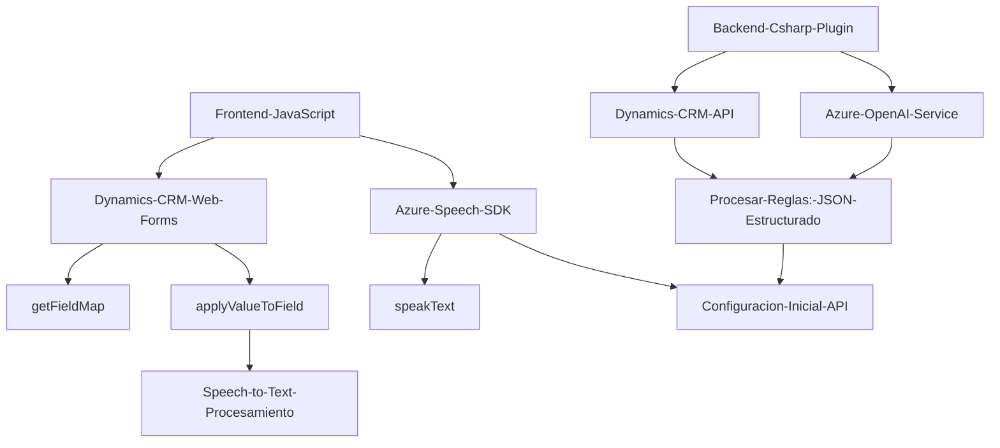

**Breve resumen técnico:**
El repositorio incluye implementaciones relacionadas con la accesibilidad y el procesamiento de entrada/salida en formularios de Dynamics CRM mediante voz, junto con un plugin que utiliza el servicio Azure OpenAI para transformar texto. La solución integra APIs externas (como Azure Speech SDK y Azure OpenAI) y utiliza patrones de arquitectura orientados a la modularidad y a servicios externos.

---

### Descripción de arquitectura:
1. **Tipo de solución:** Una aplicación híbrida que combina un backend para ejecución de plugins y un frontend para interacción de usuarios, con integración basada en APIs externas.
2. **Arquitectura:** El diseño general sigue una arquitectura de tipo **n capas**, con interacción entre capas de presentación (frontend), lógica de negocio (plugins y clases de CRM), y servicios externos (Azure Speech SDK y OpenAI).
3. Uso de **servicios distribuidos** y patrón **SOA** (Service-Oriented Architecture) por la integración con Azure APIs.
4. **Componentización modular:** Cada archivo realiza tareas específicas, con clara delimitación entre frontend (JS) y backend (.NET).

---

### Tecnologías usadas:
1. **Frontend:**
   - **Lenguaje:** JavaScript.
   - **Framework/SDK:** Azure Speech SDK (accesibilidad mediante voz).
   - **Dominio de plataforma:** Dynamics CRM Web Forms.
   - Patrones utilizados:
     - Modularidad procedimental.
     - Carga dinámica de dependencias (SDK) para eficiencia.

2. **Backend:**
   - **Lenguaje:** C# (.NET Framework).
   - **Framework:** Dynamics CRM Plugin SDK.
   - **Integración API:** Azure OpenAI Service.
   - Patrones utilizados:
     - Plugin (modularidad de CRM).
     - Cliente-servidor (comunicación con APIs).

3. **Dependencias externas:**
   - Azure Speech SDK.
   - Azure OpenAI API.
   - Dynamics CRM Web API para manipulación interactiva de formularios.
   - Librerías auxiliares como Newtonsoft.Json y System.Net.Http.

---

### Diagrama Mermaid válido para GitHub:

---

### Conclusión final:
El repositorio combina un frontend con JavaScript para mejorar la accesibilidad vía voz mediante Azure Speech SDK y un backend basado en C# que comunica Dynamics CRM con servicios de IA de Azure OpenAI, formando una solución híbrida con integración en n capas. Está fuertemente basado en tecnologías de Microsoft y en APIs destinadas a interactuar con servicios en la nube, optimizando el flujo de trabajo de usuarios en contextos empresariales. Ideal para escenarios centrados en accesibilidad, automatización, y CRM.