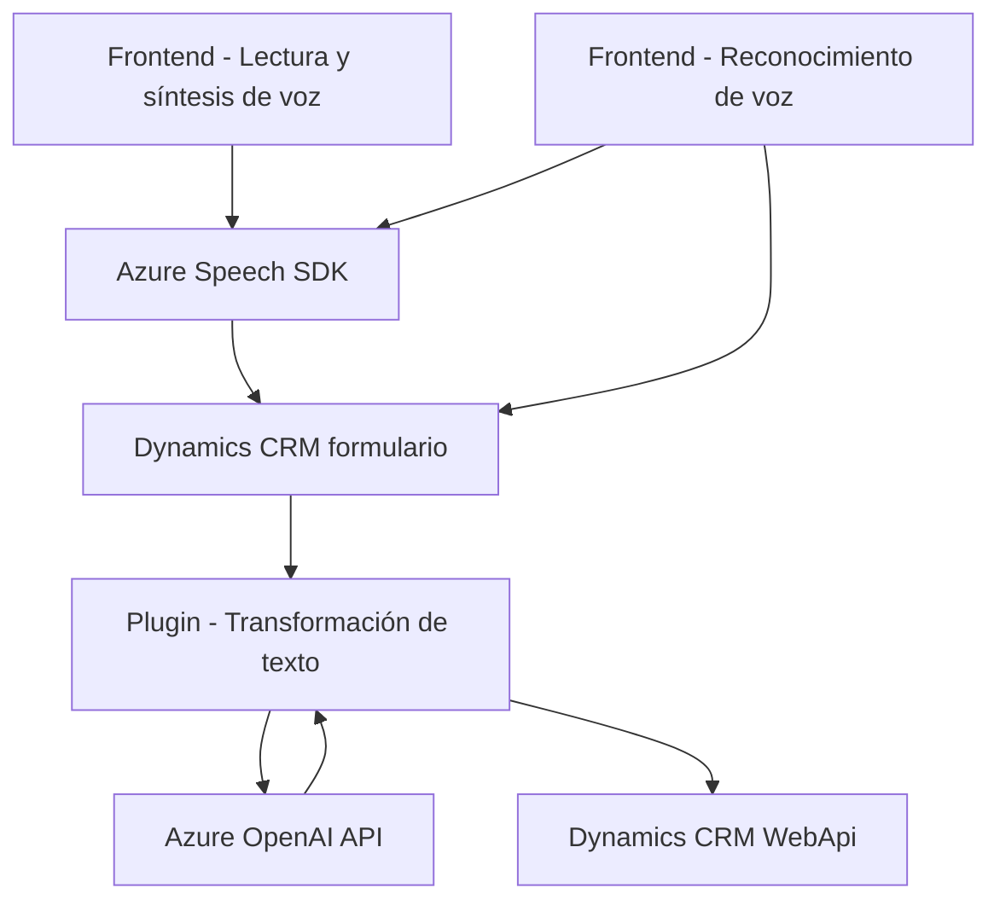

### Breve resumen técnico

El repositorio muestra una solución distribuida que combina frontend en JavaScript y plugins en C# para Microsoft Dynamics CRM, integrando servicios externos de Azure Speech SDK y Azure OpenAI API. Se enfoca en proporcionar interacción por voz y texto mediante transformación avanzada de datos, todo centralizado en formularios de Dynamics 365.

---

### Descripción de arquitectura

La arquitectura sigue un estilo modular, con una segmentación clara entre frontend y backend:
1. **Frontend:**
   - El frontend gestiona ambos la síntesis de voz (lectura de formularios) y el reconocimiento de voz (grabación por usuario).
   - Usa Azure Speech SDK para interactuar con datos en tiempo real.
   
2. **Backend (Plugins en Dynamics CRM):**
   - Define transformaciones avanzadas de texto vía Azure OpenAI API.
   - Usa un modelo **n-capas**, donde las capas incluyen la presentación (formularios de Dynamics), la lógica de negocio (plugins en C#), y el acceso a servicios externos (Azure).

3. **Integración con SDKs:**
   - El código combina patrones de integración cliente-servidor, aprovechando SDKs externos (Azure Speech SDK y Dynamics Web API).

---

### Tecnologías usadas

1. **Frontend:**
   - **Lenguaje:** JavaScript.
   - **Frameworks/librerías:** Azure Speech SDK.
   - **Plataforma:** Microsoft Dynamics 365 CRM (estructura de formularios).

2. **Backend:**
   - **Lenguaje:** C#.
   - **Frameworks/librerías:** 
       - Dynamics 365 SDK (Microsoft.Xrm.Sdk para plugin).
       - Newtonsoft.Json para manipulación JSON.
       - Azure OpenAI API con REST para IA y transformación de texto.
       - ASP.NET patrones básicos (HTTPClient para integración con APIs).

3. **Dependencias externas:**
   - **Azure Speech SDK:** Para reconocimiento y síntesis de voz.
   - **Azure OpenAI API:** Para transformación avanzada de texto.

---

### Diagrama Mermaid

---

### Conclusión final

La solución presenta una integración robusta entre frontend (JavaScript) y backend (C# en Dynamics 365 CRM), utilizando arquitecturas distribuidas. En el frontend, se gestionan interacciones por voz con Azure Speech SDK mientras que en el backend las funcionalidades de transformación de texto aprovechan Azure OpenAI API, siguiendo un enfoque n-capas. Esta configuración es ideal para sistemas empresariales donde la automatización y las interfaces dinámicas enriquecen el flujo de usuario.