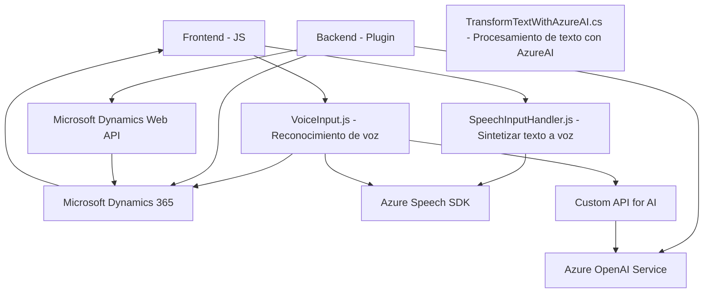

### Breve resumen técnico
Este repositorio contiene múltiples componentes interconectados que implementan funcionalidades relacionadas con el reconocimiento y síntesis de voz, así como la ejecución de lógica basada en inteligencia artificial mediante Azure AI para trabajar con formularios en Microsoft Dynamics CRM. Los archivos están divididos en dos componentes principales: un frontend que gestiona la entrada y salida de voz, y un plugin backend en el entorno de Dynamics CRM que interactúa con Azure OpenAI para procesamiento avanzado.

---

### Descripción de arquitectura
1. **Tipo de solución:** La solución se corresponde con una arquitectura híbrida orientada a servicios, combinando dos elementos principales:
   - **Frontend basado en JavaScript:** Proporciona funcionalidades de entrada y salida de voz para formularios en Microsoft Dynamics 365 utilizando **Azure Speech SDK**.
   - **Plugin para Dynamics CRM:** Realiza operaciones de backend que extienden la funcionalidad de Dynamics mediante el uso de **Azure OpenAI Service**.

2. **Arquitectura aplicada:**
   - **Modelo de N Capas:**
     - Capa de presentación: Representada por los archivos frontend que se integran directamente en los formularios dinámicos de Dynamics 365 y gestionan la voz y su procesamiento. 
     - Capa lógica: Representada por las APIs y métodos que procesan los datos en el backend de Dynamics CRM con Azure AI.
     - Capa de integración: Comunicación del plugin con el servicio externo Azure OpenAI para generación de contenido en formato JSON.
   - **Plug-in Architecture:** Se implementa un patrón de plugin específico para la ejecución de labores en el contexto del CRM a través de `IPlugin`.
   - **Integración con Microservicios:** Uso de SDKs proporcionados por Azure para el reconocimiento y síntesis de voz, así como interacción directa con el servicio Azure OpenAI y APIs personalizadas.

---

### Tecnologías usadas
#### **Frontend**
- **JavaScript**: Para la manipulación del DOM y lógica aplicativa.
- **Azure Speech SDK**: SDK para servicios de síntesis y reconocimiento de voz.
- **Microsoft Dynamics 365 Web API**: Para la interconexión con el sistema de CRM y captura/modificación de datos de formularios.

#### **Backend (Plugin)**
- **C#:**
  - Implementación del *plugin* bajo la interfaz `IPlugin`.
  - Gestión de entidades y datos del contexto CRM mediante `Microsoft.Xrm.Sdk`.
- **Newtonsoft.Json**: Para la manipulación de JSON.
- **System.Net.Http**: Para manejar solicitudes HTTP al servicio Azure OpenAI.
- **Azure OpenAI Service**: Servicio GPT para inteligencia artificial y procesamiento del lenguaje.

---

### Diagrama Mermaid válido para GitHub Markdown

---

### Conclusión final
Este repositorio muestra una solución integrada para mejorar la interacción de los usuarios con formularios en Microsoft Dynamics CRM, utilizando tecnologías como JavaScript en el frontend y plugins en C# en el backend, con integración con servicios de **Azure Speech SDK** y **Azure OpenAI Service**. La arquitectura sigue un enfoque híbrido de **N capas**, donde cada capa tiene roles claramente definidos, y sus funciones están organizadas siguiendo principios como **modularización**, **event-driven pattern**, y **delegación**, mientras aprovecha servicios en la nube para operaciones avanzadas con IA. 

Implementaciones como esta son altamente escalables, adaptables a diferentes necesidades de negocio, y están bien alineadas con las mejores prácticas en desarrollo CRM y soluciones empresariales modernas.