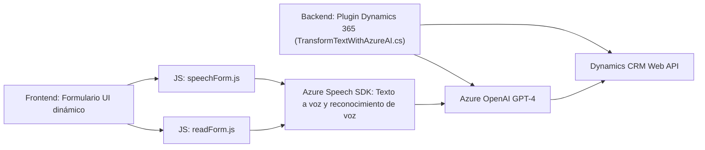

### Análisis técnico del repositorio

#### 1. Tipo de solución
Este repositorio define una solución híbrida que integra varios componentes:
- **Frontend dinámico**: Archivos JavaScript (`readForm.js`, `speechForm.js`) que manejan interacción directa en el cliente y servicios Cloud como Azure Speech SDK.
- **Backend plugin**: Implementación de lógica en el servidor mediante plugins personalizados (`TransformTextWithAzureAI.cs`) para Dynamics CRM.
- **Integración con servicios Cloud**: Uso de Azure Speech SDK y OpenAI GPT-4.

#### 2. Tecnologías, frameworks y patrones usados
- **Frontend**:
  - **Tecnología**: JavaScript, integrado con dynamics 365 como framework frontend interactivo.
  - **Frameworks/librerías externas**:
    - Azure Speech SDK para síntesis de voz y reconocimiento del habla.
    - APIs de Dynamics 365 (`Xrm.WebApi`) para manipulación de datos contextuales.

- **Backend**:
  - **Tecnología**: .NET Framework/C#.
  - **Framework/Dependency**:
    - Dynamics CRM SDK (Microsoft.Xrm.Sdk) para manejar plugins relacionados con CRM.
    - Azure OpenAI para procesamiento de texto en servicios REST.
    - Uso de librerías JSON (`Newtonsoft.Json`, `System.Text.Json`) para estructuración.

- **Patrones detectados**:
  - **Delegación basada en eventos** en el cliente.
  - **Integración de servicios externos**: conexión con servicios Azure mediante SDK.
  - **API Proxy Pattern**: en el servidor, el plugin actúa como proxy hacia Azure OpenAI.
  - **Plugin-Based Architecture** en Dynamics CRM para manejo modular.

#### 3. Tipo de arquitectura
La arquitectura es **híbrida**, combinando:
- **Frontend n capas** en el cliente (manipulación del formulario y eventos contextuales).
- **Backend basado en plugins** (Dynamics CRM) para lógica comercial y de integración.
- **Servicios distribuidos** mediante conexiones directas a Azure Speech SDK y OpenAI.

En su conjunto, adopta elementos de una arquitectura de **microservicios**, en donde cada módulo interactúa con APIs Cloud específicas para realizar tareas críticas.

#### 4. Dependencias o componentes externos
- **Azure Speech SDK**: Para síntesis y reconocimiento de voz.
- **Dynamics 365 Web API**: Comunicación entre ámbitos de formularios y datos contextuales.
- **Azure OpenAI GPT-4**: Para procesamiento sintáctico avanzado.
- **Librerías JSON**: Manejo de estructuras JSON necesarias para interactuar con servicios REST.
- **HTTP Client (System.Net.Http)**: Para solicitudes REST en el plugin.

---

### Diagrama Mermaid

---

### Conclusión final
La solución representa una arquitectura modular altamente integrada entre frontend y backend, con una fuerte dependencia en servicios Cloud como Azure Speech SDK y OpenAI GPT-4. Está diseñada para optimizar interacciones dinámicas en formularios basados en Dynamics CRM, con funcionalidades avanzadas que incluyen transcripción de voz en tiempo real y procesamiento semántico con IA. Aunque es eficiente para el caso de uso específico, sigue siendo dependiente de herramientas externas como Azure y Dynamics, lo que puede generar desafíos si el entorno se modifica.