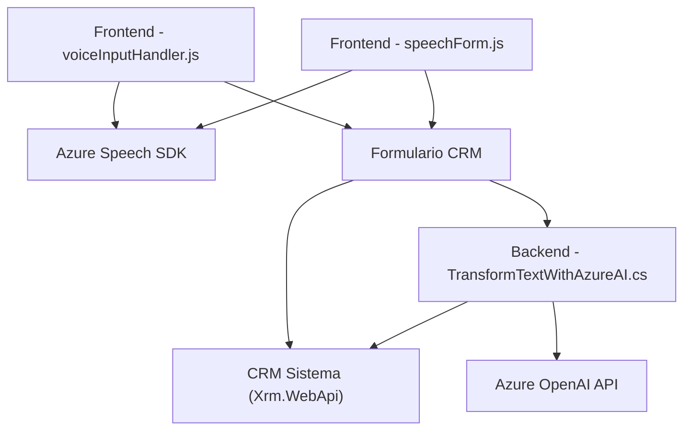

### Breve resumen técnico
El repositorio parece ser parte de un sistema CRM (Customer Relationship Management) que integra capacidades de reconocimiento/síntesis de voz y transformación de texto mediante servicios de Azure. Está estructurado en componentes para manejar la entrada vocal del usuario, actualizar campos en formularios de CRM y realizar transformaciones de texto enriquecido con Inteligencia Artificial (Azure OpenAI). 

### Descripción de arquitectura
Se implementa una **arquitectura de componentes n-capas**:
1. **Frontend (JavaScript)**: 
   - `voiceInputHandler.js` y `speechForm.js` gestionan integración del formulario CRM junto a Azure Speech SDK, facilitando entrada/salida de datos por voz y procesamiento en tiempo real.
2. **Backend (Plugin en C#)**: `TransformTextWithAzureAI.cs` actúa como un plugin para Dynamics CRM, transformando texto mediante el API de Azure OpenAI para generar datos JSON procesables en el sistema.
3. **Servicios Externos**: Cada capa interactúa con servicios en la nube de Azure (Azure Speech SDK y Azure OpenAI).

La arquitectura es de **n-capas**, ya que las responsabilidades están divididas entre:
- La presentación (frontend).
- Procesamiento de datos dinámicos (backend plugin).
- Integración con servicios externos mediante APIs.

### Tecnologías usadas
1. **Frontend**:
   - **JavaScript**: Lenguaje base para el procesamiento y actualización del CRM.
   - **Azure Speech SDK**: Reconocimiento y síntesis de voz.
   - **Xrm API**: Interacción directa con el contexto del formulario del CRM.
2. **Backend**:
   - **C# (Dynamics CRM Plugin)**: Lógica de transformación y procesamiento de texto.
   - **Azure OpenAI API**: Transformación avanzada de texto con IA.
   - **System.Net.Http**, **Newtonsoft.Json**: Llamadas HTTP y manipulación de JSON.
3. **Servicios Integrados**:
   - Azure Speech SDK.
   - Azure OpenAI para IA y procesamiento avanzado.

### Diagrama Mermaid (válido para GitHub Markdown)
El siguiente diagrama ilustra los puntos de integración y flujo entre los componentes:

### Conclusión final
El repositorio implementa un **flujo funcional orientado al usuario y servicios integrados** para una solución de CRM robusta. Su arquitectura basada en componentes y separada por capas utiliza servicios de Azure (Speech SDK y OpenAI) para sintetizar y transformar datos en tiempo real. Aunque cumple correctamente con patrones de modularidad y asincronía, los componentes están fuertemente acoplados a Azure y Dynamics CRM, lo que podría limitar la portabilidad hacia otros entornos.