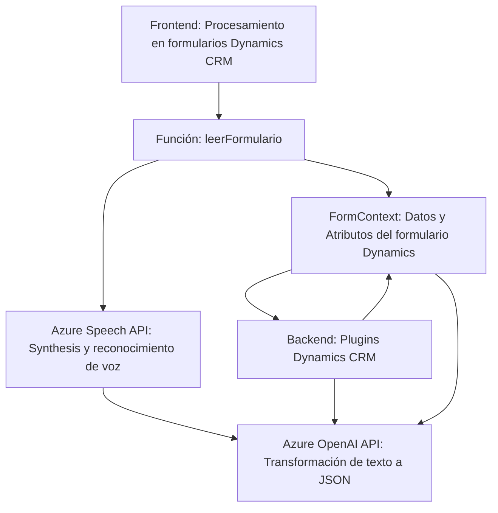

### Breve resumen técnico
Este repositorio implementa una solución integrada que combina funcionalidades de reconocimiento de voz, síntesis de texto en voz, y transformación de datos en un entorno de Microsoft Dynamics CRM. Utiliza servicios externos como Azure Speech SDK y Azure OpenAI para realizar tareas de inteligencia artificial incorporadas en formularios del CRM.

---

### Descripción de arquitectura
La arquitectura detectada es una combinación de **arquitectura de n-capas** y dependencia hacia **servicios externos** como Azure para ejecutar tareas críticas. Las capas principales identificadas son:
1. **Frontend**: Manejo de datos del formulario y síntesis de texto a voz mediante Azure Speech SDK.
2. **Backend Plugins** (Dynamics CRM Plugins): Procesamiento de datos mediante Azure OpenAI y aplicación lógica sobre los datos del usuario.
3. **Servicios externos**: Reconocimiento de voz y transformaciones alimentadas por APIs de Azure.

El sistema opera en una arquitectura orientada a eventos y servicios, donde se delegan las funcionalidades principales a APIs de Azure mientras que la capa CRM actúa como una orquestadora de datos y lógica.

---

### Tecnologías usadas
1. **JavaScript**:
   - Módulos **Azure Speech SDK** integrados dinámicamente para la síntesis de voz y reconocimiento de audio.
   - Manipulación de DOM y contexto de CRM para vincular datos del usuario con el procesamiento de eventos.
   - Uso de funciones como Promises para flujos asíncronos.

2. **C# (Dynamics CRM Plugins)**:
   - Framework .NET para la implementación de plugins.
   - Librerías de Dynamics CRM SDK para la interacción directa con entidades, consultas y contexto organizativo.
   - Integración con Azure OpenAI para transformar texto mediante modelos GPT.

3. **Azure**:
   - **Azure Speech API**: Para reconocimiento de voz y síntesis de texto.
   - **Azure OpenAI**: Para procesamiento avanzado de texto con normas estructuradas.

4. **Patrones detectados**:
   - **Modularidad**: Código segmentado por funcionalidades específicas (lectura, síntesis, procesamiento).
   - **Delegación**: Funciones delegan tareas específicas, como cargar SDKs dinámicos o procesar datos con APIs externas.
   - **Integración con APIs externas**: Parte significativa de la lógica depende de servicios externos de inteligencia artificial.

---

### Diagrama en Mermaid (estructura simplificada de interacción)

---

### Conclusión final
El repositorio describe un sistema bien diseñado desde el punto de vista técnico, aunque tiene dependencias notables en servicios externos (Azure) para cumplir con las funciones de síntesis de voz y transformación. Esta solución ofrece escalabilidad y flexibilidad al basarse en APIs, pero la dependencia en conexiones externas eleva la importancia de manejar errores y asegurar la disponibilidad.

**Recomendación:** Implementar pruebas completas de integración para verificar la sincronización entre servicios Azure y CRM en tiempo real. También es crucial garantizar niveles adecuados de seguridad para las claves API y los datos sensibles procesados.