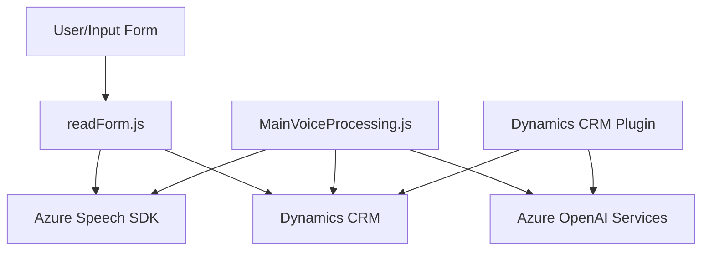

### Breve resumen técnico:

El repositorio se compone de un conjunto de archivos que implementan funcionalidades relacionadas con el procesamiento de datos y la integración de plataformas en un sistema Dynamics CRM. Los archivos están organizados para gestionar entrada y salida por voz, manipulación de datos mediante APIs externas (Azure Speech SDK y OpenAI) e interacción directa con sistemas CRM mediante plugins. Está diseñado principalmente como una solución de integración que extiende la funcionalidad nativa del CRM.

---

### Descripción de la arquitectura:

La arquitectura de la solución puede describirse como **modular, basada en capas**, con elementos de interacción en tiempo real y procesamiento mediante servicios externos. Los principales aspectos incluyen:

1. **Frontend (Javascript)**: 
   - Captura de datos desde formularios y manejo de voz (lectura y grabación).
   - Comunicación con las APIs externas y el CRM a través del navegador.

2. **Backend/Plugin CRM (C#)**:
   - Extiende funcionalidad del CRM con lógica específica mediante plugins.
   - Conexión con servicios externos (Azure OpenAI) usando REST API.

3. **Procesos externos**:
   - Azure Speech SDK: Procesamiento de voz (síntesis y reconocimiento).
   - Azure OpenAI Services: Generación y transformación de datos usando inteligencia artificial.

---

### Tecnologías usadas:

1. **Frontend (Javascript):**
   - **Azure Speech SDK**: Para integrar funciones avanzadas de voz (lectura y reconocimiento).
   - **Dynamics CRM JavaScript API (`Xrm.WebApi`)**: Interacción directa con los formularios y datos del CRM.
   - **Modularidad en funciones**: Organización de la lógica en funciones individuales.

2. **Backend (C#):**
   - **Microsoft.Xrm.Sdk**: Framework de desarrollo/plugin para Dynamics CRM.
   - **HttpClient**: Para consumo de APIs externas, como Azure OpenAI.
   - **Azure OpenAI Services**: Automatización con inteligencia artificial.
   - **System.Text.Json** / `Newtonsoft.Json`: Manejo de datos en formato JSON.

3. **Patrones usados:**
   - **Facade**: Encapsulación de procesos complejos (e.g., `startVoiceInput` en JavaScript o `Execute` en el plugin).
   - **Dependencia dinámica**: Uso condicional de recursos (carga dinámica de SDK en el cliente).
   - **Modularidad y separación de responsabilidades**: Distribución clara de funciones específicas.

---

### Diagrama **Mermaid**:

---

### Conclusión final:

El repositorio presenta una solución modular para interactuar con Dynamics CRM mediante el procesamiento de voz y texto. La arquitectura consta de una integración estrecha entre un frontend en JavaScript, un backend en C#, y servicios externos como Azure AI y Speech SDK. El diseño favorece la extensibilidad y adaptabilidad gracias a patrones como Facade y modularidad. A pesar de su robustez, la seguridad en la gestión de credenciales (Azure API Keys) y un manejo de errores más exhaustivo podrían mejorar la calidad de la solución.