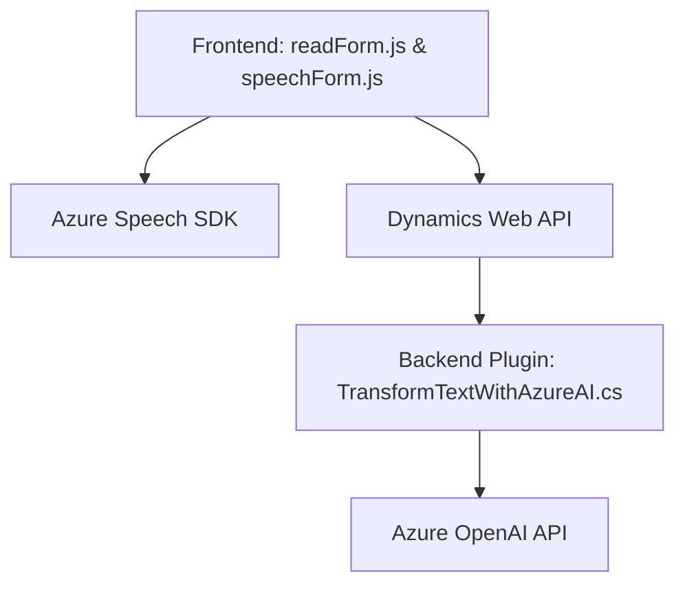

### Breve resumen técnico:
El conjunto de archivos y estructura sugiere una solución orientada a la integración de reconocimiento de voz, procesamiento dinámico de formularios, transformación de textos con IA (Azure OpenAI) y uso de Dynamics 365. La solución está integrada tanto a nivel frontend (funcionalidades de voz) como backend (plugins en CRM).

---

### Descripción de arquitectura:
1. **Tipo de solución**:
   - Una **aplicación híbrida** que combina frontend (JavaScript) y backend (C#) para la interacción dinámica con formularios y la integración de IA.
   - **Front-end**: Funcionalidades que conectan con Azure Speech SDK para reconocimiento y síntesis de voz, configurado para ser usado en contextos de formulario.
   - **Back-end**: Un plugin que ejecuta procesos de transformación de texto vía Azure OpenAI, orientado a interacciones específicas con Dynamics CRM.

2. **Tipo de arquitectura**:
   - **Multicapa (n-capas)**:
     - **Capa cliente (frontend)**: Interacción y captura de datos mediante voz.
     - **Capa lógica**: Procesamiento dinámico de datos vía APIs externas (Azure Speech y OpenAI).
     - **Capa servidor (Dynamics CRM plugin)**: Transformación y estructuración de datos enviados desde el cliente.

---

### Tecnologías usadas:
- **Frontend**:
  - **JavaScript** para lógica del cliente y manipulación del DOM.
  - **Azure Speech SDK** para reconocimiento y síntesis de voz.
  - **Dynamics 365 Web API** para manipulación de formularios dinámicos (funciones como `Xrm.WebApi.online`).
- **Backend**:
  - **C#** para desarrollo del plugin en Dynamics CRM.
  - **Azure OpenAI API** para transformación de texto.
  - **HttpClient** (C#) para comunicación vía API REST.
- **Patrones de diseño**:
  - **Modularización**: Separación de funcionalidades en funciones y clases específicas.
  - **Delegación**: Uso de callbacks y eventos para interacción con SDKs.
  - **Plugin Architecture**: El backend está diseñado como un plugin de Dynamics CRM que se dispara según eventos asociados a formularios o registros.
  - **Event-driven**: Procesos del frontend desencadenados por eventos como el reconocimiento de voz.

---

### Dependencias o componentes externos:
1. **Azure Speech SDK**: Utilizado en los archivos `readForm.js` y `speechForm.js` para reconocimiento/síntesis de voz.
2. **Dynamics 365 Web API**:
   - Manipulación de datos de formularios (contexto del cliente).
   - Integración backend mediante el contexto del plugin (`IPlugin`).
3. **Azure OpenAI API**:
   - Transformación avanzada de texto basada en IA, ya sea para generar JSON o realizar procesamiento inteligente.
4. **Frontend Context**:
   - Dependencia de elementos de formularios dinámicos dentro de Dynamics CRM.

---

### Diagrama Mermaid válido para GitHub:

---

### Conclusión final:
La solución representa una integración de voice-first frontend y backend inteligente para formularios dinámicos dentro de un ecosistema empresarial (Dynamics 365). Utiliza tecnologías de reconocimiento de voz y procesamiento de texto avanzado con Azure, lo que sugiere una arquitectura orientada al uso de SDKs y servicios en la nube. 

Aunque la solución es modular y de múltiples capas, la presencia de dependencias directas (como claves API embebidas) podría necesitar revisiones de seguridad y mejores prácticas para desarrollar una solución más robusta y extensible.