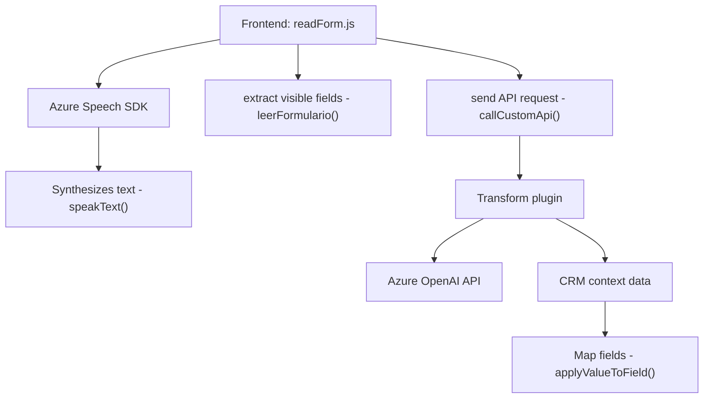

### Breve resumen técnico

El repositorio parece estar relacionado con un sistema CRM (probablemente Dynamics CRM) que integra Azure Speech y Azure OpenAI API para manejar entrada de voz y procesamiento de datos formateados. Incluye un **frontend** para capturar y sintetizar voz, transformar texto según reglas predefinidas, e interactuar con formularios dinámicos, mientras que en el **backend** se utiliza un plugin que realiza transformaciones de texto mediante integración con Azure OpenAI API.

---

### Descripción de arquitectura

#### Tipo de solución
Es una solución **híbrida frontend-backend asociada a un sistema CRM**. El **frontend** permite la interacción en tiempo real con el usuario, mientras que el **backend** maneja la ejecución de reglas en el contexto del CRM.

#### Arquitectura
La arquitectura observada presenta características **de n capas**:
- **Frontend**: Incluye lógica para capturar entrada de voz en tiempo de ejecución utilizando Azure Speech, procesar datos y presentarlos en un formulario.
- **Backend**: Estructura basada en **plugin** dentro del CRM, con procesamiento de texto basado en reglas predefinidas usando Azure OpenAI API.

---

### Tecnologías usadas
1. **Frontend**:
   - **Azure Speech SDK** (para entrada/salida de voz).
   - **JavaScript** para modularidad y lógica de negocio.
   - **Dynamics CRM**: Lógica asociada al contexto del formulario (API `Xrm.WebApi`).

2. **Backend**:
   - **Dynamics CRM SDK**: Utilizado para la creación de plugins con la interfaz `IPlugin`.
   - **Azure OpenAI API**: Se utiliza para procesamiento de texto avanzado.
   - **C#**: Lenguaje principal para manejo del plugin.
   - **System.Net.Http / Newtonsoft.Json**: Para realización de peticiones a APIs y manipulación de objetos JSON.

#### Patrones empleados
- Modularidad (Frontend en funciones independientes).
- Plugin-based Architecture (Backend estructurado en eventos CRM).
- Integración dinámica con servicios externos (SDKs y APIs externas).
- Procesamiento asincrónico en varias operaciones (promesas en JS y peticiones HTTP).

---

### Dependencias o componentes externos
1. **Azure Speech SDK**: Para captura y síntesis de voz.
2. **Azure OpenAI API**: Procesamiento de lenguaje natural.
3. **Microsoft Dynamics CRM SDK**: Manejo de datos asociados al CRM.
4. **Xrm.WebApi**: Interfaz para solicitudes asincrónicas al CRM.
5. **System.Text.Json / Newtonsoft.Json**: Serialización y manipulación de JSON.
6. **HttpClient**: Para realizar peticiones a APIs externas.

---

### Diagrama Mermaid

---

### Conclusión final

El repositorio implementa una solución híbrida que combina un **frontend basado en JavaScript** y un **backend configurado como plugin en Dynamics CRM**. La solución utiliza tecnologías de Azure (Speech SDK y OpenAI API) para enriquecer la interacción con el usuario en un sistema CRM mediante entrada de voz.

El diseño modular en funciones independientes para el frontend y la arquitectura basada en **eventos de CRM plugin** en el backend permiten una integración eficiente con servicios externos mientras mantienen una lógica ordenada por capas.

La arquitectura cumple con los principios de modularidad y extensibilidad, aunque algunos aspectos como la seguridad del API Key en el backend podrían optimizarse para mejorar robustez y escalabilidad.