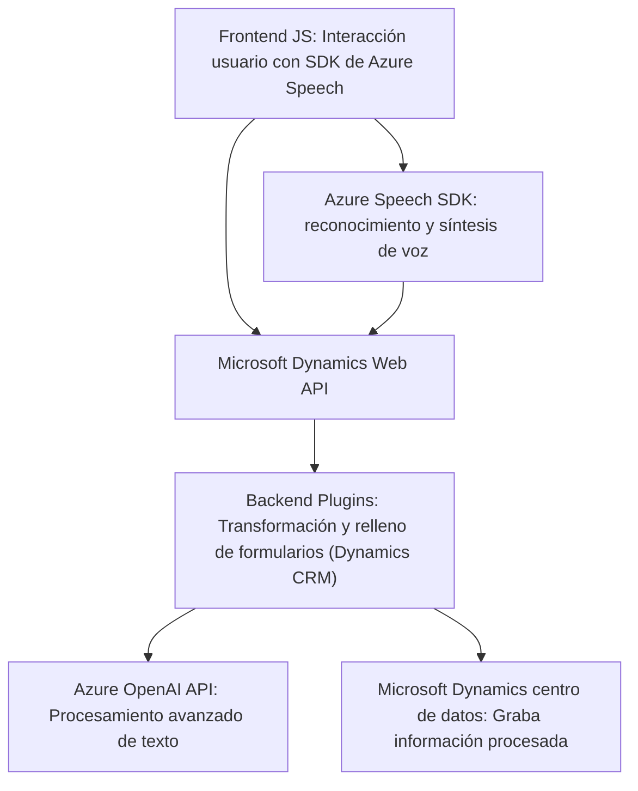

## Breve resumen técnico

El repositorio parece estar centrado en automatizar procesos relacionados con la interacción entre formularios de Microsoft Dynamics 365 y servicios avanzados de procesamiento de voz y texto proporcionados por **Azure Speech SDK** y **Azure OpenAI**.

Se han identificado tres principales módulos:
1. **Frontend**: Procesamiento directo en el navegador con el SDK de Azure Speech, gestionando síntesis y reconocimiento de voz.
2. **Integración Dynamics vía API**: Relleno automático de formularios y manipulación de datos en Microsoft Dynamics 365.
3. **Plugin Dynamics CRM**: Uso de un Plugin de Dynamics CRM que interactúa con Azure OpenAI para realizar transformaciones avanzadas de texto.

---

### Descripción de arquitectura

La arquitectura observada es un sistema **híbrido integrador** compuesto por los siguientes elementos:
1. **Frontend acoplado al navegador**:
   - Scripts JavaScript que extienden la funcionalidad de Dynamics 365 a través de SDKs de Azure para interacción con voz y procesamiento de entrada.
   
2. **Plugins de Dynamics 365**:
   - Proporcionan lógica extendida dentro de la plataforma CRM.
   - Siguen el patrón de **local plugin architecture**, utilizando dependencias nativas del runtime de Dynamics CRM.

3. **Dependencias externas hacia Azure**:
   - Integración con Azure Speech y Azure OpenAI para procesar datos (voz -> texto, texto -> JSON).

Aunque el sistema no es completamente desacoplado, los elementos individuales de integración (plugin, frontend y APIs externas) permiten cierta separación de responsabilidades.

---

### Tecnologías usadas

1. **Frontend**:
   - JavaScript.
   - Azure Speech SDK: Reconocimiento y síntesis de voz.
   - Microsoft Dynamics Web API (`Xrm.WebApi`): Manipulación directa del contexto de formularios.

2. **Backend (Plugins)**:
   - C# bajo .NET Framework.
   - Microsoft Dynamics SDK.
   - Azure OpenAI API: Transformación de texto.

3. **Patrones de diseño**:
   - Modularización funcional (frontend).
   - Callback asíncrono para carga dinámica de SDKs.
   - Patrón de plugin extendido para Dynamics CRM.
   - Uso del patrón cliente-servidor REST para integraciones con servicios en la nube.

---

### Dependencias o componentes externos

1. **Azure Speech SDK**: Utilizado tanto para síntesis como para reconocimiento de voz. Descargado dinámicamente en el frontend desde el navegador.
2. **Azure OpenAI API**: Procesamiento basado en IA (transformación de texto).
3. **Microsoft Dynamics Web API**: Manipulación de formularios y comunicación con entidades del CRM.
4. **Otros paquetes utilizados en el plugin**:
   - `Newtonsoft.Json.Linq`.
   - `System.Text.Json`.
   - `System.Net.Http`.

---

### Diagrama Mermaid válido para GitHub

---

### Conclusión final

El sistema observado está diseñado como una extensión de Microsoft Dynamics 365, con capacidad de interactuar dinámicamente con servicios en la nube (Azure Speech SDK y Azure OpenAI) para realizar tareas automatizadas como reconocimiento de voz, síntesis de datos legibles y generación de JSON estructurado. La solución aborda los siguientes aspectos clave:

- **Integración fluida de múltiples dependencias hacia Azure**.
- **Automatización de procesos cotidianos para usuarios Dynamics CRM a través de reconocimiento de voz y transformación de texto**.
  
Sin embargo, el sistema podría beneficiarse de mejorar su modularidad (especialmente en el frontend) y hacerlo más compatible con arquitecturas modernas como Hexagonal o Microservicios, para reducir el acoplamiento entre elementos del sistema.