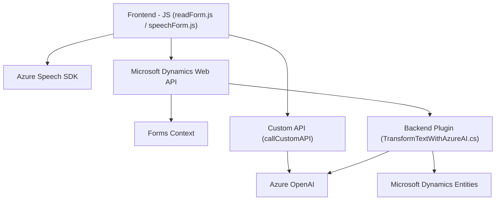

# Análisis Técnico

## Breve Resumen Técnico
El repositorio presenta una solución híbrida que integra la funcionalidad de formularios en Dynamics CRM con soporte para entrada y síntesis de voz mediante Azure Speech SDK, además de la transformación de texto utilizando Azure OpenAI en un plugin. Está organizado en tres componentes principales:
1. **Frontend:** Scripts que permiten la interacción del usuario con formularios y servicio de reconocimiento de voz.
2. **Backend Plugin:** Plugin para Dynamics CRM que utiliza el servicio Azure OpenAI.
3. **Integraciones Externas:** Servicios de Azure utilizados en ambas partes (Speech SDK y OpenAI API).

---

## Descripción de Arquitectura
La solución sigue una arquitectura de **N capas orientada a servicios**, con los siguientes elementos:
- **Capa de presentación (frontend):** Scripts de cliente que interactúan con usuarios y formularios.
- **Capa de lógica de negocio (plugins en Dynamics CRM):** Encapsula reglas y procesamiento de datos utilizando integraciones externas como Azure OpenAI.
- **Capa de servicios externos:** Azure Speech SDK y OpenAI para la síntesis de voz y transformación de texto.

Los scripts del frontend funcionan mediante integración con el contexto de los formularios Dynamics CRM, mientras los plugins en el backend procesan las solicitudes de texto transformado desde el CRM.

---

## Tecnologías y Frameworks Usados

1. **Frontend (JavaScript):**
   - **Azure Speech SDK:** Reconocimiento y síntesis de voz.
   - **Microsoft Dynamics CRM Web API (`Xrm.WebApi`).**
   - Programación estructurada con orientación modular.

2. **Backend Plugin (C#):**
   - **Microsoft Dynamics CRM SDK:** Interfaces como `IPlugin` y `IOrganizationService`.
   - **Azure OpenAI API:** Consumo mediante `HttpClient` en .NET para procesamiento de texto.
   - **Newtonsoft.Json:** Manipulación JSON.

3. **Patrones utilizados:**
   - **Service-Oriented Architecture (SOA):** Uso de servicios Azure Speech y OpenAI.
   - **Plugin Pattern:** Implementación estándar para extensiones de Dynamics CRM.
   - **Dynamic SDK Loading:** Carga condicional y dinámica del Azure SDK en el frontend.

---

## Dependencias o Potenciales Componentes Externos
1. **Principales:**
   - Azure Speech SDK.
   - Azure OpenAI API.
   - Microsoft Dynamics CRM Web API.
   - Dynamics CRM Plugin SDK.

2. **Adicionales:**
   - Exposición de servicios a través de un endpoint público de Azure OpenAI.
   - Posibles dependencias específicas para gestión de acceso o autenticación (Azure AD, API Management).

---

## Diagrama Mermaid

---

## Conclusión Final
La solución integra dos funcionalidades principales a través de componentes en el frontend y backend. En el frontend, se implementa entrada y síntesis de voz utilizando Azure Speech SDK y funcionalidades modulares para manipular formularios Dynamics CRM. Por otro lado, el plugin de backend aprovecha Azure OpenAI API para realizar el procesamiento avanzado de texto. La arquitectura es de N capas con orientación hacia SOA, utilizando Dynamics CRM como núcleo y Azure servicios como integraciones externas.