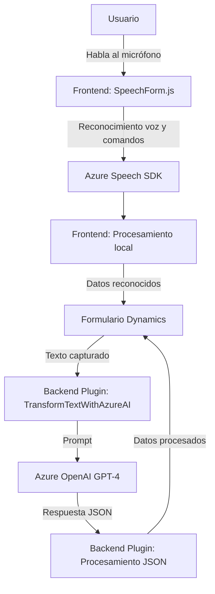

### Breve resumen técnico:
El repositorio describe una solución dedicada a la integración de **interacción por voz** con formularios de Dynamics CRM usando **Azure Speech SDK** para reconocimiento y síntesis de voz. También incluye un plugin que utiliza **Azure OpenAI** para transformar datos textuales en transcripciones procesadas. Utiliza JavaScript para el frontend y C# para los plugins de Dynamics CRM.

---

### Descripción de arquitectura:
La solución se divide en:
1. **Frontend (JavaScript)**:
   - Procesa la voz del usuario mediante Azure Speech SDK.
   - Genera transcripciones y las mapea a los formularios dinámicos en el CRM.
   - Maneja reconocimiento de voz, síntesis de voz y lógica de procesamiento.

2. **Backend Plugin (.NET y Dynamics CRM)**:
   - Extiende las funcionalidades de Dynamics CRM con un plugin para invocar Azure OpenAI.
   - Transforma las entradas textuales del CRM en un formato JSON estructurado.

### Arquitectura utilizada:
- **N capas**:
   - **Frontend (Presentación)**: Reconocimiento de voz y síntesis integrada con formularios.
   - **Lógica de negocio (Backend, Plugins)**: Mapeo y procesamiento de transcripciones con OpenAI, almacenamiento y APIs.
   - **Persistencia (Dynamics CRM)**: Actualización de atributos del formulario en el CRM.

---

### Tecnologías usadas:
- **Frontend**:
   - JavaScript, Azure Speech SDK.
   - Interacción con APIs de Dynamics CRM.

- **Backend**:
   - C# (Microsoft Dynamics CRM Plugin Framework).
   - JSON Manipulación (Newtonsoft.Json, System.Text.Json).
   - Azure OpenAI (GPT-based processing).

- **Servicios externos**:
   - Azure Speech SDK (`https://aka.ms/csspeech/jsbrowserpackageraw`).
   - Azure OpenAI API (`gpt-4`, Chat Completions endpoint).
   - APIs personalizadas de Dynamics CRM (`Xrm.WebApi`, `trial_TransformTextWithAzureAI`).

---

### Diagrama Mermaid:

---

### Conclusión final:
La solución implementada es un sistema híbrido que combina **interacción por voz** con procesamiento por IA para enriquecer formularios en **Dynamics CRM**. La arquitectura basada en n capas facilita la separación de responsabilidades y escalabilidad del sistema. Los principales puntos de integración están con **Azure Speech SDK**, **Azure OpenAI**, y el uso de plugins en Dynamics CRM para conectar el frontend y backend. Este diseño es extensible y puede adaptarse a casos de uso avanzados con mínima modificación.