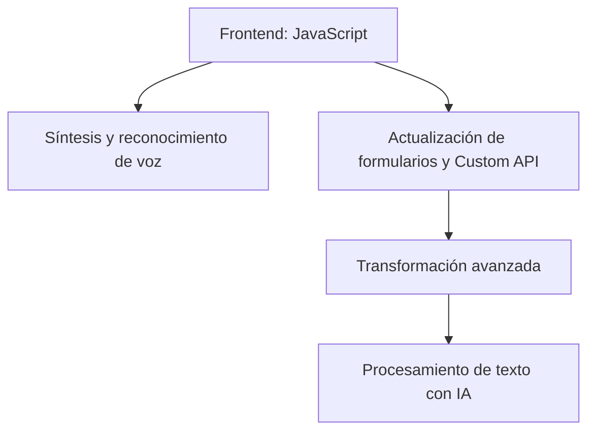

### Breve resumen técnico
El repositorio parece implementar una solución que integra reconocimiento de voz, síntesis de voz y procesamiento de texto en aplicaciones basadas en formularios de Microsoft Dynamics CRM mediante el uso de Azure Speech SDK y Azure OpenAI API. Combina archivos de frontend en JavaScript y plugins para backend en C#, lo que permite enriquecer la experiencia del usuario con capacidades impulsadas por inteligencia artificial y voz.

---

### Descripción de arquitectura
La solución se divide en dos partes principales:
1. **Frontend**:
   - Interactúa directamente con el usuario para realizar reconocimiento y síntesis de voz.
   - Manipula datos de los formularios visibles y gestiona la integración con la capa backend o API de Dynamics.

2. **Backend**:
   - Implementado como plugins para Microsoft Dynamics CRM.
   - Encargado de procesar y transformar texto (entrada de los formularios o reconocimiento de voz) mediante Azure OpenAI API.

#### Arquitectura general
La solución parece estar basada en una **arquitectura híbrida**:
- **N capas**: Distinción entre frontend, backend y la integración con otros servicios (Azure Speech SDK y Azure OpenAI API).
- **Extendida con microservicios**: La interacción con Dynamics Web API y Azure OpenAI API introduce un enfoque basado en microservicios REST.
- **Patrón modular**: Código organizado en módulos independientes (módulos de reconocimiento y síntesis de voz, plugin de transformación textual).

---

### Tecnologías usadas
1. **Frontend**:
   - **JavaScript**: Principal lenguaje de programación.
   - **Azure Speech SDK**: Proporciona capacidades de síntesis y reconocimiento de voz.
   - **Dynamics Web API (Xrm.WebApi)**: Para interactuar con formularios y una Custom API en Dynamics CRM.
   - **Callback/Event-driven**: Manejo de dependencias asincrónicas como la carga dinámica del SDK.

2. **Backend (Plugins)**:
   - **C#**: Lenguaje utilizado para el desarrollo de plugins para Microsoft Dynamics CRM.
   - **Microsoft.Xrm.Sdk**: SDK utilizado para integrarse con el entorno Dynamics.
   - **Azure OpenAI API**: Servicio para procesamiento avanzado basado en inteligencia artificial.
   - **Pattern HTTP Client Integration**: Para enviar solicitudes y consumir servicios externos.

---

### Diagrama **Mermaid**

---

### Conclusión final
Este repositorio implementa una solución que combina procesamiento de voz, análisis y transformación de texto con una integración fluida en Dynamics CRM. La arquitectura se basa en capas, y emplea patrones como modularidad, plugins y microservicios para una integración extensible. Aunque el diseño general es sólido, aspectos como el manejo seguro de claves de Azure y un mayor tratamiento de errores podrían mejorarse. Por último, el diagrama Mermaid valida la estructura de comunicación entre los componentes presentes.