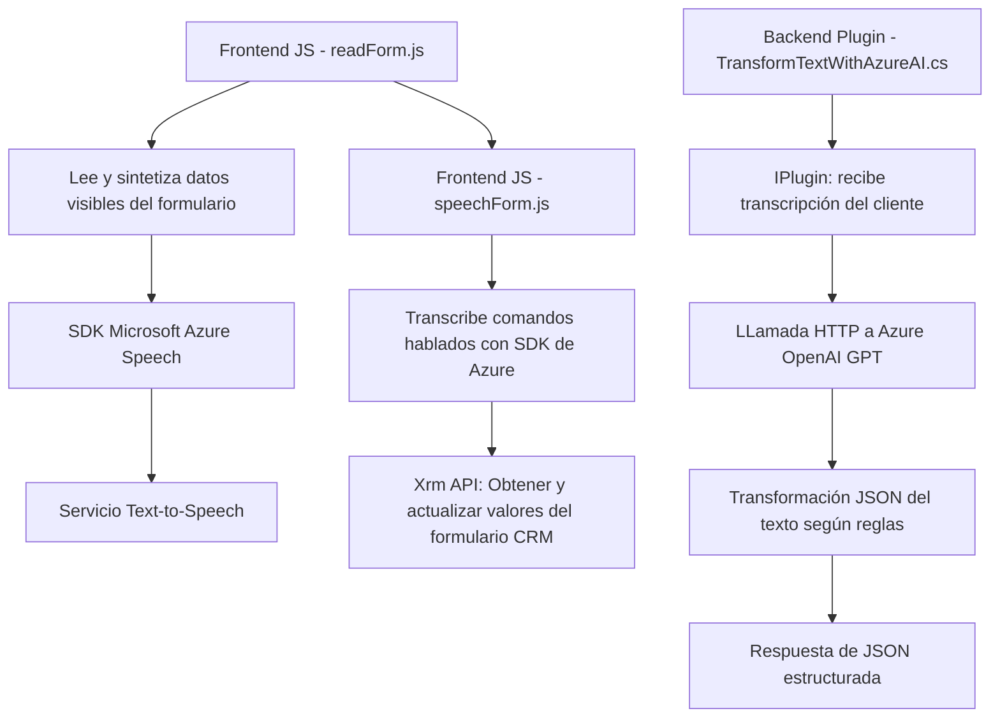

### Breve resumen técnico

El repositorio contiene una solución que permite la interacción mediante entrada y salida de voz en un entorno CRM (Dynamics), con funciones que procesan formularios, sintetizan texto y transcriben comandos hablados. Además, integra un plugin que utiliza Azure OpenAI para transformar texto según reglas estrictas. La arquitectura presenta una combinación de frontend modular en JavaScript y componentes backend (plugin) para interacción con servicios externos como Azure Speech SDK y OpenAI.

---

### Descripción de arquitectura

La solución tiene una arquitectura **multicapa** que se compone de dos partes principales:

1. **Capa cliente (Frontend):**
   - Archivos `readForm.js` y `speechForm.js` proporcionan funcionalidades relacionadas con el reconocimiento de voz, lectura de formularios CRM y síntesis de texto a voz. Se implementa carga dinámica de SDKs.
   - Importante adopción de modularidad y uso de APIs externas.

2. **Capa de lógica de negocio (Plugin en backend):**
   - El archivo `TransformTextWithAzureAI.cs` se implementa como un plugin adherente al entorno de Dynamics CRM, manejando transformaciones de texto mediante normas específicas con Azure OpenAI.

La solución reutiliza servicios externos mediante SDK y permite operaciones asincrónicas asegurando una integración robusta entre el frontend y los servicios backend.

---

### Tecnologías usadas

1. **Frontend (JavaScript):**
   - **Microsoft Azure Speech SDK:** Funcionalidades de síntesis y reconocimiento de voz.
   - **Xrm API:** Interacción con el entorno CRM Dynamics.
   - **AJAX/JavaScript:** Carga dinámica de scripts y llamadas API.
   - **Promise:** Manejador de asincronismo para funciones de reconocimiento y síntesis.

2. **Backend (C#, ASP.NET):**
   - **Microsoft Dynamics CRM Plugin:** Componentes que operan en el contexto de CRM.
   - **Azure OpenAI (GPT-4o):** Transformación avanzada de texto.
   - **Newtonsoft.Json y System.Text.Json:** Manejo de estructuras JSON.
   - **HttpClient:** Comunicación con APIs externas.

3. **Patrones utilizados:**
   - Modularidad en funciones específicas (frontend y backend).
   - `Plugin Design Pattern` para integrar sistemas en Dynamics CRM.
   - `API Gateway Pattern` para interacción con Azure SDK y OpenAI.

---

### Diagrama Mermaid válido para GitHub

---

### Conclusión final

La solución presentada es una **integración de frontend y backend heterogéneo** diseñada para extender las capacidades de interacción en entornos de CRM Dynamics mediante el uso de tecnologías avanzadas como el Azure Speech SDK y Azure OpenAI. La arquitectura modular permite una separación clara de responsabilidades entre la gestión de voz en el frontend y la lógica transformacional en el backend. Esta solución está orientada a ofrecer una interfaz avanzada con capacidades de reconocimiento de voz, síntesis de texto a audio y manipulación inteligente de datos.