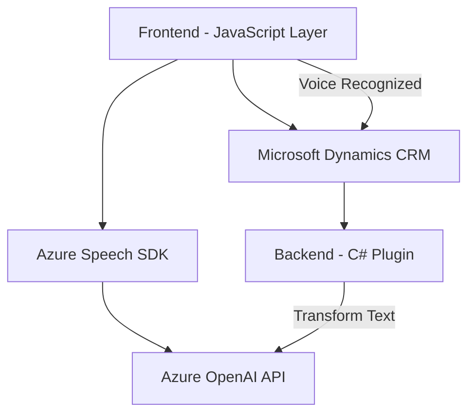

### Breve resumen técnico

El repositorio contiene una solución híbrida que integra varias tecnologías para la interacción entre usuarios y una aplicación basada en *Microsoft Dynamics CRM*. Esto incluye herramientas frontend (JavaScript) para captura y síntesis de voz, un *plugin* backend (C#) para procesamiento y transformación de texto con Azure OpenAI API, y una arquitectura modular que permite integrar servicios en la nube como Azure Cognitive Services Speech SDK.

---

### Descripción de arquitectura

La solución está diseñada bajo el concepto de una **arquitectura de capas** mezclada con elementos de **arquitectura SOA**. Las responsabilidades de frontend y backend están separadas, proporcionando al cliente una interfaz web en forma de formularios dinámicos que interactúan con el servidor. Las capas se dividen como sigue:

1. **Frontend (presentación):**
   - Implementado con JavaScript.
   - Recoge datos de formularios y proporciona salida de la funcionalidad de síntesis y reconocimiento de voz utilizando servicios de Azure.

2. **Backend (lógica y servicios):**
   - Implementado en C# mediante un plugin para Dynamics CRM.
   - Realiza transformaciones avanzadas de datos/textos mediante el servicio de Azure OpenAI, exponiendo eventos aprovechables dentro del contexto CRM.

3. **Servicios Cloud (Azure):**
   - Usa Azure Speech SDK para sintetizar texto y reconocer voz.
   - Usa Azure OpenAI API para transformar texto según reglas definidas.

Este diseño modular y basado en servicios facilita el desacoplamiento y la escalabilidad.

---

### Tecnologías usadas

1. **Frontend:**
   - *JavaScript*: Manipulación del DOM, interacción asíncrona con APIs y recursos externos.
   - *Azure Cognitive Services Speech SDK*: Servicios de síntesis y reconocimiento de voz basados en la nube.
   - *Microsoft Dynamics CRM SDK*: Para integrar formularios con funcionalidades personalizadas.

2. **Backend:**
   - *C# + Microsoft Dynamics SDK*: Implementación del plugin para ejecución backend en Dynamics CRM.
   - *Azure OpenAI API*: Implementación de lógica avanzada basada en Machine Learning para procesar entradas de texto.
   - *System.Net.Http y JSON Serialization*: Para comunicación con APIs y manejo de datos.

3. **Patrones de diseño y arquitectura:**
   - **MVC (Modelo Vista Controlador)**: Separación clara entre presentación (front), controladores y lógica (backend).
   - **SOA (Service-Oriented Architecture)**: Uso de servicios web (Azure APIs) para cumplir objetivos específicos.
   - **Plugin Pattern**: Integración personalizada en Microsoft Dynamics para extender funcionalidad mediante eventos específicos.
   - **Modularidad y reutilización**: Funciones bien estructuradas para cubrir casos independientes.

---

### Diagrama Mermaid

---

### Conclusión final

La solución integra funcionalidades avanzadas como síntesis y reconocimiento de voz, junto con transformación de texto basada en inteligencia artificial. Utiliza una arquitectura de capas compatible con Microsoft Dynamics CRM, donde el frontend interactúa con el usuario y delega tareas computacionalmente complejas al backend y a servicios en la nube (Azure Cognitive Services y Azure OpenAI).

Este enfoque asegura modularidad, reutilización y una alta escalabilidad, haciéndola apta para escenarios empresariales que requieran servicios de voz e inteligencia artificial en tiempo real. Sin embargo, depender de servicios externos como Azure puede imponer restricciones en términos de costos asociados y requisitos de conectividad.