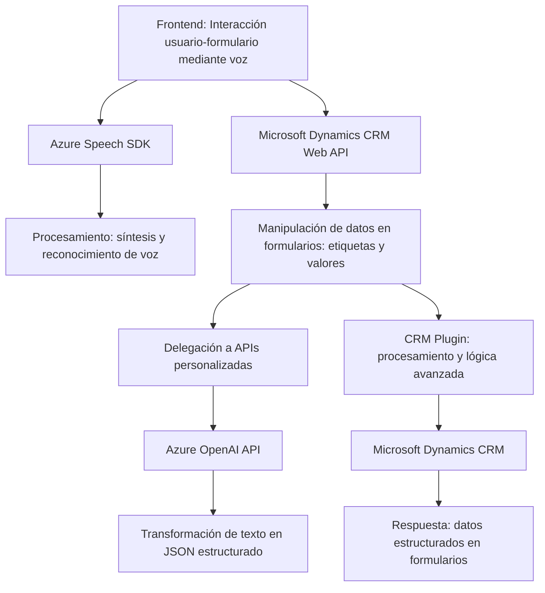

### Breve resumen técnico
El repositorio tiene tres componentes principales: archivos frontend que interactúan con la voz y datos en formularios (mediante Azure Speech SDK y reconocimiento de habla), y un archivo backend que extiende Dynamics CRM como un plugin, integrándose con Azure OpenAI para transformar texto y devolver respuestas JSON estructuradas. La solución está orientada a la interacción voz-usuario y la personalización dinámica de datos a través de APIs avanzadas.

---

### Descripción de arquitectura
La solución es una combinación de arquitectura **n-capas** y **orientada a servicios**:
1. **Frontend:** Actúa como la capa de interacción con el usuario. Utiliza reconocimiento de voz y síntesis de voz para manipular formularios dinámicos (Azure Speech SDK).
2. **Backend:** Complementa al CRM usando un plugin que procesa datos mediante Azure OpenAI, sirviendo como la capa lógica que conecta al CRM con servicios externos.
3. **Integración horizontal:** El sistema aprovecha dependencias externas como Azure Speech SDK y Azure OpenAI, alineándose con principios **SOA** (Service-Oriented Architecture).

---

### Tecnologías utilizadas
1. **Frontend:**
   - **Azure Speech SDK:** Reconocimiento y síntesis de voz.
   - **JavaScript:** Manipulación de DOM y formularios dinámicos vinculados a `executionContext`.
   - **Microsoft Dynamics CRM Web API:** Para acceder y modificar datos en formularios.
2. **Backend:**
   - **Microsoft Dynamics CRM Plugin Framework:** Extensión mediante la implementación de `IPlugin`.
   - **Azure OpenAI API:** Procesamiento avanzado de texto.
   - **Bibliotecas .NET:**
     - `Newtonsoft.Json`: Manipulación JSON.
     - `System.Net.Http`: Comunicación API.
3. **Patrones aplicados:**
   - **Carga dinámica:** El SDK de voz se carga sólo cuando es necesario.
   - **Delegación modular:** División clara de responsabilidades en funciones individuales.
   - **Service-Oriented Design:** Conexión de CRM con servicios externos (Azure).

---

### Diagrama **Mermaid**

---

### Conclusión final
El repositorio implementa una solución **híbrida** que combina funcionalidades frontend y backend, orientada a facilitar la interacción basada en voz y procesar datos dinámicamente en formularios dentro de Dynamics CRM. Está estructurada como una **arquitectura n-capas** con integraciones orientadas a servicios (SOA). Los patrones de carga dinámica, modularidad, y delegación contribuyen a la escalabilidad y adaptabilidad de la solución.