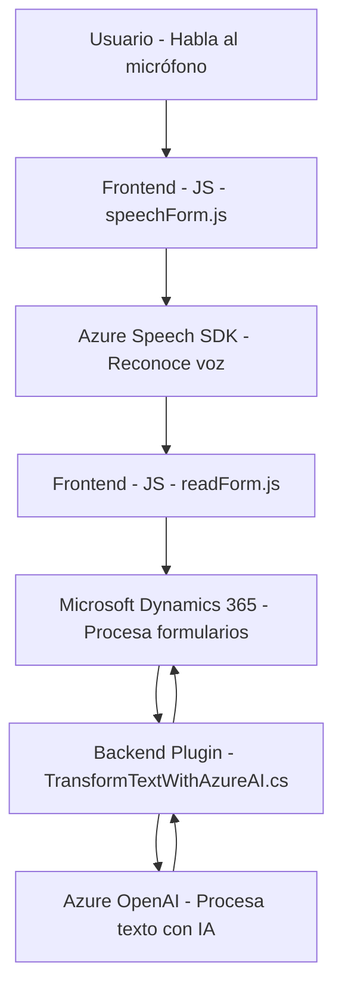

## 1. Breve resumen técnico:

El repositorio define una solución que integra servicios avanzados de reconocimiento y síntesis de voz usando **Azure Speech SDK** con formularios en **Microsoft Dynamics 365**. Incluye módulos frontend (JavaScript) para el reconocimiento de voz, procesamiento de datos de formularios, y síntesis de voz, además de un backend (en .NET/C#) que implementa un plugin para la transformación avanzada de texto mediante **Azure OpenAI**.

---

## 2. Descripción de la arquitectura:

La solución implementa una arquitectura híbrida basada en un enfoque de **n capas** donde:
1. **Frontend:** Maneja la interacción directa con el usuario y los formularios de Dynamics 365.
2. **Backend:** Procesa texto entrante utilizando servicios como Azure OpenAI, y responde con datos estructurados en JSON.
3. **External services:** Integra servicios externos como Azure Speech SDK y Azure OpenAI para operaciones de reconocimiento de voz y procesamiento de lenguaje natural.

**Características arquitectónicas:**
- Modular y desacoplado: Las funciones están organizadas para distintas responsabilidades en el frontend (manejo de SDK, reconocimiento de voz, procesamiento de texto) y el backend (transformación avanzada de texto con plugins).
- Plugins y SDKs externos: Utiliza el sistema plugin de Dynamics 365 y comunicación directa con APIs de Azure.
- Extensible y escalable: Con dependencias externas configuradas dinámicamente, facilita la expansión a nuevas funcionalidades como IA avanzada o reconocimiento de voz en otros idiomas.

---

## 3. Tecnologías usadas:

### Frontend:
- **Frameworks/SDK:** No se menciona explícitamente un marco como React o Angular, pero utilizan JavaScript puro y el SDK de Azure Speech.
- **Servicio de voz:** **Azure Speech SDK** para reconocimiento y síntesis de voz.
- **Integración directa con Microsoft Dynamics 365**: Manejo de formularios mediante API propias de Dynamics (`executionContext`, `Xrm.WebApi`).

### Backend (Plugin en C#):
- **Framework:** .NET para desarrollo de un plugin de Microsoft Dynamics CRM.
- **Librerías:** JSON manejo con `Newtonsoft.Json.Linq`, `System.Text.Json`.
- **Servicio de IA:** **Azure OpenAI API** para transformación de texto usando lenguaje natural.

### Patrones:
- Modularización: Separación clara de responsabilidades en funciones/clases.
- Integración con SDKs: Dependencia exclusiva en SDKs de Microsoft.
- Stateless Services: Las funciones funcionales y el plugin interactúan de forma independiente sin mantener un estado persistente.

---

## 4. Dependencias o componentes externos:
- **Azure Speech SDK**:
  - Para reconocimiento de voz y síntesis.
  - URL de carga directa: `https://aka.ms/csspeech/jsbrowserpackageraw`.
- **Azure OpenAI API**:
  - Procesamiento de datos para transformar texto y producir resultados en formato JSON.
- **Microsoft Dynamics 365**:
  - Dependencias internas como `Xrm.WebApi` y el contexto del formulario (`executionContext`).

---

## 5. Diagrama Mermaid válido:

---

## Conclusión final:

El repositorio implementa una solución moderna para la interacción avanzada con formularios en sistemas empresariales. Utiliza una arquitectura **n capas** híbrida que combina el manejo eficiente de frontend (lectura, síntesis de voz) con servicios externos (Azure Speech SDK y OpenAI). La integración del plugin en Dynamics CRM subraya un diseño extensible hacia IA y reconocimiento de voz, optimizando la experiencia del usuario.

Por último, el enfoque modular y su separación de responsabilidades aseguran un mantenimiento sostenible y la escalabilidad futura del sistema.