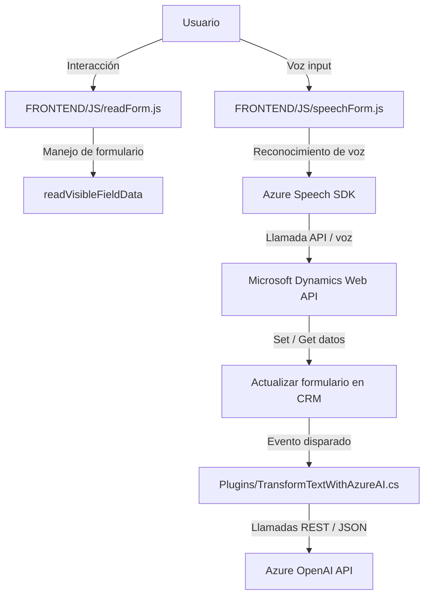

### Análisis técnico

#### Breve resumen técnico
El repositorio incluye módulos y componentes distribuidos en archivos que implementan funcionalidades complejas de reconocimiento de voz y manejo de formularios dinámicos, integrados específicamente con Microsoft Dynamics CRM y Azure AI/ML services. La solución utiliza una arquitectura modular y dependencias de servicios externos como Azure Speech SDK y OpenAI API para trabajos específicos.

---

### Descripción de la arquitectura
- **Tipo de solución**: La solución es principalmente una **aplicación de integración** que combina módulos frontend (JavaScript) y plugins backend (*.NET*) para extender funcionalidades de Microsoft Dynamics CRM.
- **Arquitectura**: 
  - **Multicapa (N-capas)**:
    - Capa de presentación: Archivos como `readForm.js` y `speechForm.js` forman la capa de interacción con el usuario, manejando formularios y voz.
    - Capa de negocio: Plugins como `TransformTextWithAzureAI.cs` encapsulan la lógica empresarial y comunicación con servicios externos.
    - Capa de datos: Integración directa con Microsoft Dynamics mediante su API.
  - **Event-driven architecture**:
    - Los plugins responden a eventos específicos dentro del CRM, como cambios de atributos o acciones del usuario.
  - **External Service Integration**:
    - Usa SDK y APIs externos como Azure AI y OpenAI para tareas específicas (voz y transformación de texto).
  - **IoC (Inversion of Control)**:
    - Implementación en Dynamics CRM con el plugin integrado como parte de su flujo.

---

### Tecnologías, patrones y frameworks usados
1. **Frontend**: 
   - JavaScript en combinación con `DOM` para manipulación y carga dinámica.
   - **Azure Speech SDK**:
     - Reconocimiento de voz y síntesis con configuraciones específicas (clave API, región, etc.).
   - AJAX/Fetch para comunicación con APIs.
2. **Backend**:
   - Microsoft Dynamics CRM Plugin Framework (`IPlugin`).
   - Azure OpenAI API para procesamiento de texto avanzado.
   - Manejo de dependencias HTTP usando `System.Net.Http`.
   - Manejo de JSON usando `Newtonsoft.Json` y `System.Text.Json`.
3. **Patrones**:
   - **Modularidad** para funciones específicas.
   - **Encadenamiento de funciones**: Cada función realiza acciones individuales pero están interconectadas en un flujo cohesivo.
   - **Single Responsibility Principle (SRP)**: Observado en el diseño de cada función y clase del repositorio.

---

### Dependencias o componentes externos
1. **Externos**:
   - Azure Speech SDK.
   - Azure OpenAI API.
   - Microsoft Dynamics CRM API (Xrm namespace).
   - JSON Manejo: `Newtonsoft.Json` y `System.Text.Json`.
   - HTTP handling para conectar Dynamics y OpenAI (`System.Net.Http`).
2. **Internos**:
   - Contexto de ejecución CRM (`IServiceProvider`).
   - Métodos auxiliares para mapeos y reconocimiento: `getFieldMap`, `applyValueToField`, etc.
3. **Notables**:
   - Carga dinámica de scripts (Azure Speech SDK) dentro del cliente basado en navegador.
   - URL personalizados de endpoints API.

---

### Diagrama **Mermaid**

---

### Conclusión final
El repositorio demuestra la implementación de una solución altamente integrada que utiliza múltiples capas de software y dependencias externas para proporcionar funcionalidades inteligentes basadas en inteligencia artificial. Está diseñado para extender Dynamics CRM con capacidades avanzadas de entrada de voz, procesamiento de texto y síntesis mediante tecnologías de Azure, creando una arquitectura sólida y modular adaptable a escenarios empresariales dinámicos.