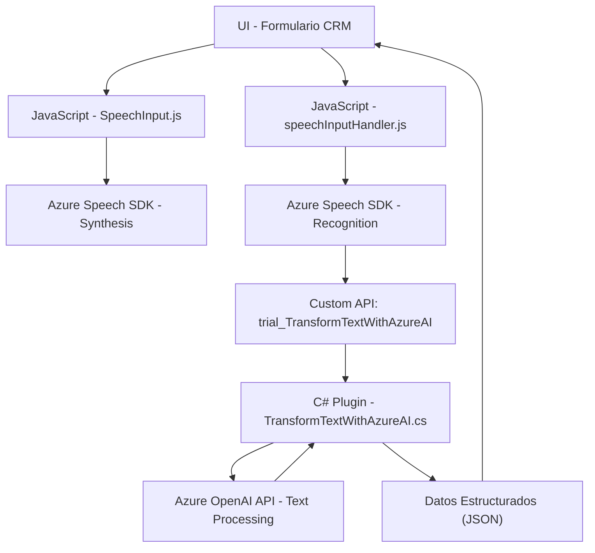

### **Breve resumen técnico**

- La solución parece ser una combinación de un frontend avanzado implementado en JavaScript y un plugin en C# para Dynamics CRM que permite una interacción fluida entre el usuario y una plataforma CRM mediante reconocimiento y síntesis de voz utilizando Azure Speech SDK y procesamiento de texto estructurado con Azure OpenAI.
- Se enfoca en accesibilidad mediante reconocimiento y síntesis de voz, y en la automatización de procesamiento de formularios en un entorno altamente integrado.

---

### **Descripción de arquitectura**

#### **Tipo de solución**
La solución consiste en un sistema híbrido:
1. **Frontend**: Implementado en JavaScript. Es probable que funcione como parte de una integración de scripts dentro de formularios CRM.
   - **SpeechInput.js**: Sintetiza texto obtenido desde formularios en voz utilizando Azure Speech SDK.
   - **speechInputHandler.js**: Reconoce voz, procesa la entrada, y rellena automáticamente formularios en Dynamics CRM usando IA (Azure OpenAI).
2. **Backend Plugin**: Implementado en C#, actúa como un microservicio o punto de integración para Dynamics CRM. Utiliza Azure OpenAI para transformar texto y proporcionar resultados como JSON estructurado.

#### **Arquitectura**
La solución muestra características de una arquitectura **n capas**:
1. **Capa de presentación**: Frontend en JavaScript integrado con formularios CRM.
2. **Capa de lógica de dominio**:
   - Scripts de JavaScript procesan datos desde formularios y los envían hacia APIs externas.
   - El plugin maneja la lógica central y transforma texto con el servicio Azure OpenAI.
3. **Capa de integración/API**:
   - Integración directa con:
     - Azure Speech SDK para reconocimiento/síntesis de voz.
     - Azure OpenAI para procesamiento estructurado del texto.
4. Las funciones de front y backend están bien separadas, pero colaboran a través de servicios externos e interfaces del CRM.

---

### **Tecnologías usadas**

#### **Frontend**
- **JavaScript**:
  - Programación modular y orientada a eventos.
  - Uso de Azure Speech SDK con carga dinámica desde un CDN.
- **Patrones**:
  - Modularización funcional.
  - Event-driven programming (asincrónico y basado en callbacks).

#### **Backend**
- **C#**:
  - Desarrollo del plugin para Dynamics CRM.
- **Azure OpenAI**:
  - API para transformar texto en JSON estructurado.
  - Implementación mediante solicitudes HTTP.
- **Microsoft Dynamics SDK**:
  - Conexión e interacción con el entorno CRM.
- **Serialización JSON**:
  - `System.Text.Json` y `Newtonsoft.Json.Linq`.

#### **Servicios y dependencias externas**
- **Azure Speech SDK**: Para reconocimiento/síntesis de voz.
- **Azure OpenAI API**: Para procesamiento avanzado de texto y generación de JSON.
- **CRM API**: Para interactuar con los campos y tipos del formulario.

---

### **Diagrama Mermaid**

---

### **Conclusión final**

La solución representa una integración efectiva entre frontend y backend en sistemas CRM. Utiliza JavaScript avanzado para mejorar la accesibilidad mediante entrada y salida de voz, enlazado mediante Azure Speech SDK. En el backend, un plugin encargado del procesamiento estructurado de texto envía datos a Azure OpenAI. 

Se destacan los siguientes aspectos clave:
1. **Modularidad**: Cada archivo cumple roles específicos separados en frontend y backend, garantizando escalabilidad y facilidad de mantenimiento.
2. **Integración avanzada**: Uso centralizado de APIs externas como Azure Speech y OpenAI para procesamiento de voz y texto estructurado.
3. **Capacidad futura**: La solución podría extenderse para soportar más formularios, reglas dinámicas o funcionalidades de IA.

Es una implementación robusta en sistemas CRM que facilita la interacción y automatización de entradas.