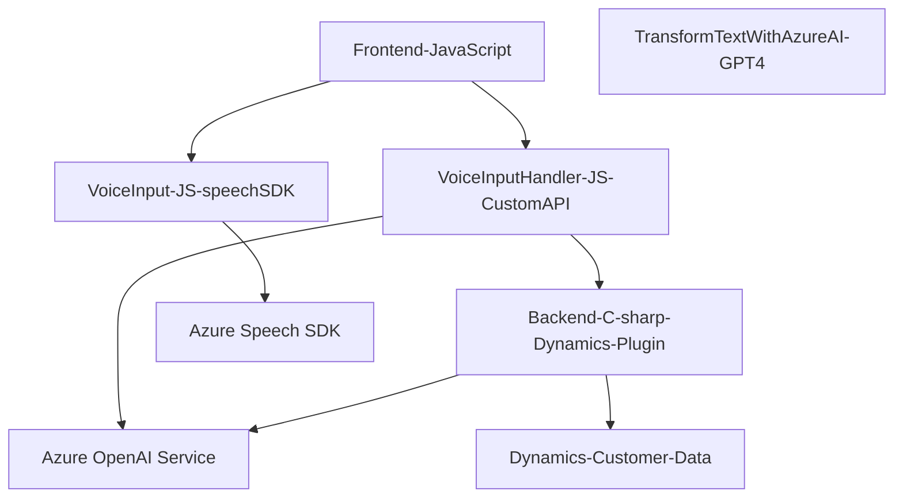

### Breve resumen técnico:

El repositorio contiene piezas de código de una solución que parece abordar la interacción entre usuarios y formularios mediante entrada y síntesis de voz, además de una integración avanzada de inteligencia artificial. La solución incluye tres componentes: un frontend para capturar y sintetizar datos, un backend que utiliza plugins de Dynamics CRM para formato y validación basada en IA, y dependencias con servicios externos como **Azure Speech SDK** y **Azure OpenAI Service**.

---

### Descripción de arquitectura:

La arquitectura sigue un modelo en capas con integración de servicios externos:
1. **Frontend**:
   - Consolida funcionalidades relacionadas con voz y formularios (captura, síntesis y actualización de datos).
   - Piezas modulares que delegan tareas específicas como carga de SDK, mapeo de datos y procesamiento.
2. **Backend**:
   - Un plugin implementado para Dynamics CRM, funcionando como un mediador para invocar servicios de IA y transformar texto en estructuras JSON válidas.
3. **Servicios externos**:
   - Comunicación directa con Azure Speech SDK y Azure OpenAI para tareas de síntesis y procesamiento de datos, respectivamente.

### Tecnologías usadas:

1. **Frontend**:
   - Lenguaje: JavaScript.
   - SDK: **Azure Speech SDK** (para entrada y síntesis de voz).
   - API: `Custom API` (Azure AI posiblemente configurada como un servicio REST).
   - Framework: Dependencia de Dynamics CRM para cliente web (`Xrm.WebApi`).

2. **Backend**:
   - Lenguaje: C#.
   - Framework: Dynamics CRM Plugins.
   - Servicios: **Azure OpenAI Service** (GPT-4) y `Newtonsoft.Json` para JSON.

3. **Patrones de diseño**:
   - **Modularidad**: Separación lógica por funcionalidades dentro de archivos independientes.
   - **Cargador de dependencias dinámico**: Carga del SDK de Azure solo cuando es requerido.
   - **Cliente/Proveedor**: Comunicación con servicios Azure mediante solicitudes HTTP como mecanismo de integración.

---

### Diagrama Mermaid:

---

### Conclusión final:

Este repositorio construye una solución orientada a enriquecer la interacción humano-computadora mediante el uso de comandos de voz, síntesis de texto, y procesamiento avanzado con inteligencia artificial. La arquitectura en capas garantiza separación funcional y claridad en la integración de tecnologías como **Azure Speech SDK**, **Azure OpenAI Service**, y Plugins para Dynamics CRM.

- **Ventajas**:
  - Modularidad, lo cual permite fácil mantenibilidad.
  - Integración avanzada con servicios de Azure amplía las capacidades de la solución.

- **Recomendaciones**:
  - Optimizar el uso de asincronía en el backend para evitar bloqueos durante llamadas HTTP externas.
  - Consolidar la representación de datos para hacerlos homogéneos, implementando validaciones más estrictas en tiempo real.