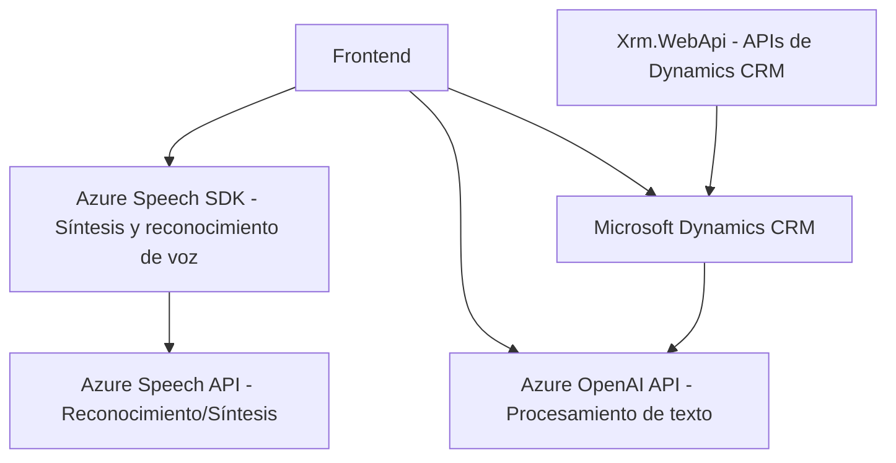

### **Breve Resumen Técnico**

El repositorio proporcionado pertenece a un sistema que integra funcionalidades avanzadas de reconocimiento y síntesis de voz utilizando el **Azure Speech SDK**, combinado con procesamiento de texto a través de una API de inteligencia artificial en **Azure OpenAI Service**. Además, incluye un plugin desarrollado para **Microsoft Dynamics CRM**, que actúa como una conexión con el servicio de procesamiento de OpenAI y realiza transformaciones estructuradas de datos. Esto indica claramente que se trata de una solución que integra un **frontend web** y **servicios externos** en una arquitectura híbrida pensada para interacción basada en voz y texto.

---

### **Descripción de Arquitectura**

La arquitectura del proyecto puede clasificarse como un **sistema cliente-servidor basado en servicios externos**, con una aproximación modular y con soporte para la ejecución de plugins en un entorno CRM (probablemente Dynamics 365). Utiliza patrones como **modular design**, **factory pattern**, y hace uso extensivo de **APIs externas** (Azure Speech SDK y Azure OpenAI APIs).  

El sistema no está orientado a microservicios, sino que es más bien un **sistema de separación por capas** (n-capas) compuesto principalmente por:
1. **Frontend:** Funciones de reconocimiento de voz, síntesis y actualización dinámica de formularios.
2. **Backend:** Plugin para Dynamics CRM que actúa como intermediario con el servicio de Azure OpenAI.

Esta solución sugiere que las piezas trabajan en conjunto de manera simplificada.

---

### **Tecnologías Usadas**
1. **Frontend**:
   - **JavaScript**: Lenguaje principal para las funcionalidades del navegador.
   - **Azure Speech SDK**: Para reconocimiento de voz y síntesis.
   - **APIs personalizadas**.
   - **Dynamics CRM Web APIs**: Para interacción con campos y atributos de formularios.

2. **Backend**:
   - **C# (.NET Framework)**: Implementación del plugin para Dynamics CRM.
   - **Microsoft.Xrm.Sdk APIs**: Interacción con el sistema CRM.
   - **Newtonsoft.Json**: Procesamiento de JSON.
   - **Azure OpenAI Service** (GPT): Para procesamiento de datos y texto.

3. **Patrones**:
   - **N-capas**: Separación entre componentes de frontend, backend y servicios externos.
   - **Integración de Servicios Cloud**: Uso de Azure Speech SDK y OpenAI APIs.
   - **Factory Pattern y Modular Design**: Uso modular de funciones y objetos en los archivos JavaScript.

---

### **Diagrama Mermaid**

---

### **Conclusión Final**

La solución es un sistema de integración inteligente entre **Microsoft Dynamics CRM**, **Azure Speech SDK**, y **OpenAI Azure API**, habilitando reconocimiento de voz y síntesis, con interpretación inteligente a través de IA. Gracias a un diseño modular basado en múltiples capas (frontend, APIs externas y CRM backend), ofrece funcionalidades relacionadas con la interacción de formularios mediante comandos de voz y conversión de texto a voz.

Se trata de una solución de arquitectura híbrida que combina **cliente-servidor** y herramientas externas para extender las capacidades de procesamiento de información en escenarios empresariales.