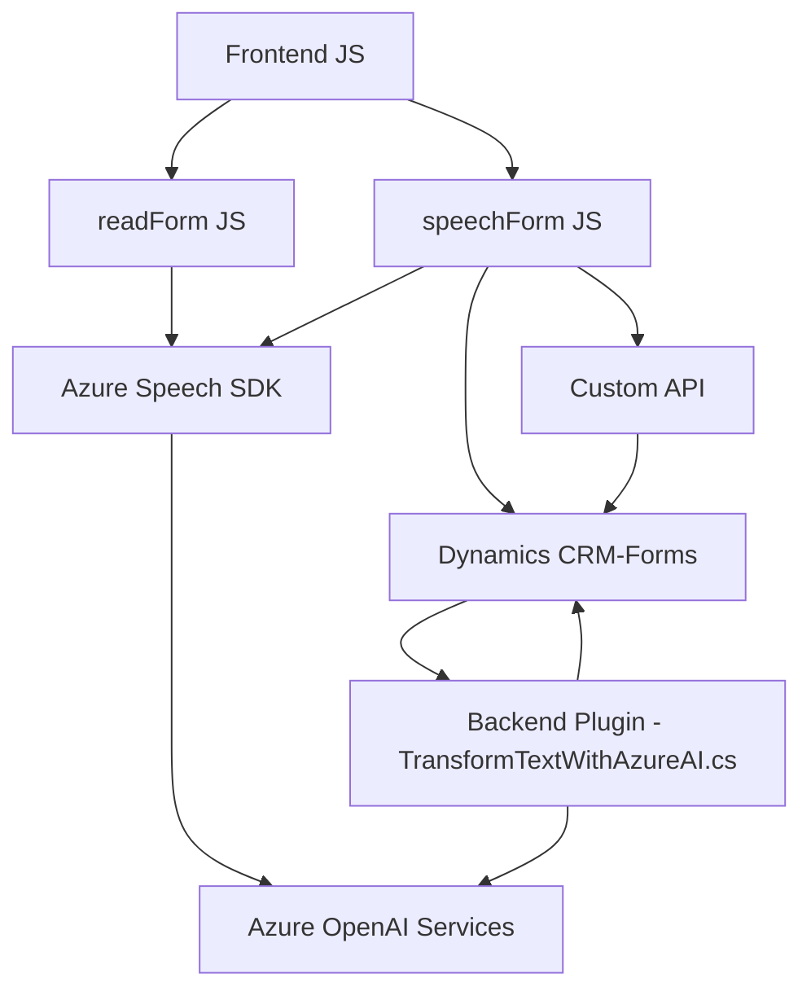

### Breve Resumen Técnico

Este repositorio contiene una solución híbrida enfocada principalmente en la interacción entre voz y texto, incorporando tecnología de Microsoft Dynamics CRM y sus formularios. A través del uso de **Microsoft Azure Speech SDK** y **Azure OpenAI**, se automizan procesos como lectura de información de formularios, síntesis de audio desde texto comprimido, y transformación de entrada de texto mediante lógica avanzada de inteligencia artificial (IA).

### Descripción de Arquitectura

La arquitectura es multicapas (n capas), dado que existen módulos diferenciados que operan sobre datos que provienen de un formulario y que luego interactúan con servicios externos. Además, algunos componentes presentan rasgos de **arquitectura orientada a eventos**, como la captación de voz o el procesamiento de datos por desencadenadores.

Los principales elementos incluyen:
- **Frontend JavaScript (readForm.js y speechForm.js):** Proporcionan funcionalidades para síntesis de audio, captura de voz, y manipulación de formularios de Dynamics CRM.
- **Backend Plugin .NET (TransformTextWithAzureAI.cs):** Funcionalidades avanzadas de IA para procesar texto mediante Azure OpenAI y actualizar elementos de Dynamics CRM.

### Tecnologías Usadas

- **Microsoft Azure Speech SDK:** Para captura de voz y síntesis de audio.
- **Microsoft Azure OpenAI:** Usa modelos GPT para transformación avanzada de texto.
- **Dynamics CRM SDK (.NET):** Plugin para integrar API personalizada y manipular datos internos de Dynamics CRM.
- **JavaScript:** Base para las interacciones del frontend.
  - Dependencias como `Xrm.WebApi` para consumir APIs de Dynamics CRM.
- **C#.NET:** Backend del plugin con integración de APIs y procesamiento de datos.
- **JSON Manipulation Libraries:**
  - `Newtonsoft.Json.Linq` y `System.Text.Json`: Serialización y parsing de datos JSON.
- **HTTP Client Libraries (System.Net.Http):** Para consumo de servicios externos como Azure.

### Diagrama Mermaid

### Conclusión Final

La solución es una integración avanzada de tecnologías de Microsoft que aplica tanto patrones de n capas como orientados a eventos para la interacción voz-texto. Mediante el SDK de Azure Speech y Azure OpenAI, se realizan operaciones de síntesis de voz y manipulación inteligente de formularios CRM. La combinación de un frontend JavaScript modular y un backend en C# para Dynamics CRM asegura una alta escalabilidad y modularidad.