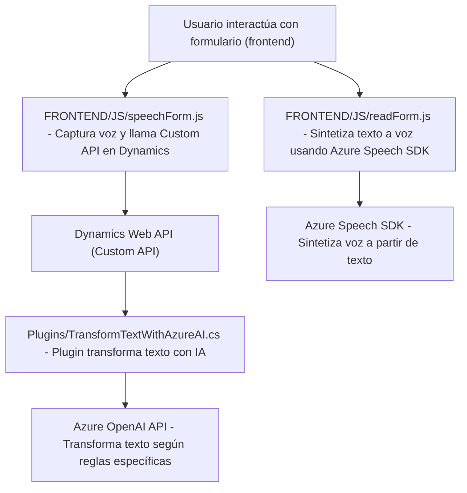

### Resumen técnico

El repositorio presenta diferentes archivos de un sistema que parece integrar múltiples tecnologías para interacción con formularios dinámicos, reconocimiento y síntesis de voz, y procesamiento de texto con ayuda de inteligencia artificial. Los archivos principales están divididos en funciones de frontend (basadas en JavaScript) y backend (plugins para Dynamics) con una clara interacción con APIs externas como Azure Speech SDK y Azure OpenAI.

---

### Descripción de arquitectura

1. **Tipo de solución**: 
   La solución es un sistema híbrido compuesto por una funcionalidad de frontend interactiva (procesamiento de texto y voz) y lógica de backend basada en plugins para Dynamics CRM que utilizan inteligencia artificial para tareas específicas.

2. **Arquitectura**:
   - **N capas**: La solución tiene al menos dos capas principales:
     - **Frontend**: Manejo de interacción con el usuario y conexión con Azure Speech SDK.
     - **Backend**: Lógica del servidor a través de plugins en Dynamics CRM con interacción con Azure OpenAI.
   - **Elemento parcialmente distribuido**:
     - Usa servicios externos (Azure Speech SDK y Azure OpenAI) como soporte adicional.

3. **Patrones observados**:
   - Modularidad: Cada archivo implementa funcionalidades específicas encapsulando tareas en funciones gestionables.
   - Plugin Pattern: Se usa en el backend mediante `IPlugin` para Dynamics.
   - Sincronización y callbacks: En el frontend, se asegura la carga secuencial de dependencias como Azure Speech SDK.
   - Cliente-Servidor: Comunicación entre cliente interactivo (JavaScript) y servicios del servidor externo.

---

### Tecnologías usadas

1. **Frontend**:
   - **JavaScript** para lógica en tiempo real.
   - **Azure Speech SDK** para síntesis y reconocimiento de voz.
   - **DOM API** para manejo dinámico de scripts y datos del formulario.
   
2. **Backend**:
   - **C#** como lenguaje principal.
   - **Microsoft Dynamics SDK** para integración de plugins en CRM.
   - **Azure OpenAI API** para procesamiento avanzado de texto.
   - **JSON libraries**:
     - `Newtonsoft.Json.Linq` y `System.Text.Json` para manejo y serialización de datos JSON.

---

### Dependencias y componentes externos

1. **Azure Speech SDK**: Para reconocimiento y síntesis de voz.
2. **Azure OpenAI API**: Procesamiento de texto con IA.
3. **Dynamics CRM Web API**: Acceso y modificación de formularios desde el backend.
4. **Bibliotecas de C#**: Para HTTP requests y manejo de JSON.
5. **DOM API**: Usado en el frontend para cargado dinámico y manipulación de elementos HTML.

---

### Diagrama Mermaid

---

### Conclusión final

Este repositorio representa un sistema robusto que combina capacidades de frontend interactivo (texto a voz y reconocimiento de voz) con un backend que aprovecha servicios en la nube y plugins para tareas específicas dentro de Dynamics. La arquitectura modular y de n capas garantiza escalabilidad y fácil mantenimiento, mientras que las integraciones con Azure aumentan la funcionalidad basada en inteligencia artificial y procesamiento avanzado de voz.