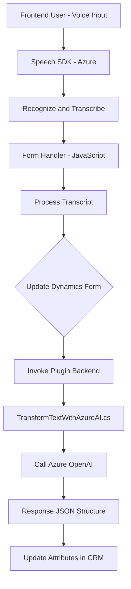

### Breve resumen técnico:

Este repositorio cuenta con una solución destinada a integrar reconocimiento y síntesis de voz con Microsoft Dynamics 365, usando servicios de inteligencia artificial, como **Azure Speech SDK** y **Azure OpenAI GPT**, que realizan transcripción de voz, transformación de texto en JSON y actualización dinámica de formularios en el entorno CRM. 

### Descripción de arquitectura:

La arquitectura comprende **una solución modular basada en servicios integrados** que interactúan con Dynamics 365 mediante plugins, APIs externas y scripts JavaScript. Adopta patrones como Service Layer y integración de microservicios para la comunicación con APIs externas. No es un sistema distribuido como tal, ya que depende de un sistema central (Dynamics 365), pero utiliza elementos como EDA (Event-Driven Architecture) mediante los eventos de reconocimiento/transcripción.

Es una mezcla entre un **modelo de arquitectura en capas** (en el ámbito CRM) y una **arquitectura orientada a eventos** para la ejecución del proceso de voz.

### Tecnologías usadas:

1. **Frontend:** JavaScript para la integración del _Speech SDK_ con los formularios de Dynamics 365.  
2. **Backend:** Microsoft Dynamics CRM Plugins (C#).
3. **Microsoft Azure**:
   - **Azure Speech SDK**: Reconocimiento y síntesis de voz.
   - **Azure OpenAI GPT (gpt-4)**: Procesamiento avanzado de texto.
   - **Azure Web Services** para comunicación con APIs externas.
4. **REST API:** Integración de servicios externos mediante `HttpClient`.
5. **CRM-Specific APIs:** Dynamics 365 (`IPluginExecutionContext`, `Xrm.WebApi.online`).

### Dependencias o componentes externos presentes:

1. **Azure Speech SDK**: Reconocimiento y síntesis de voz.
2. **Azure OpenAI GPT API**: Transformación avanzada de texto en JSON.
3. **JSON Libraries**: `System.Text.Json` y `Newtonsoft.Json.Linq`.
4. **Microsoft Dynamics SDK**: APIs para interacción con el entorno CRM.
5. **Dynamic Form Contexts**: Operación sobre datos contextuales de formularios.

### Diagrama Mermaid válido para GitHub:

### Conclusión final:

Esta solución integrada está diseñada para habilitar el reconocimiento de voz avanzado y el procesamiento de texto mediante servicios de Azure, actualizando dinámicamente el contenido de formularios en Dynamics 365. La arquitectura modular y la separación en capas, junto con la dependencia de SDKs y APIs externas, proporcionan escalabilidad y una solución eficiente para aplicaciones empresariales basadas en CRM.

Además, la implementación de patrones como gestión de eventos y modularidad en los scripts garantiza una experiencia funcional y una fácil mantenibilidad. Sin embargo, se debe considerar la alta dependencia de los servicios de Azure, lo que requiere garantizar la disponibilidad y conexión constante.