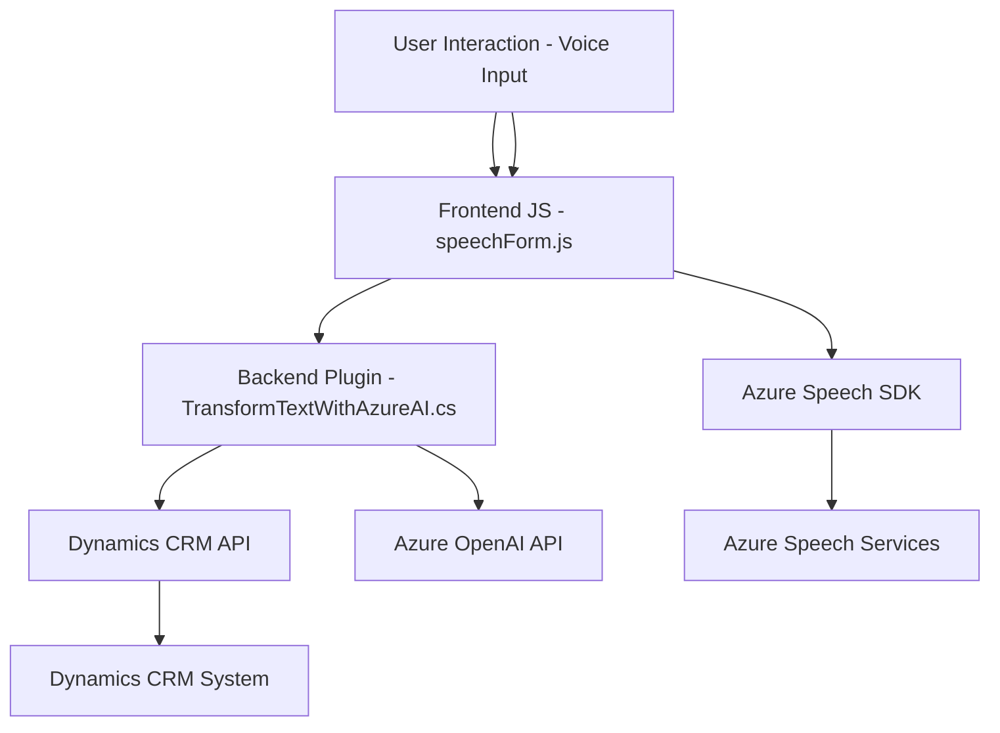

### Breve resumen técnico

El repositorio integra diferentes componentes que trabajan juntos para permitir la interacción entre datos de formularios y sistemas basados en Microsoft Dynamics CRM mediante reconocimiento de voz, transformación de texto con IA, y síntesis de voz. Utiliza Azure Speech SDK y Azure OpenAI para ofrecer estas funcionalidades, y se estructura en tres principales capas funcionales: frontend (JavaScript), backend (C# Plugins) y servicios externos (Azure).

---

### Descripción de arquitectura

La solución tiene una arquitectura orientada a servicios (SOA) con integración de componentes externos y un enfoque modular. La solución se organiza así:
1. **Frontend**: Contiene JavaScript archivos (como `readForm.js` y `speechForm.js`) que manejan la interacción de los usuarios con formularios, reconocimiento de voz y síntesis de texto utilizando Azure Speech SDK. Este actúa como el cliente donde ocurre la captura y muestra de datos.
2. **Middleware**: La lógica más pesada recae sobre la aplicación web y los servicios de Azure. API de procesamiento de IA o comunicación API de Dynamics CRM ocurre mediante estos elementos.
3. **Plugins Backend**: Los plugins como `TransformTextWithAzureAI.cs` conectan Dynamics CRM al servicio externo Azure OpenAI API para transformar texto y estructurar datos según normas específicas.

El sistema utiliza eventos de plugins y servicios RESTful para establecer la comunicación entre los componentes internos y externos.

---

### Tecnologías usadas

1. **Frontend (JavaScript)**:
   - **Azure Speech SDK** para reconocimiento y síntesis de voz.
   - **Dynamics CRM APIs** para la manipulación de datos en formularios.
   - **HTML, JavaScript** para front-end puro (interacción directa con inputs de usuario).

2. **Backend (C#)**:
   - **Microsoft Dynamics CRM SDK** para plugins que interactúan directamente con plataformas CRM como Dynamics.
   - **Azure OpenAI, GPT-4** para transformar texto.

3. **Servicios Externos**:
   - **REST APIs**: Comunicación con el servicio de Azure Speech SDK y Azure OpenAI API.
   - **Azure Services** for cloud-based processing.

---

### Diagrama Mermaid

---

### Conclusión final

Este repositorio represents a well-thought-out solution leveraging modern cloud-based services for dynamic human-computer interaction. It's primarily focused on enabling voice-enabled form inputs and processing those inputs with AI services for structured data. The architecture features modular components and follows a service-oriented approach leveraging REST APIs and plugins for seamless communication between the client frontend and cloud services. This structure is extensible and scalable, benefiting from Azure's robust capabilities.