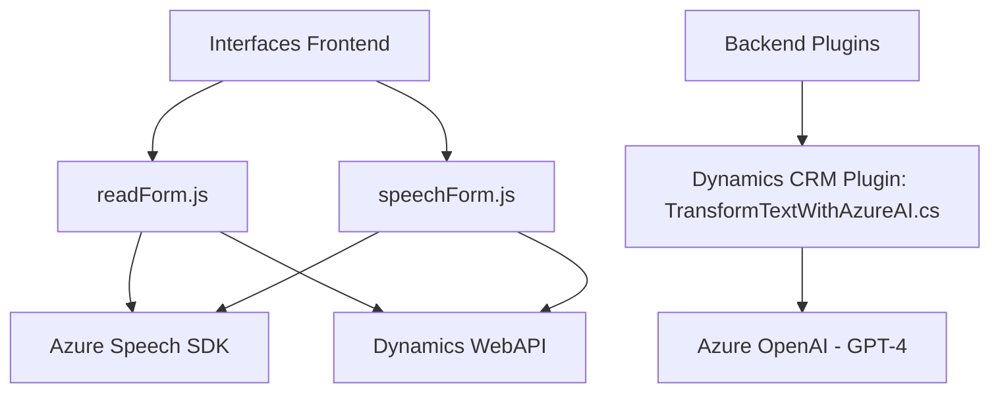

### Breve Resumen Técnico

Este repositorio implementa una solución híbrida que incluye un **frontend basado en JavaScript** para interacción con formularios y aplicaciones Dynamics 365, así como componentes backend en **C#** (plugins) para extender la funcionalidad de Dynamics CRM mediante integración con Azure services. Utiliza tecnologías modernas como **Azure Speech SDK** y **Azure OpenAI Service** para brindar capacidades de síntesis y reconocimiento de voz y procesamiento avanzado de lenguaje natural.

---

### Descripción de la Arquitectura

La arquitectura general del proyecto se puede clasificar como **"hexagonal orientada a servicios"**, con funcionalidades divididas en capas que interactúan mediante integración con APIs y servicios externos (Azure y Dynamics). 

1. **Frontend**: Proporciona una interfaz en Dynamics CRM para interacción con formularios y datos, comunicándose con servicios externos (Azure Speech, APIs) y manipulando datos localmente.
   - Utiliza una estructura modular con funciones independientes para lectura, síntesis de voz, y transcripción de datos del formulario.
   - Emplea carga dinámica de dependencias bajo demanda (ej. Azure Speech SDK).

2. **Backend (Plugins)**: Se desarrolla en **C#** y funciona como extensiones para Dynamics CRM. Los plugins interactúan con el contexto de `IPlugin` y utilizan APIs externas como **Azure OpenAI Service** para procesar datos de entrada y devolver análisis enriquecidos al sistema CRM.

La solución muestra una adecuada separación de responsabilidades:
- El **frontend** consume servicios y transforma los datos.
- Los **plugins backend** manejan acciones de negocio más complejas y procesamiento avanzado directamente en el servidor.

---

### Tecnologías Usadas

#### Frontend:
1. **Lenguaje**: JavaScript/ECMAScript.
2. **Framework y SDK**:
   - **Azure Speech SDK**: Carga dinámica desde CDN pública para proporcionar síntesis y reconocimiento de voz.
3. **API**:
   - **Dynamics WebAPI (`Xrm.WebApi`)**: Para interactuar con formularios y datos del sistema.
4. **Patrones**:
   - Modularidad: Código dividido en funciones específicas.
   - Event-driven: Uso de callbacks para manejar eventos dinámicos (ej. carga de SDK).

#### Backend:
1. **Lenguaje**: C#.
2. **Framework**:
   - Microsoft Dynamics SDK (`Microsoft.Xrm.Sdk`).
   - .NET Framework/Standard.
3. **API Externa**:
   - **Azure OpenAI Service**: Integración con GPT-4 para procesar texto y estructurarlo como JSON.
4. **Bibliotecas**:
   - `Newtonsoft.Json` y `System.Text.Json` para manipulación de JSON.
   - `System.Net.Http` para solicitudes HTTP hacia Azure OpenAI.
5. **Patrones**:
   - Plugin-driven: Extensión lógica en Dynamics CRM mediante `IPlugin`.
   - API integration: Comunicación directa con servicios remotos (Azure OpenAI).

---

### Dependencias y Componentes Externos

#### Frontend:
1. **Azure Speech SDK**:
   - URL de carga: `https://aka.ms/csspeech/jsbrowserpackageraw`.
   - Usado para interacción de voz (síntesis, transcripción).
2. **Dynamics WebAPI**:
   - Manipulación de datos del sistema CRM.
3. **JavaScript DOM**:
   - Para control dinámico de dependencias y manipulación de formularios.
   
#### Backend:
1. **Azure OpenAI Service**:
   - Procesamiento de texto con aprendizaje automático.
2. **.NET Framework**:
   - Permite extensión de campañas CRM mediante plugins.
3. **Newtonsoft.Json y System.Text.Json**:
   - Formateo y manipulación de respuestas JSON.
4. **HTTP Client**:
   - Comunicación con servicios remotos mediante solicitudes POST/GET.

---

### Diagrama Mermaid

---

### Conclusión Final

Este repositorio implementa una solución extendida para integración de **speech-to-text**, **transcripción avanzada**, y **procesamiento basado en IA** en Microsoft Dynamics CRM. Combina una arquitectura **hexagonal orientada a servicios** con interacción directa con APIs de Azure y Microsoft Dynamics. La estructura modular y el uso de patrones como eventos y encapsulación lo hace ideal para sistemas empresariales que requieren alta flexibilidad.

Sin embargo, se observan los siguientes puntos de mejora:
1. **Seguridad**: Las claves API (`azureKey`, `azureRegion`) están expuestas directamente en los scripts del frontend. Esto representa un serio riesgo y deben gestionarse mediante un sistema de variables de entorno o Azure Key Vault.
2. **Documentación parcial**: Aunque los comentarios son funcionales, falta una guía arquitectónica general para los desarrolladores que integren o mantengan el sistema.

