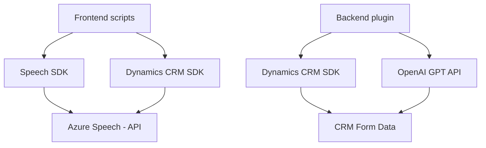

### Breve resumen técnico
El repositorio parece estar orientado a soluciones integradas con Microsoft Dynamics CRM, que incluyen componentes de procesamiento de voz y texto mediante Azure Speech SDK y Azure OpenAI. Su propósito es interactuar con formularios CRM, convertir inputs de voz a texto, sintetizar campos de formularios en voz, y transformar comandos textuales en datos estructurados.

### Descripción de arquitectura
La arquitectura es modular y combina elementos de una arquitectura **n-capas**:
1. **Capa de integración externa**: Utiliza servicios en la nube de Azure (Speech SDK y OpenAI API) para sintetizar, procesar, y transformar datos.
2. **Capa de lógica de negocios**: Implementada mediante plugins (en `Plugins`), que manipulan datos en Dynamics CRM y aplican reglas específicas.
3. **Capa de cliente**: Consiste en scripts JavaScript, que interactúan con los formularios visibles de Dynamics CRM.

La solución tiene características de una arquitectura basada en **servicios**, delegando tareas específicas a APIs externas mientras mantiene capas internas desacopladas.

### Tecnologías usadas
1. **Frontend**:
   - **JavaScript** para manipulación de formularios y la integración con APIs de voz y texto.
   - **Azure Speech SDK** para reconocimiento y síntesis de voz.
   - **Microsoft Dynamics CRM SDK** (`Xrm.WebApi`) para conexión con el backend del CRM.

2. **Backend**:
   - **C# (.NET Framework)** en el plugin.
   - **Azure OpenAI API** (GPT-4): Para transformación semántica y análisis de textos.
   - **JSON Serialization Libraries**: Manipulación y estructuración en formato JSON usando `System.Text.Json` y `Newtonsoft.Json`.

3. **Patrones de diseño**:
   - **Plugin Pattern**: C# implementa la lógica de negocio como extensiones para eventos en Dynamics CRM.
   - **Lazy Loading**: SDK y servicios externos se cargan dinámicamente según necesidad.
   - **API Consumer**: Comunicación eficaz con servicios externos como Speech SDK y OpenAI.
   - **Modular Design**: Scripts y plugins separados por tipo de funcionalidad para mejor mantenibilidad.

### Dependencias o componentes externos
1. **Azure Speech SDK**: Utilizado en los scripts de frontend para síntesis y reconocimiento de voz.
2. **Azure OpenAI**: Para transformación avanzada de texto en el backend.
3. **Microsoft Dynamics CRM SDK**: Para manipular formularios y datos en Dynamics CRM.
4. **Newtonsoft.Json & System.Text.Json**: Para trabajar con JSON en el backend (serialización y deserialización).
5. Potenciales APIs personalizadas para integrar comandos de voz/texto.

---

### Diagrama Mermaid (GitHub-compatible)

---

### Conclusión final
Este repositorio representa una solución híbrida que incluye **frontend**, **backend**, y **servicios externos** usando una arquitectura modular y orientada a servicios. Está diseñada para su integración con Dynamics CRM, específicamente para procesar datos textuales y de voz. Las dependencias externas, como Azure Speech SDK y OpenAI API, aportan capacidades avanzadas (IA, reconocimiento y síntesis), mientras que los plugins y scripts interactúan con los datos locales del CRM.