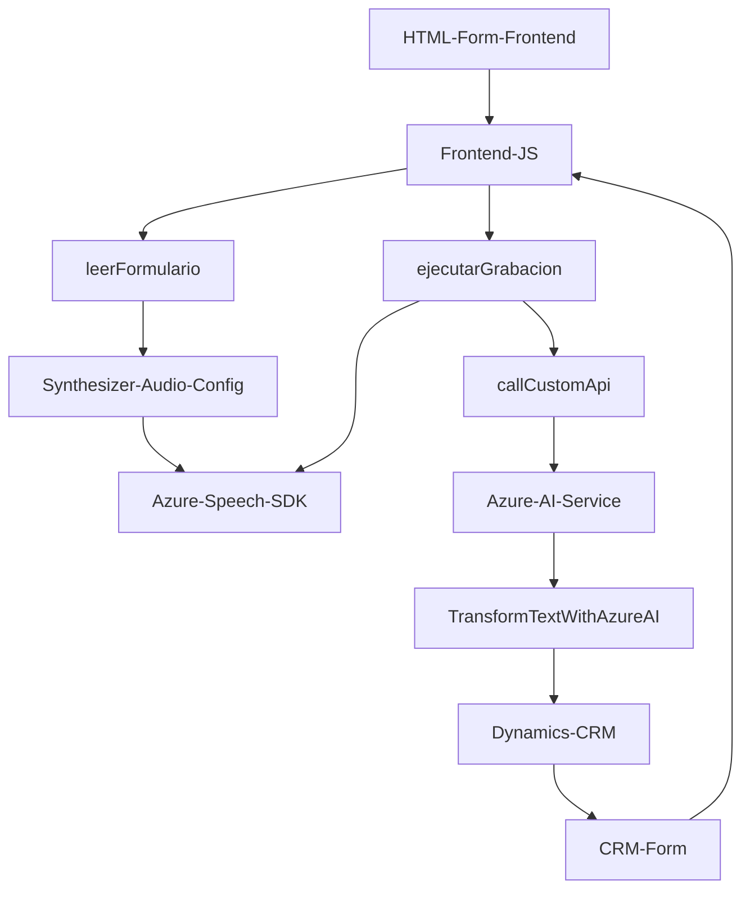

### Breve resumen técnico
El repositorio presenta una solución híbrida orientada a la integración de funcionalidades avanzadas de interacción de datos mediante el reconocimiento speech-to-text, síntesis de texto a voz y procesamiento inteligente con Azure AI. Su finalidad principal es mejorar la interacción y automatización en formularios dinámicos en Microsoft Dynamics CRM. Está dividido en tres componentes principales: un frontend basado en JavaScript, integración de Dynamics CRM y un plugin de backend que utiliza Azure AI.

---

### Descripción de arquitectura
La solución representa una arquitectura de **n capas** adaptada para entornos de Microsoft Dynamics CRM. Cada componente de la solución tiene asignadas responsabilidades claras:
1. **Frontend (JS):** Se centra en la interacción con el usuario para la captura de datos mediante voz y síntesis de texto, utilizando eventos y SDK externos.
2. **Lógica de negocio (Dynamics Plugins):** Amplía las capacidades del CRM mediante un plugin que se comunica con servicios externos de Azure OpenAI para transformar datos.
3. **Servicios externos (Azure Speech SDK y Azure OpenAI):** Componentes externos encargados de la síntesis de voz y transformación avanzada de texto.

---

### Tecnologías usadas
1. **Frontend (JavaScript):**
   - **Azure Speech SDK** para la síntesis de texto a voz y reconocimiento de voz.
   - Microsoft Dynamics CRM para el acceso y manipulación de datos.
   - Internamente utiliza patrones funcionales y modularidad.
   
2. **Backend (C# Plugin):**
   - **Microsoft Dynamics SDK:**
     - Acceso a servicios y contexto de CRM.
   - **Azure OpenAI Service API** para transformación de texto.
   - Bibliotecas .NET:
     - `System.Net.Http` para comunicación HTTP.
     - `System.Text.Json` o `Newtonsoft.Json` para serialización y deserialización.
     
3. **Patrones de diseño:**
   - Patrón de Plugins (Extensibilidad de Dynamics CRM).
   - Patrón basado en eventos: Uso de callbacks para ejecución asíncrona.
   - Modularidad funcional y separación de responsabilidades.

---

### Diagrama Mermaid
A continuación describimos un esquema detallado con conectividad lógica y dependencias externas, siguiendo tus reglas obligatorias:

---

### Conclusión final
La solución presentada es una arquitectura orientada a integrar capacidades de inteligencia artificial y reconocimiento de voz con Microsoft Dynamics CRM. Su estructura es modular y sigue principios de separación por capas para garantizar la consistencia lógica entre componentes frontend y backend.

#### Características destacadas:
1. **Alineamiento con arquitectura n capas:** Proporciona controles individuales en cada nivel administrativo (interfaz, lógica y servicios externos).
2. **Capacidades extendibles:** El uso de plugins y APIs otorga flexibilidad para adaptarse a nuevas funcionalidades o servicios.
3. **Integración con tecnologías de vanguardia:** Dependencia directa de herramientas de Azure (Speech SDK y OpenAI), agrega valor a la solución aumentando su nivel de automatización.

### Recomendaciones:
1. Mejorar el manejo de errores en integraciones externas (ej., manejo más robusto de fallos en Azure Speech SDK y OpenAI).
2. Documentar las configuraciones necesarias del entorno Dynamics CRM y de las claves de Azure para facilitar el despliegue del sistema.
