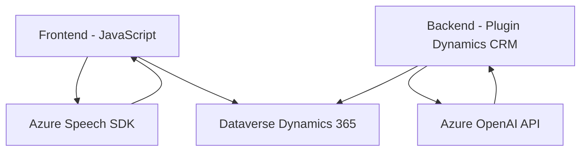

### Breve resumen técnico:
El repositorio implementa una solución de interacción por voz y transformación de texto integrada con **Azure AI** y **Dynamics 365**, utilizando reconocimiento de voz, síntesis de texto a voz, y servicios de inteligencia artificial. La funcionalidad está distribuida entre un **frontend en JavaScript**, un **backend en Dynamics CRM** (C#), y **servicios externos** como el **Azure Speech SDK** y **Azure OpenAI**.

---

### Descripción de arquitectura:
Esta solución tiene una **arquitectura híbrida** que combina:
1. **Frontend modular**: JavaScript organiza funcionalidades en un diseño modular y reutilizable. 
2. **Back Office Dynamics Plugin**: Arquitectura de plugin de Dynamics CRM que se integra directamente con la API de Dataverse.
3. **Interacción con servicios externos**: Utiliza **Azure Speech SDK** y **Azure OpenAI** para procesar datos de voz y texto en tiempo real, implementando un patrón de integración de servicios.

Los archivos tienen una **arquitectura de capas**, donde cada capa delega responsabilidades específicas:
- **Frontend**: Interactúa con el Speech SDK y el formulario web de Dynamics.
- **Backend (plugin)**: Procesa datos y realiza solicitudes a servicios de OpenAI.
- **Servicios externos**: Proveen reconocimiento de voz, síntesis de texto a voz, y transformación de datos.

---

### Tecnologías usadas:
1. **Frontend**:
   - **JavaScript**: Lenguaje base para implementar lógica del cliente.
   - **Azure Speech SDK**: Reconocimiento de voz y síntesis de texto a voz.
   - **Dynamics 365 Web Resources (Form API)**: Para manipular formularios dinámicos.

2. **Backend**:
   - **C# (.NET Framework)**: Implementación del plugin de Dynamics CRM/Dataverse.
   - **Dynamics CRM SDK**: Para acceder al contexto de ejecución CRM.
   - **Azure OpenAI Service**: API GPT para transformar texto.
   - **Newtonsoft.Json** y **System.Text.Json**: Manejo de datos JSON.
   - **System.Net.Http**: Comunicación HTTP con servicios externos.

3. **Servicios externos**:
   - Azure Speech SDK.
   - Azure OpenAI Service (GPT).

---

### Diagrama Mermaid válido para GitHub:

---

### Conclusión final:
La solución implementa un sistema eficiente de interacción hombre-máquina, utilizando tecnologías y servicios de **Microsoft Azure** junto con **Dynamics 365 CRM**. La arquitectura mezcla varios patrones:
- **N Capas** en la separación entre frontend, backend y servicios externos.
- **Orientación a servicios** por la integración con Azure SDKs y APIs.
- **Modularidad** como principio básico para organizar funciones en el frontend.

La implementación muestra un buen aprovechamiento de herramientas avanzadas como Azure Speech SDK y OpenAI, pero necesita atención en aspectos de seguridad, como la gestión de credenciales sensibles. Además, se recomienda documentar mejor la configuración de los servicios externos (clave, regiones, versión) para su despliegue en otros entornos.