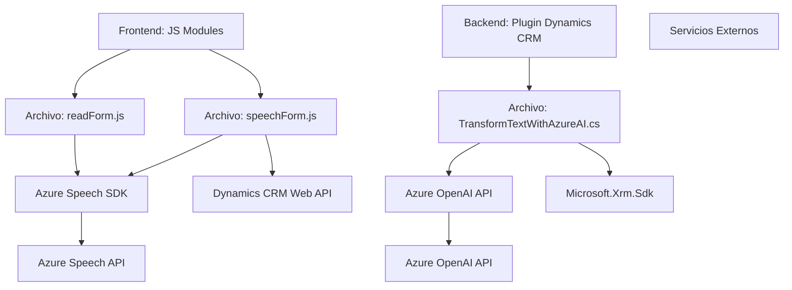

### Breve Resumen Técnico

El repositorio contiene componentes relacionados con **interacción de voz y texto estructurado** para formularios Dynamics CRM utilizando tecnologías como Azure Speech SDK y Azure OpenAI. Las funcionalidades incluyen reconocimiento de voz, sintetización de texto a voz, procesamiento avanzado de texto y manejo de formularios en Dynamics CRM.

---

### Descripción de Arquitectura

El sistema está compuesto por módulos residentes en distintas capas de arquitectura:

1. **Frontend (JS):**
   - Archivos `readForm.js` y `speechForm.js`: Implementan la interacción directa del cliente con formularios en Dynamics CRM mediante eventos de voz y entrada de texto, utilizando módulos JS y dependencias externas (Azure Speech SDK).

2. **Backend (Plugin en C#):**
   - `Plugins/TransformTextWithAzureAI.cs`: Un plugin registrado en Dynamics CRM que utiliza una API externa de inteligencia artificial (Azure OpenAI) para transformar y estructurar texto según reglas específicas.

#### ✅ **Identificamos una arquitectura por capas con integración API:**
   - **Frontend dinámico:** Procesa datos de usuario en tiempo real utilizando la interacción directa con Azure Speech SDK y la API de Dynamics CRM.
   - **Backend de procesos:** Maneja la transformación avanzada de datos de texto mediante plugin Dynamics CRM con Azure OpenAI (Backend externo dirigido vía HTTP API).
   - **Interacción directa con servicios en la nube:** Ambos componentes interactúan con servicios externos de Azure (Speech y OpenAI).

---

### Tecnologías Usadas

1. **Frontend (JavaScript):**  
   - *Core:* ECMAScript 6 (ES6).  
   - *Azure Speech SDK:* Conversión texto a voz y reconocimiento de voz en tiempo real.  
   - *Dynamics 365 Web API:* Manipulación de registros y formularios a través de su interfaz HTTP.  

2. **Backend (C#, Plugin Dynamics CRM):**  
   - *Framework .NET:* Para la implementación de un plugin CRM.
   - *Azure OpenAI API:* Procesamiento avanzado de texto.
   - *System.Net.Http y Newtonsoft.Json:* Consumo HTTP y manipulación JSON.  
   - *Microsoft.Xrm.Sdk:* Interacciones con Dynamics CRM.

#### Patrones Observados:
- **Event-driven architecture:** Especial uso de eventos contextualizados para comenzar procesos de voz y texto.  
- **Integración API:** Usamos servicios Azure Speech SDK y OpenAI para funcionalidades avanzadas como reconocimiento de voz, síntesis y análisis.  

---

### Diagramas Mermaid

Aquí se visualizan en Mermaid los componentes, dependencias y flujo de datos en el repositorio.

---

### Conclusión Final

Este repositorio implementa una solución completa de **interacción de voz y procesamiento avanzado de texto** en un entorno Dynamics CRM utilizando servicios de Azure.  
La arquitectura **n-capas** combina Frontend dinámico para interacción directa con datos en tiempo real y Backend modular integrado con IA. Este sistema destaca por la integración API y un enfoque modular, siendo adecuado para escenarios de automatización empresarial.