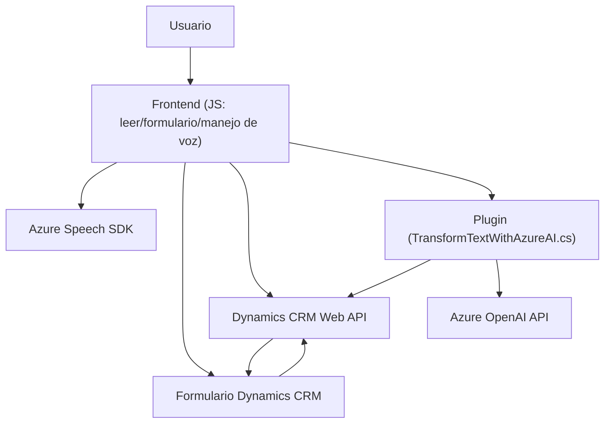

### Breve resumen técnico
Este repositorio integra interactuaciones con Dynamics CRM, reconociendo y generando texto usando **Azure Speech SDK** y **Azure OpenAI API**, todo dentro de una solución que mejora la gestión de datos en formularios mediante voz e IA. Abarca tres áreas principales: frontend basado en JavaScript para formularios, un plugin en C# para procesamiento con OpenAI y la manipulación específica de datos dentro de un entorno CRM.

---

### Descripción de arquitectura
1. **Tipo de solución:** 
   Es una solución híbrida que combina **frontend interactivo** (JavaScript) con lógica de negocio en un **backend acoplado** dentro de **Dynamics CRM**, habilitando funcionalidades mediante plugins y APIs externas.

2. **Arquitectura General:**
   - Utiliza una arquitectura de **n capas** basada en:
     - **Frontend** (procesamiento de voz e interacción con usuario).
     - **Backend CRM** (integración mediante plugin y Dynamics API).
     - **Azure APIs** (Speech SDK y OpenAI API) como servicios externos.
   - Muestra patrones de integración **API-to-API** y un modelo clásico de servicios distribuidos.

3. **Patrones de diseño:**
   - **Callback Pattern** en la carga asincrónica del SDK.
   - Modularización y separación funcional mediante métodos con responsabilidades específicas.
   - **Plugin Pattern** (para extensibilidad en Dynamics CRM).
   - **Transformación y normalización de datos** con JSON en servicios externos.

4. **Componentes externos:**
   - **Azure Speech SDK:** Para reconocimiento y síntesis de voz.
   - **Azure OpenAI API:** Procesamiento y transformación de texto usando modelos GPT.
   - **Dynamics CRM Web API:** Actualización y manipulación directa de datos en el sistema CRM.

---

### Tecnologías usadas
1. **Frontend (JavaScript)**
   - **Azure Speech SDK**: Reconocimiento de voz, síntesis de texto a voz.
   - **Form API en Dynamics CRM**: Interacción con los datos de los formularios.
   - **JavaScript Promises y Callback Pattern**: Para asincronismo en cargas y solicitudes HTTP.

2. **Backend (C# Plugin – Dynamics CRM)**
   - **Microsoft.Xrm.Sdk**: SDK oficial de Dynamics CRM.
   - **HTTP Client API**: Para consumir Azure OpenAI API con solicitudes REST.
   - **Newtonsoft.Json**: Para manipulación y transformación de respuestas JSON.
   - **Plugin Framework**: Extensión clásica de Dynamics CRM mediante `IPlugin`.

3. **Servicios externos**
   - **Azure Speech SDK** (endpoint JS/browser).
   - **Azure OpenAI API**, configurada con `gpt-4o`.

---

### Diagrama Mermaid
A continuación se muestra un diagrama representativo de las relaciones entre las principales entidades y servicios en la solución propuesta:

---

### Conclusión final
Esta solución demuestra cómo integrar efectivamente servicios modernos de reconocimiento de voz e inteligencia artificial (IA) con sistemas clásicos como Dynamics CRM. Utiliza una arquitectura bastante cohesiva basada en n capas y extensiones plugin para Dynamics CRM, aprovechando APIs distribuidas como Azure Speech SDK y Azure OpenAI. Su diseño modular y uso de patrones de integración externa permite escalabilidad y adaptabilidad a nuevas funcionalidades.

Recomendaciones:
- **Optimización:** Dividir lógicas más complejas (como los métodos en `TransformTextWithAzureAI.cs`) en clases auxiliares para promover mayor reutilización y testabilidad.
- **Seguridad:** Garantizar la protección adecuada de las claves de API utilizadas para Azure Speech y OpenAI mediante variables de entorno.
