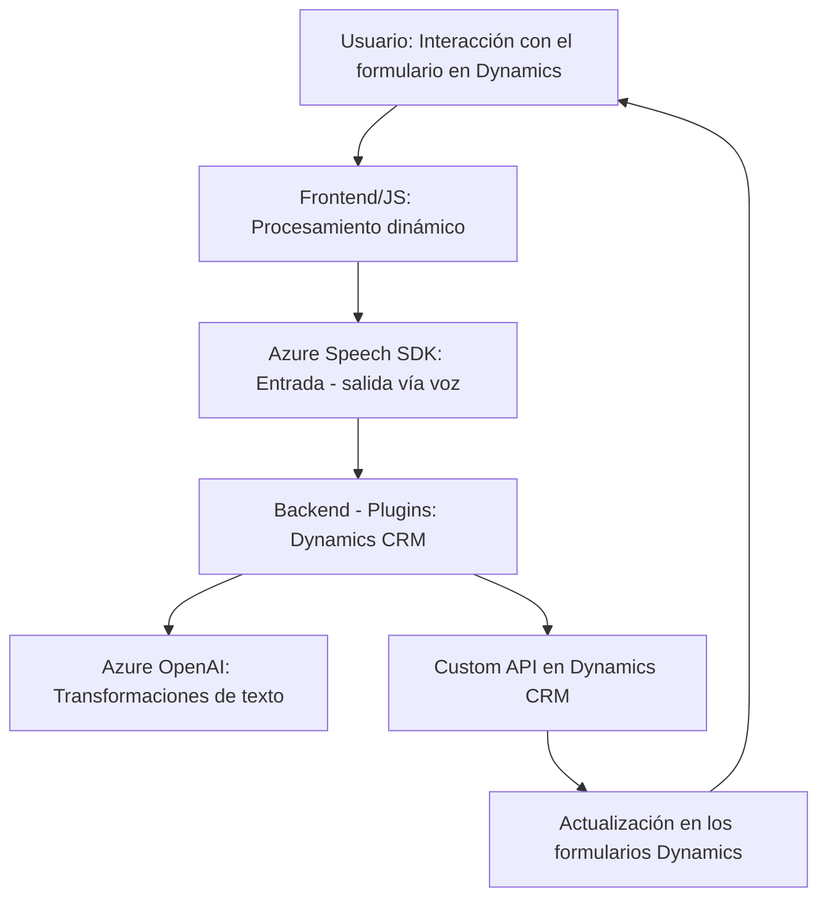

# Análisis del repositorio

## Resumen técnico
Este repositorio combina módulos frontend en JavaScript y componentes backend con C#, diseñados para gestionar datos dinámicos desde formularios e interactuar con servicios de Azure (Speech SDK y OpenAI). Su propósito principal es integrar funcionalidades de accesibilidad y procesamiento avanzado de datos en formularios, con Dynamics CRM como el núcleo de operaciones.

---

## Descripción de arquitectura
### Tipo de solución:
Es una arquitectura híbrida que une:
1. **Frontend**: Scripts JavaScript para interacción de voz, lectura y síntesis de formularios.
2. **Backend**: Plugins en C# que proporcionan transformación de datos y extensiones basadas en Dynamics CRM conectadas a servicios como Azure OpenAI.

### Tipo de arquitectura:
La solución utiliza una combinación de **n-capas**:
- Capa de presentación (Frontend que utiliza Azure Speech SDK).
- Capa de lógica de negocio (Plugins de Dynamics CRM interactuando con Azure OpenAI y API internas).
- Capa de integración externa (Servicios de Azure Speech y OpenAI).

Además, usa una **SOA (Service-Oriented Architecture)**, donde distintas responsabilidades están divididas en servicios y API externos.

### Patrones clave:
- **Callback y carga dinámica**: Su implementación en frontend asegura dependencias disponibles antes de ejecutar tareas críticas.
- **Builder Pattern**: Utilizado en el diseño de solicitudes HTTP del plugin de `TransformTextWithAzureAI`.
- **Plugin extensible**: Extiende la funcionalidad del CRM (Dynamics) siguiendo el patrón de extensibilidad.

---

## Tecnologías usadas
1. **Frontend**:
   - **JavaScript**: Scripts funcionales para comunicación con Azure Speech SDK.
   - **Azure Speech SDK**: Manejo de entrada/salida de voz con síntesis en español.
  
2. **Backend**:
   - **C#**: Desarrollo del plugin en Dynamics.
   - **Microsoft Dynamics CRM SDK**: Para extensiones y manejo del contexto.
   - **Azure OpenAI Service**: Uso de GPT para transformación de texto.
   - **System.Net.Http**: Envío de solicitudes HTTP al endpoint OpenAI.

---

## Dependencias externas potenciales
- **Azure Speech SDK**: API dinámica cargada desde un CDN público.
- **Azure OpenAI**: Solicitudes POST al endpoint para transformación de texto.
- **Dynamics CRM API**: Para la manipulación de formularios y entidades.

---

## Diagrama Mermaid

---

## Conclusión final
Este repositorio representa una solución híbrida con integración completa entre frontend y backend en Dynamics CRM. Se destaca el uso de tecnologías modernas como Azure Speech SDK y OpenAI para mejorar la experiencia de usuario en términos de accesibilidad y procesamiento de datos. La arquitectura es flexible, basada en n-capas con un enfoque de extensibilidad (Plugins y servicios), adecuada para integraciones empresariales en sistemas CRM.